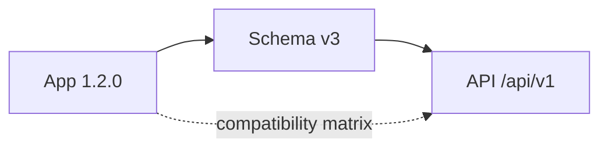
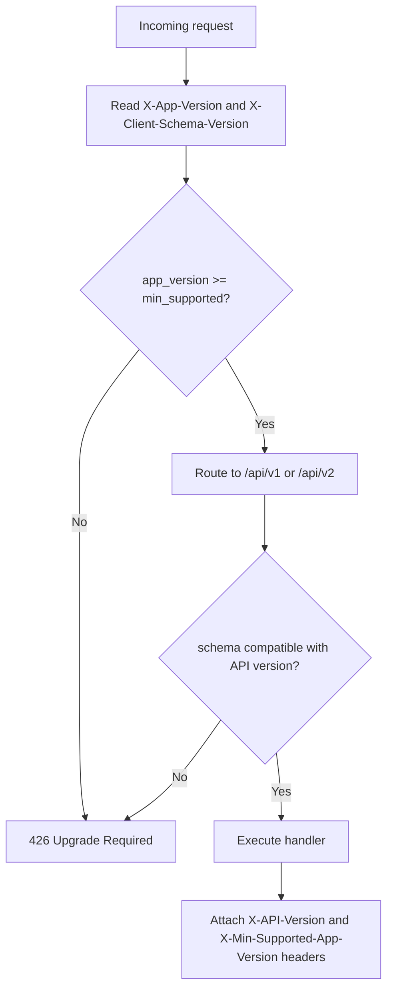
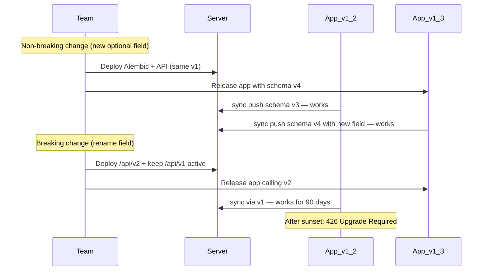

# SmartOps API Versioning Strategy

> Related docs: [Architecture](./architecture.md) · [Local Database Migrations](./local-database-migrations.md) · [Deployment](./deployment.md) · [MVP Requirements](./mvp-requirements.md)

## Overview

SmartOps is offline-first: users update the mobile app at different times and may sync days later on an older version. The backend must serve multiple app versions simultaneously without losing offline data.

This document defines how **app version**, **client schema version**, and **API version** work together, plus sync protocol rules, compatibility policy, and deprecation process.

---

## Three Version Concepts

These must stay separate — do not conflate them.

| Concept | Example | Owner | Purpose |
|---|---|---|---|
| **App version** | `1.2.0` (semver) | Mobile release | User-facing; store updates; force-update checks |
| **Client schema version** | `3` (integer) | Isar migration runner | Local DB migration tracking |
| **API version** | `v1` (URL path) | Backend routes | REST contract + sync protocol |



**Rule:** API version bumps only on **breaking** contract changes. App and schema versions can increment without a new API version if changes are backward-compatible.

---

## Compatibility Policy

### Recommended approach: N + N-1 for 90 days

| Policy | Rationale |
|---|---|
| Support current + previous API version | Mobile users update slowly; offline users sync on old apps |
| 90-day deprecation window | Organic app store updates without blocking business operations |
| Force update below minimum | Security fixes, auth breaking changes, incompatible sync |
| Single PostgreSQL schema | v1 and v2 APIs share one DB; adapter layers handle shape differences |

**Do not** run only one API version for SmartOps. Offline sync from an old app after a server deploy would fail and erode user trust.

### When to bump API version (v1 → v2)

| Change | New API version? |
|---|---|
| Add optional JSON field / nullable DB column | No — v1 continues |
| Add new endpoint | No — v1 continues |
| Rename or remove request/response field | **Yes — v2** |
| Change field type or validation rules | **Yes — v2** |
| Change sync push/pull envelope structure | **Yes — v2** |
| Change auth token format | **Yes — v2** + force update |

### When to force app update (same API version)

- Critical security patch
- Google OAuth client ID rotation
- Client below `min_supported_app_version` in server config
- Client schema version incompatible with active API version

---

## URL Path Versioning (Primary)

Base URL pattern:

```
https://api.smartops.app/api/v1/...
https://api.smartops.app/api/v2/...   ← future breaking changes only
```

Examples:

```
POST /api/v1/auth/google
POST /api/v1/sync/push
GET  /api/v1/sync/pull
GET  /api/v1/expenses

POST /api/v2/sync/push              ← future: breaking sync change
```

### FastAPI structure (future implementation)

```
backend/app/
  api/
    v1/
      router.py
      auth.py
      sync.py
      expenses.py
      ...
    v2/
      router.py
      sync.py                       # only endpoints that changed
      ...
  schemas/
    v1/
    v2/
  services/                         # shared — NOT duplicated per version
    expense_service.py
    sync_service.py
    ...
```

**Principle:** v1 and v2 route handlers call the same `services/` layer. Version-specific adapters transform request/response shapes at the boundary.

---

## Client Identification Headers

Mobile sends on **every** API request (including auth and sync):

| Header | Example | Required | Purpose |
|---|---|---|---|
| `Authorization` | `Bearer eyJ...` | Yes (except auth endpoints) | JWT access token |
| `X-App-Version` | `1.2.0` | Yes | Semver from `package_info` |
| `X-Client-Schema-Version` | `3` | Yes | Isar `LocalDbMeta.schema_version` |
| `X-Platform` | `android` / `ios` | Yes | Platform-specific behavior |
| `X-Device-Id` | UUID | Yes | Device binding (auth + sync) |
| `X-Organization-Id` | UUID | Yes (business endpoints) | Tenant context |

### Server response headers

| Header | Purpose |
|---|---|
| `X-API-Version` | API version that handled the request (e.g. `1`) |
| `X-Min-Supported-App-Version` | Below this → mobile shows force-update screen |
| `X-Latest-App-Version` | Optional soft nudge to update |
| `X-Deprecation-Warning` | Optional: `API v1 sunsets 2026-09-01` during sunset period |

Mobile stores `X-Min-Supported-App-Version` from the last successful response and checks on app launch.

---

## Compatibility Matrix

Server maintains a compatibility config (environment variables for MVP; DB table `api_compatibility` post-MVP):

| min_app_version | max_schema_version | api_version | status | sunset_date |
|---|---|---|---|---|
| 1.0.0 | 99 | v1 | active | — |
| 1.5.0 | 6 | v2 | active | — |
| 1.0.0 | 3 | v1 | deprecated | 2026-09-01 |

### Middleware flow



### Middleware implementation (conceptual)

```python
# Conceptual — not production code
async def version_check_middleware(request, call_next):
    app_version = parse_semver(request.headers.get("X-App-Version"))
    schema_version = int(request.headers.get("X-Client-Schema-Version", 0))

    if app_version < settings.min_supported_app_version:
        return JSONResponse(status_code=426, content={...})

    if not is_schema_compatible(schema_version, request.url.path):
        return JSONResponse(status_code=426, content={...})

    response = await call_next(request)
    response.headers["X-API-Version"] = "1"
    response.headers["X-Min-Supported-App-Version"] = settings.min_supported_app_version
    return response
```

---

## Error Responses

### 426 Upgrade Required (force update)

Returned when app version or schema version is below minimum supported.

```json
{
  "error": {
    "code": "APP_UPDATE_REQUIRED",
    "message": "Please update SmartOps to continue",
    "details": {
      "min_supported_app_version": "1.3.0",
      "latest_app_version": "1.5.0",
      "min_supported_schema_version": 4,
      "store_url": "https://play.google.com/store/apps/details?id=com.smartops.app"
    }
  }
}
```

**Mobile behavior:** Show blocking "Update required" screen with store link. Local Isar data remains intact; sync paused until update.

### Soft deprecation (non-blocking)

During the 90-day sunset window, v1 endpoints return `200 OK` with:

```
X-Deprecation-Warning: API v1 sunsets on 2026-09-01. Please update your app.
```

---

## Sync Protocol Versioning

Sync is the highest-risk cross-version surface because old apps push offline data collected before a server deploy.

### MVP rules (v1 only)

| Rule | Detail |
|---|---|
| Single sync API | `POST /api/v1/sync/push`, `GET /api/v1/sync/pull` |
| Forward compatibility | Server **ignores unknown fields** in push payload |
| Backward compatibility | Server **never requires** new fields from old clients |
| Pull filtering | Server omits fields the client schema does not support (by `X-Client-Schema-Version`) |
| Defaults | Server fills new DB columns with defaults when old clients omit them |

### Push from old client to new server

```json
{
  "device_id": "uuid",
  "client_schema_version": 2,
  "last_sync_at": "2026-06-01T10:00:00Z",
  "changes": {
    "expenses": [
      {
        "id": "uuid",
        "operation": "create",
        "data": { "amount": 500, "category_id": "uuid", "expense_date": "2026-06-01" },
        "client_updated_at": "2026-06-01T09:00:00Z"
      }
    ]
  }
}
```

Server accepts this even if DB now has optional `vendor_id` column — fills NULL server-side.

### Pull to old client from new server

Server filters response fields by client schema version:

```
if client_schema_version < 4:
    omit "gstin" from customer objects in pull response
if client_schema_version < 5:
    omit "recurring_expense_id" from expense objects
```

Old app never sees fields it cannot store in Isar.

### Breaking sync change (v2)

When push/pull envelope structure changes:

```
POST /api/v2/sync/push
GET  /api/v2/sync/pull
```

- v1 sync endpoints remain active for 90 days
- App v1.x continues calling v1 sync
- App v2.x calls v2 sync
- After sunset: v1 sync returns `426 Upgrade Required`

---

## Release Coordination Workflow



### Deploy checklist

1. **Classify** the change: breaking or backward-compatible?
2. **Compatible change:** deploy server (Alembic + API v1), then app — either order OK
3. **Breaking change:** deploy v2 API alongside v1; release new app calling v2; announce v1 sunset date
4. **Update** compatibility matrix and OpenAPI specs
5. **Test** matrix (see below)
6. **Communicate** sunset date in release notes and in-app if needed

### Relationship to local migrations

| Layer | Tool | Doc |
|---|---|---|
| Server DB | Alembic | [Database Design](./database-design.md) |
| Local Isar | Migration runner | [Local Database Migrations](./local-database-migrations.md) |
| API contract | URL path + headers | This document |

See [Local Database Migrations](./local-database-migrations.md) for Isar-specific release coordination.

---

## Deprecation and Sunset Process

| Phase | Duration | Action |
|---|---|---|
| Active | Indefinite | API version fully supported |
| Deprecated | 90 days | v(N-1) still works; `X-Deprecation-Warning` header added |
| Sunset | End of deprecation | v(N-1) returns `426 Upgrade Required` |
| Retired | After sunset | v(N-1) routes removed from codebase |

### Sunset communication

1. Set `sunset_date` in compatibility config
2. Add deprecation header to responses
3. Log requests from deprecated clients (Sentry/metrics)
4. Optional: in-app banner for users on old app versions
5. On sunset date: flip config to return 426 for deprecated version

**Never** delete v1 routes without completing the sunset period — offline users may sync for the first time after weeks.

---

## Mobile Client Behavior

| Server response | Mobile action |
|---|---|
| `200 OK` | Normal operation; update cached `min_supported_app_version` from headers |
| `426 APP_UPDATE_REQUIRED` | Show force-update screen; preserve local data; pause sync |
| `401 Unauthorized` | Attempt token refresh; re-login if refresh fails |
| `409 Conflict` | Existing sync conflict handler |
| Network error | Continue offline mode |

### Dio interceptor (conceptual)

```dart
// Conceptual — not production code
class VersionInterceptor extends Interceptor {
  @override
  void onRequest(RequestOptions options, RequestInterceptorHandler handler) {
    options.headers['X-App-Version'] = appVersion;
    options.headers['X-Client-Schema-Version'] = schemaVersion.toString();
    options.headers['X-Platform'] = Platform.isAndroid ? 'android' : 'ios';
    options.headers['X-Device-Id'] = deviceId;
    handler.next(options);
  }

  @override
  void onResponse(Response response, ResponseInterceptorHandler handler) {
    final minVersion = response.headers.value('X-Min-Supported-App-Version');
    if (minVersion != null) cacheMinSupportedVersion(minVersion);
    handler.next(response);
  }

  @override
  void onError(DioException err, ErrorInterceptorHandler handler) {
    if (err.response?.statusCode == 426) {
      navigateToForceUpdateScreen(err.response?.data);
    }
    handler.next(err);
  }
}
```

---

## Testing Matrix

Before every release that touches API or schema:

| Test case | Expected |
|---|---|
| Old app (v1.1) + new server (v1 API) | Sync push/pull works |
| New app (v1.2) + new server (v1 API) | New optional fields sync correctly |
| Old app + server after v1 sunset | `426 Upgrade Required` |
| New app calling v2 + v2 server | v2 sync works |
| Old app calling v1 + server with v2 deployed | v1 still works during deprecation |
| App below min_supported_app_version | `426` on all endpoints |
| Offline app update (schema migration) then sync | Pending queue pushes via correct API version |

---

## OpenAPI Documentation

| Spec | URL | Purpose |
|---|---|---|
| v1 | `/api/v1/openapi.json` | MVP + mobile client reference |
| v2 | `/api/v2/openapi.json` | When breaking changes ship |

- Tag deprecated v1 endpoints with `deprecated: true` during sunset
- Phase 3 web admin generates TypeScript client from active spec
- Do not merge v1 and v2 into one spec — keep separate

---

## MVP Scope (v1.0 Beta)

Keep implementation minimal for first release:

| Item | MVP status |
|---|---|
| `/api/v1` only | Yes — no v2 routes yet |
| Version headers on all requests | Yes — implement from day one |
| Compatibility middleware | Yes — reject below `1.0.0` only |
| Sync forward/backward compatibility rules | Yes |
| Pull field filtering by schema version | Yes — when new fields added |
| v2 routes | No — document process; implement when first breaking change occurs |
| `api_compatibility` DB table | No — use env vars (`MIN_SUPPORTED_APP_VERSION=1.0.0`) |
| Soft deprecation headers | No — needed when v2 ships |

---

## Environment Variables (MVP)

| Variable | Example | Purpose |
|---|---|---|
| `MIN_SUPPORTED_APP_VERSION` | `1.0.0` | Force update threshold |
| `LATEST_APP_VERSION` | `1.0.0` | Returned in 426 response |
| `MIN_SUPPORTED_SCHEMA_VERSION` | `1` | Reject sync from older schemas |
| `ANDROID_STORE_URL` | Play Store URL | 426 response |
| `IOS_STORE_URL` | App Store URL | 426 response |

---

## Related Documents

- [Architecture](./architecture.md) — API layer design, sync engine
- [Local Database Migrations](./local-database-migrations.md) — Isar schema versioning, release coordination
- [Deployment](./deployment.md) — deploy v2 alongside v1; never delete v1 without sunset
- [Database Design](./database-design.md) — Alembic server migrations
- [MVP Requirements](./mvp-requirements.md) — version header acceptance criteria
