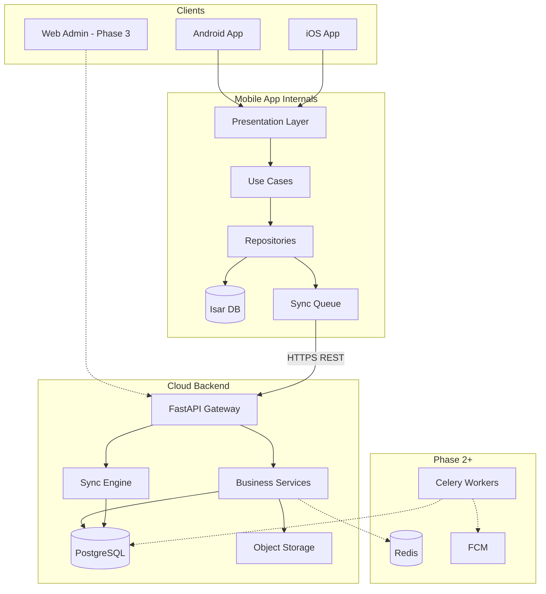
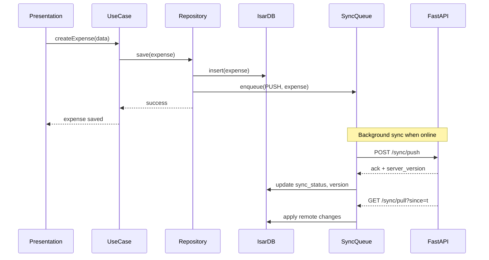
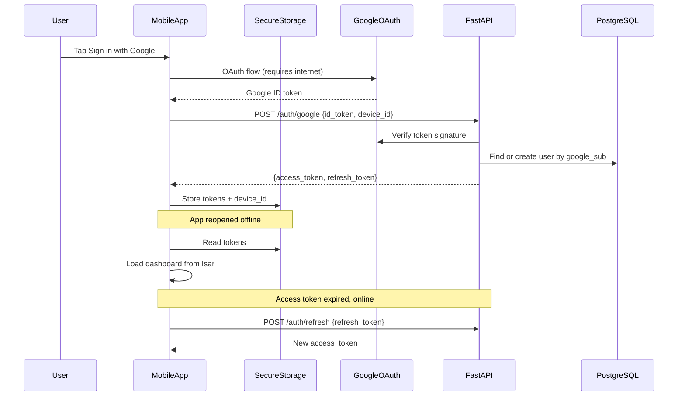
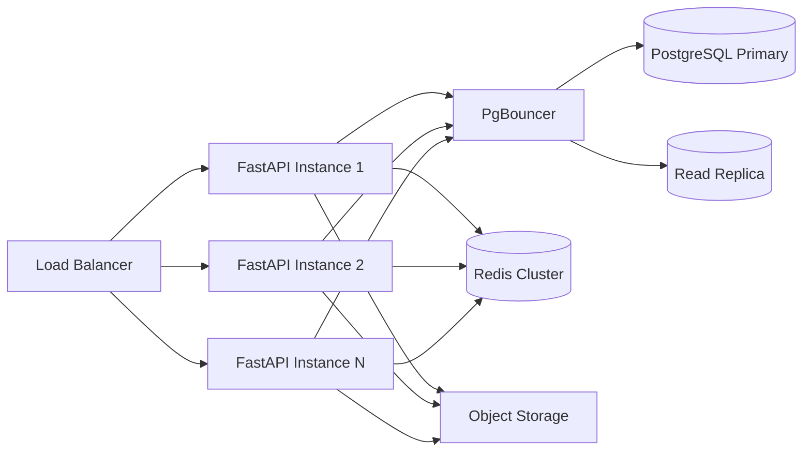
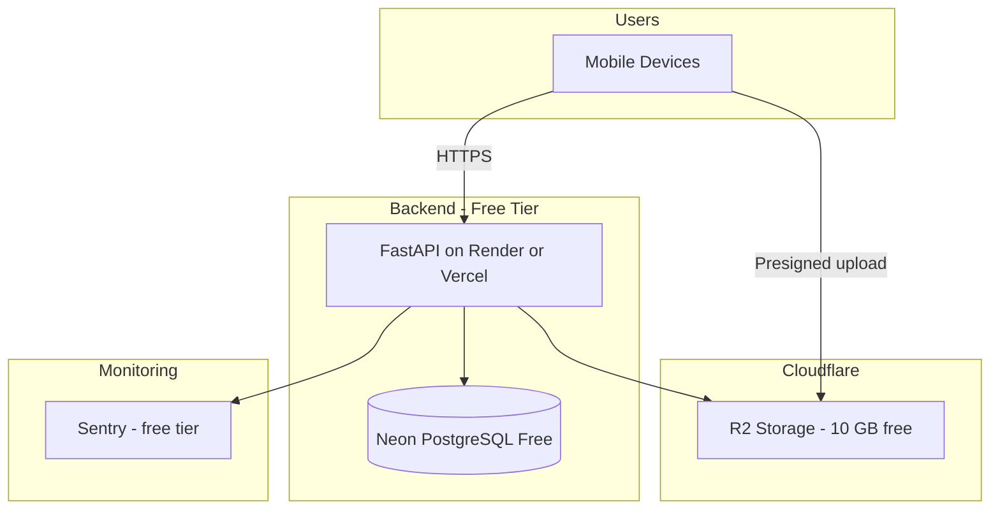

# SmartOps System Architecture

> Related docs: [Tech Stack](./tech-stack.md) · [Database Design](./database-design.md) · [Auth & Sessions](./auth-sessions.md) · [API Versioning](./api-versioning.md) · [UI/UX Design System](./ui-ux-design-system.md) · [UI/UX Screens](./ui-ux-screens.md) · [Local Database Migrations](./local-database-migrations.md) · [Local Development](./local-development.md) · [Testing Strategy](./testing-strategy.md) · [Sync Protocol](./sync-protocol.md) · [Deployment](./deployment.md) · [MVP Requirements](./mvp-requirements.md)

## Overview

SmartOps follows an **offline-first** architecture: the mobile app is the primary interface, all business operations work without internet, and data synchronizes to a cloud backend when connectivity is available. The backend serves as the source of truth for multi-user access, cloud backup, and future web/AI features.

**Design principles:**
1. Offline-first — local writes never block on network
2. Single source of truth — PostgreSQL on server; Isar on device
3. Tenant isolation — every query scoped by `organization_id`
4. Sync, not realtime — batch delta sync for MVP; realtime deferred
5. Backend owns business rules — mobile validates UX; server validates authority

---

## High-Level Architecture



---

## Mobile Architecture

### Folder Structure

```
mobile/
├── lib/
│   ├── main.dart
│   ├── app.dart                    # MaterialApp, routing, theme
│   ├── core/
│   │   ├── auth/                   # AuthService, token manager
│   │   ├── network/                # Dio client, interceptors
│   │   ├── sync/                   # SyncEngine, SyncQueue, conflict handler
│   │   ├── database/               # Isar initialization, schemas
│   │   ├── router/                 # go_router configuration
│   │   ├── theme/                  # AppTheme, colors, typography
│   │   ├── l10n/                   # Generated localization
│   │   └── utils/                  # Date, currency, validators
│   ├── features/
│   │   ├── auth/
│   │   ├── onboarding/
│   │   ├── dashboard/
│   │   ├── expenses/
│   │   ├── revenue/
│   │   ├── employees/
│   │   ├── attendance/
│   │   ├── payroll/
│   │   ├── inventory/
│   │   └── crm/
│   └── shared/
│       ├── widgets/                # Reusable UI components
│       ├── models/                 # Shared DTOs
│       └── extensions/
├── assets/
│   ├── images/
│   └── l10n/
│       ├── app_en.arb
│       └── app_hi.arb
└── test/
```

### Feature Module Structure

Each feature follows the same internal layout:

```
features/expenses/
├── domain/
│   ├── entities/
│   │   └── expense.dart
│   ├── repositories/
│   │   └── expense_repository.dart     # abstract interface
│   └── usecases/
│       ├── create_expense.dart
│       ├── get_expenses.dart
│       └── delete_expense.dart
├── data/
│   ├── models/
│   │   └── expense_model.dart          # Isar collection + JSON serialization
│   ├── datasources/
│   │   ├── expense_local_datasource.dart
│   │   └── expense_remote_datasource.dart
│   └── repositories/
│       └── expense_repository_impl.dart
└── presentation/
    ├── providers/
    │   └── expense_providers.dart      # Riverpod providers
    ├── screens/
    │   ├── expense_list_screen.dart
    │   └── expense_form_screen.dart
    └── widgets/
        └── expense_card.dart
```

### Presentation Layer

Screens and widgets follow [UI/UX Design System](./ui-ux-design-system.md) and [UI/UX Screens](./ui-ux-screens.md):

| Concern | Location | Reference |
|---|---|---|
| M3 theme, tokens | `core/theme/` | Design system §1.1 |
| Shared components | `shared/widgets/` | `SmartOpsScaffold`, `SyncStatusBanner`, `MetricCard`, etc. |
| Navigation | `core/router/` | 5-tab bottom nav + hub screens; role-based route guards |
| Screen layouts | `features/*/presentation/screens/` | Screen specs S-001 through S-102 |
| Localization | `core/l10n/` + ARB files | All UI strings; Hindi layout tested at 360dp |

**Key UI patterns:** offline-first banner on every authenticated screen, empty states with CTA on all lists, confirm dialogs for destructive actions, ≤3 taps from dashboard to core actions.

### Data Flow (Offline-First)



### Repository Pattern

Every repository implements a dual-write strategy:

1. **Write locally first** — always succeeds if device storage available
2. **Enqueue sync operation** — persisted in Isar sync queue table
3. **Background sync** — SyncEngine processes queue when network available
4. **Read from local** — UI always reads Isar; never blocks on API

```dart
// Conceptual flow — not production code
class ExpenseRepositoryImpl implements ExpenseRepository {
  Future<Expense> create(Expense expense) async {
    final local = expense.copyWith(
      syncStatus: SyncStatus.pending,
      version: 0,
    );
    await _local.save(local);
    await _syncQueue.enqueue(SyncOp.create('expenses', local.id));
    return local;
  }
}
```

---

## Backend Architecture

### Folder Structure

```
backend/
├── app/
│   ├── main.py                     # FastAPI app factory
│   ├── api/
│   │   └── v1/
│   │       ├── router.py           # Aggregates all v1 routes
│   │       ├── auth.py
│   │       ├── organizations.py
│   │       ├── employees.py
│   │       ├── expenses.py
│   │       ├── revenue.py
│   │       ├── attendance.py
│   │       ├── payroll.py
│   │       ├── inventory.py
│   │       ├── crm.py
│   │       ├── dashboard.py
│   │       ├── sync.py
│   │       └── files.py
│   ├── core/
│   │   ├── config.py               # Settings via pydantic-settings
│   │   ├── security.py             # JWT, password hashing
│   │   ├── deps.py                 # FastAPI dependencies (auth, db, tenant)
│   │   └── exceptions.py
│   ├── models/                     # SQLAlchemy ORM models
│   ├── schemas/                    # Pydantic request/response schemas
│   ├── services/                   # Business logic layer
│   │   ├── auth_service.py
│   │   ├── expense_service.py
│   │   ├── payroll_service.py
│   │   ├── dashboard_service.py
│   │   └── file_service.py
│   ├── sync/
│   │   ├── engine.py               # Push/pull orchestration
│   │   └── conflict.py             # LWW + role priority resolver
│   └── workers/                    # Celery tasks (Phase 2)
├── alembic/                        # Database migrations
├── tests/
├── Dockerfile
└── pyproject.toml
```

### API Layer Design

See [API Versioning](./api-versioning.md) for full compatibility policy, headers, and sync rules. Per-entity payload shapes in [Sync Protocol](./sync-protocol.md).

**REST conventions:**
- Base URL: `/api/v1` (future breaking changes → `/api/v2`; support N + N-1 for 90 days)
- All business endpoints require `Authorization: Bearer {access_token}`
- Organization context via `X-Organization-Id` header (validated against user's memberships)
- Client version headers on every request: `X-App-Version`, `X-Client-Schema-Version`, `X-Platform`, `X-Device-Id`
- Pagination: cursor-based (`?cursor=&limit=50`) for list endpoints
- Filtering: query params (`?from_date=&to_date=&category_id=`)

**Versioned backend structure (future):**

```
backend/app/api/
  v1/          # MVP — all endpoints
  v2/          # future — only changed endpoints
backend/app/services/   # shared business logic (not duplicated per version)
backend/app/schemas/v1/ and schemas/v2/
```

**Response headers:**

| Header | Purpose |
|---|---|
| `X-API-Version` | Version that handled the request |
| `X-Min-Supported-App-Version` | Below this → mobile force-update screen |
| `X-Latest-App-Version` | Optional soft update nudge |

**Response envelope:**

```json
{
  "data": { },
  "meta": {
    "cursor": "abc123",
    "has_more": true
  }
}
```

**Error envelope:**

```json
{
  "error": {
    "code": "EXPENSE_NOT_FOUND",
    "message": "Expense with id xyz not found",
    "details": {}
  }
}
```

**426 Upgrade Required** (app or schema version below minimum):

```json
{
  "error": {
    "code": "APP_UPDATE_REQUIRED",
    "message": "Please update SmartOps to continue",
    "details": {
      "min_supported_app_version": "1.3.0",
      "latest_app_version": "1.5.0",
      "store_url": "https://play.google.com/store/apps/..."
    }
  }
}
```

Mobile shows blocking update screen; local data preserved; sync paused. See [API Versioning](./api-versioning.md).

### Service Layer

Business rules live exclusively in `services/`. Route handlers are thin:

```
Route Handler → Service → Repository (SQLAlchemy session) → PostgreSQL
```

Examples of server-side rules:
- Owner-only: delete organization, modify salary structures
- Payroll run cannot be edited after status = `paid`
- Expense amount must be positive
- Employee count cannot exceed subscription plan limit
- Attendance date cannot be in the future

---

## Sync Engine

### Sync Metadata (Every Syncable Record)

| Field | Type | Purpose |
|---|---|---|
| `id` | UUID | Global unique identifier |
| `organization_id` | UUID | Tenant isolation |
| `version` | integer | Incremented on each server write |
| `updated_at` | timestamptz | Server timestamp |
| `deleted_at` | timestamptz nullable | Soft delete marker |
| `client_updated_at` | timestamptz | Client timestamp for LWW |
| `sync_status` | enum | pending / synced / conflict (client only) |

### Sync Endpoints

**Push — `POST /api/v1/sync/push`**

Client sends batch of changed records grouped by entity type:

```json
{
  "device_id": "uuid",
  "last_sync_at": "2026-06-01T10:00:00Z",
  "changes": {
    "expenses": [
      { "id": "...", "operation": "create", "data": { }, "client_updated_at": "..." }
    ],
    "attendance_records": [ ]
  }
}
```

Server response:

```json
{
  "accepted": ["expense-id-1"],
  "conflicts": [
    {
      "entity": "employees",
      "id": "...",
      "resolution": "server_wins",
      "server_data": { }
    }
  ],
  "server_timestamp": "2026-06-01T10:05:00Z"
}
```

**Pull — `GET /api/v1/sync/pull?since={timestamp}&organization_id={id}`**

Returns all records modified since `since` across all entity types, grouped by table.

### Conflict Resolution

| Data type | Strategy | Rationale |
|---|---|---|
| General fields (name, notes) | Last-Write-Wins (client_updated_at) | Simple, predictable |
| Financial amounts (salary, expense, revenue) | Role priority: Owner > Manager > Employee | Prevents unauthorized overrides |
| Payroll runs (status = paid) | Server wins — immutable | Financial integrity |
| Deletes vs edits | Delete wins if server deleted_at set | Tombstone propagation |

**MVP limitation:** Single active device per organization owner. Multi-device sync with full conflict UI deferred to v2. If a second device logs in, show warning and require explicit device takeover.

### Sync Phases

| Phase | Capability |
|---|---|
| MVP (v1.0) | Manual sync on app open + periodic background sync; single device |
| v2.0 | Multi-device sync, conflict review UI, smart sync (delta only) |
| v3.0 | Real-time sync via WebSocket for web admin + mobile |

---

## Authentication & Authorization

MVP uses **Google Sign-In only** (zero SMS cost). Phone OTP is added in Phase 2. See [Auth & Sessions](./auth-sessions.md) for full session lifecycle details.

### Auth Flow (Google Sign-In)



### Auth API Endpoints (MVP)

| Endpoint | Purpose |
|---|---|
| `POST /api/v1/auth/google` | Verify Google ID token, upsert user, issue JWT pair |
| `POST /api/v1/auth/refresh` | Exchange refresh token for new access token |
| `POST /api/v1/auth/logout` | Revoke refresh token for current device |

### Mobile Session Lifecycle

Sessions are token-based, not cookie-based. See [Auth & Sessions](./auth-sessions.md) for the full reference.

| Scenario | Behavior |
|---|---|
| First login | Requires internet (Google OAuth + backend token exchange) |
| App reopened offline | Local Isar data works; sync paused |
| Access token expired offline | Local operations continue; sync blocked until online refresh |
| Access token expired online | Silent refresh via refresh token |
| Refresh token expired (30+ days) | User must sign in with Google again |
| Logout | Revoke server refresh token; wipe secure storage and local DB |

**Session settings:** Access token 15 min · Refresh token 30 days · Tokens in `flutter_secure_storage` only · Single-device policy for MVP (new login revokes prior refresh token).

### RBAC (MVP — Simplified)

| Role | Description |
|---|---|
| Owner | Full access; billing; org settings; all modules |
| Manager | CRUD on employees, attendance, expenses, revenue, inventory, CRM; no billing |
| Employee | View own profile, mark own attendance, view own payslip |

Full 6-role model (Admin, HR, Accountant) expands in v2. See [MVP Requirements](./mvp-requirements.md) for permission matrix.

### Authorization Enforcement

```
Request → JWT validation → Load user + memberships → Check role permission → Filter by organization_id
```

Implemented as FastAPI dependency chain:

```python
# Conceptual — not production code
async def require_permission(permission: str):
    async def checker(user: User = Depends(get_current_user),
                      org_id: UUID = Depends(get_organization_id)):
        member = get_membership(user.id, org_id)
        if not has_permission(member.role, permission):
            raise HTTPException(403)
    return checker
```

---

## Security Architecture

| Layer | Measure |
|---|---|
| Transport | TLS 1.3; certificate pinning in mobile (Phase 2) |
| Authentication | JWT access (15 min) + refresh (30 days, device-bound) |
| Authorization | RBAC + organization_id row filtering on every query |
| Data at rest | PostgreSQL encryption (managed provider); app-level AES for salary/bank fields |
| Data in transit | HTTPS only; no sensitive data in URL params |
| File uploads | Presigned S3 URLs; max 10 MB; allowed MIME types validated |
| Rate limiting | 100 req/min per user (MVP in-process); Redis-backed Phase 2 |
| Audit | All payroll and financial mutations logged to `audit_logs` |
| Input validation | Pydantic schemas on all inputs; parameterized SQL only |
| Secrets | Environment variables; never in code or mobile binary |

---

## File Storage Architecture

```
Mobile → POST /files/presign {filename, content_type}
       ← {upload_url, file_key}

Mobile → PUT upload_url (direct to S3/R2)

Mobile → POST /expenses {..., attachment_key: file_key}
```

Files stored at: `{organization_id}/{entity_type}/{file_key}`

Supported in MVP: JPEG, PNG, PDF (invoice photos, employee documents, payslip PDFs)

---

## Dashboard Aggregation

Dashboard metrics computed from local Isar data for offline viewing. Server-side aggregation available when online for cross-device consistency.

**Metrics (MVP):**
- Total revenue (current month)
- Total expenses (current month)
- Net profit (revenue - expenses)
- Cash flow (revenue - expenses - payroll paid)
- Employee count (active)
- Attendance summary (present/absent/on-leave today)
- Salary due (unpaid payroll runs)
- Outstanding payments (CRM balances)

**Query strategy:**
- Mobile: Isar aggregate queries on local collections
- Backend: SQL aggregation with `(organization_id, date)` indexes
- Cache: none in MVP; Redis cache for dashboard in Phase 2

---

## Scalability Roadmap

| Phase | Users | Architecture changes |
|---|---|---|
| Phase 1 (MVP) | 0–1,000 | Single FastAPI instance, managed PostgreSQL, direct S3 |
| Phase 2 | 1,000–10,000 | Redis cache, read replica, Celery for reports/notifications, CDN |
| Phase 3 | 10,000–100,000 | Horizontal API scaling (2–4 instances), connection pooling (PgBouncer), FCM |
| Phase 4 | 100,000–1M+ | DB sharding by organization_id, event-driven sync (Kafka/NATS), K8s |

### Horizontal Scaling (Phase 3+)



---

## Future Web Expansion (Phase 3)

The web admin dashboard shares the same FastAPI backend:

```
mobile/     → Flutter (field operations, offline)
web/        → Next.js (admin dashboard, reports, settings)
backend/    → FastAPI (shared business logic)
```

**Monorepo addition:**
- OpenAPI spec generated from FastAPI → TypeScript client for Next.js
- No business logic duplication — web calls same `/api/v1` endpoints
- Web uses online-only mode (no local DB); mobile remains offline-first

**Web MVP features (Phase 3):**
- Organization settings and billing
- Advanced reports and exports
- Multi-user management
- Bulk data import

---

## Deployment Architecture (MVP)

See [Deployment Guide](./deployment.md) for full setup instructions. MVP uses **free-tier infrastructure** (₹0/mo recurring).

**Primary recommendation:** Neon (PostgreSQL) + Render (FastAPI)
**Alternative:** Neon + Vercel (serverless; 10 s timeout on Hobby plan)



---

## Technical Risks & Mitigations

| Risk | Impact | Mitigation |
|---|---|---|
| Sync conflicts corrupt financial data | High | Role-priority on financial fields; immutable paid payroll |
| Isar schema migration on app update | Medium | Versioned forward-only migrations; backup sync_queue first; see [Local Database Migrations](./local-database-migrations.md) |
| Large sync payloads on slow networks | Medium | Delta sync; compress payloads; retry with exponential backoff |
| Users without Google account cannot sign up | Medium | Clear beta messaging; prioritize OTP in v2 |
| Single-device limitation frustrates users | Low (MVP) | Clear UX messaging; v2 multi-device prioritized |
| PostgreSQL downtime | High | Managed provider with auto-failover; mobile continues offline |

---

## Related Documents

- [Tech Stack](./tech-stack.md) — technology choices and versions
- [Database Design](./database-design.md) — schema, tables, indexes
- [MVP Requirements](./mvp-requirements.md) — feature scope and acceptance criteria
- [Revenue Model](./revenue-model.md) — subscription tiers and feature gating
- [Auth & Sessions](./auth-sessions.md) — Google Sign-In, JWT sessions, offline behavior
- [Local Database Migrations](./local-database-migrations.md) — Isar schema updates on app upgrade
- [Deployment](./deployment.md) — Neon + Render/Vercel free-tier setup
- [API Versioning](./api-versioning.md) — multi-app-version support, headers, sync protocol
