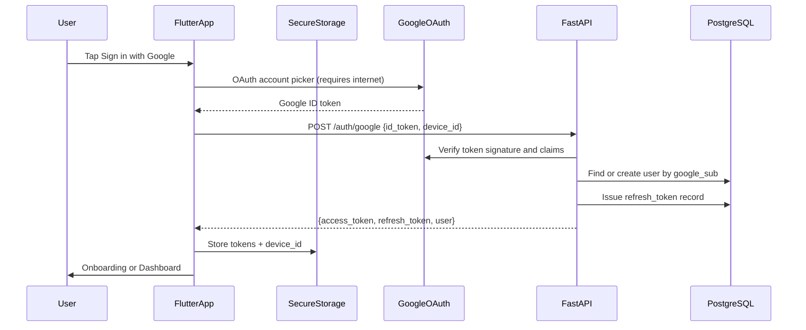
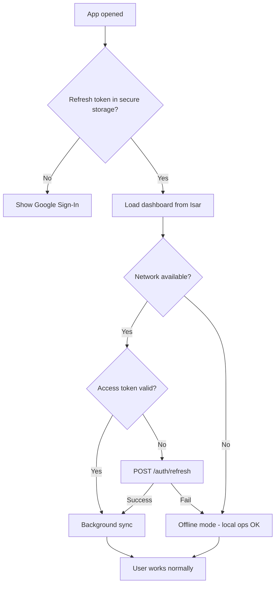
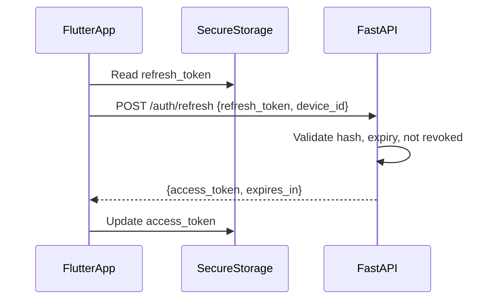
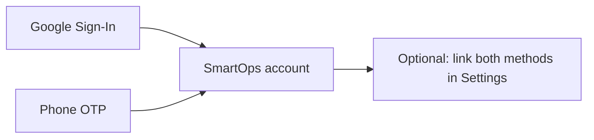

# SmartOps Authentication & Mobile Sessions

> Related docs: [Architecture](./architecture.md) · [Database Design](./database-design.md) · [Tech Stack](./tech-stack.md) · [MVP Requirements](./mvp-requirements.md)

## Overview

SmartOps MVP uses **Google Sign-In only** for authentication (zero SMS cost). Phone OTP is deferred to Phase 2. Sessions are **token-based** — not browser cookies — and designed to support the offline-first architecture.

---

## Auth Strategy by Phase

| Phase | Methods | Cost |
|---|---|---|
| MVP v1.0 | Google Sign-In only | Free |
| v2.0 | Google + Phone OTP (MSG91) | SMS per OTP |
| v3.0 | + Apple Sign-In, SSO for enterprise | Varies |

### Why Google first

- No MSG91 or SMS infrastructure cost in MVP
- No password management burden
- Familiar flow for users with Gmail/Google accounts
- Google verifies identity; backend trusts verified ID tokens

### Tradeoff

Users without a Google account cannot sign up until OTP ships in v2. Marketing should state "Sign in with Google" clearly during beta.

---

## Google Sign-In Flow



### Mobile implementation (future)

- Package: `google_sign_in` (Flutter)
- Obtain Google ID token after user selects account
- Send to backend; do **not** use Google token directly for API calls

### Backend implementation (future)

| Endpoint | Purpose |
|---|---|
| `POST /api/v1/auth/google` | Verify ID token, upsert user, return JWT pair |
| `POST /api/v1/auth/refresh` | Exchange refresh token for new access token |
| `POST /api/v1/auth/logout` | Revoke refresh token for device |

**Verification:** `google-auth` Python library validates ID token against Google's public keys. Check `aud` (client ID), `iss`, and `exp` claims.

**User identity:** Primary key for Google users is `google_sub` (stable Google user ID). Email comes from Google profile and may change; `google_sub` does not.

### Google auth request/response

**Request:**

```json
{
  "id_token": "eyJhbG...",
  "device_id": "uuid-generated-on-first-install",
  "device_name": "Rajesh's Pixel 7"
}
```

**Response:**

```json
{
  "data": {
    "access_token": "eyJhbG...",
    "refresh_token": "opaque-random-string",
    "expires_in": 900,
    "user": {
      "id": "uuid",
      "email": "owner@gmail.com",
      "full_name": "Rajesh Kumar",
      "avatar_url": "https://..."
    },
    "organizations": []
  }
}
```

---

## How Mobile Sessions Work

Mobile apps do **not** use session cookies like websites. A SmartOps session is the combination of:

1. **Access token** (JWT) — short-lived, sent on every API request
2. **Refresh token** — long-lived, used only to obtain new access tokens
3. **device_id** — UUID generated on first app install
4. **Cached context** — active organization ID, user profile in memory/Isar

### Two tokens, two jobs

| Token | Lifetime | Storage | Purpose |
|---|---|---|---|
| Access token (JWT) | 15 minutes | `flutter_secure_storage` | `Authorization: Bearer ...` on every API call |
| Refresh token (opaque) | 30 days | `flutter_secure_storage` | Silent renewal of access token; stored hashed on server |

### What is NOT the session

- Isar local database — business data, not auth
- SharedPreferences — never store tokens here
- Google ID token — used once at login, then discarded

---

## Session Lifecycle Scenarios

| Scenario | Behavior |
|---|---|
| First login | Requires internet (Google OAuth + backend exchange) |
| App reopened, online, valid access token | Instant entry; background sync may run |
| App reopened, offline, valid access token | Full offline access; sync paused |
| App reopened, offline, expired access token | **Local data still works** — expenses, attendance, etc. Sync blocked until online |
| App reopened, online, expired access token | Silent refresh via refresh token → new access token → sync resumes |
| Refresh token expired (30+ days offline) | User must sign in with Google again |
| Logout | Revoke refresh token on server; wipe secure storage and local Isar DB |
| New login on different device (MVP) | Previous device refresh token revoked (single-device policy) |

### Offline-first rule

**Business operations never stop because of auth.** Only **cloud sync** requires a valid access token. This matches the offline-first strategy in [app-details.md](./app-details.md).



---

## Secure Storage

Tokens and session metadata live in `flutter_secure_storage` only:

```
flutter_secure_storage
├── access_token
├── refresh_token
├── device_id          # UUID, generated on first install
└── active_org_id      # last selected organization
```

| Platform | Mechanism |
|---|---|
| Android | Encrypted SharedPreferences / Keystore |
| iOS | Keychain |

**Never store in:** SharedPreferences, Isar, logs, crash reports, or analytics payloads.

---

## Server-Side Session Tracking

Access tokens are **stateless** JWTs. Refresh tokens are **stateful** — stored in the `refresh_tokens` table:

| Column | Purpose |
|---|---|
| `user_id` | Owner of session |
| `device_id` | Device binding |
| `token_hash` | Hashed refresh token (never store plaintext) |
| `expires_at` | 30-day expiry |
| `revoked_at` | Set on logout or new device login |

This enables:
- Logout from current device
- Single-device MVP policy (revoke old token on new login)
- Future "active sessions" management UI

---

## Token Refresh Strategy

| Setting | Value | Rationale |
|---|---|---|
| Access token TTL | 15 minutes | Limits exposure if stolen |
| Refresh token TTL | 30 days | Supports long offline periods without re-login |
| Refresh trigger | App foreground + network available | Proactive refresh before sync |
| Offline grace | Unlimited local access while refresh token exists locally | Offline-first UX |
| Single device (MVP) | New login revokes previous device refresh token | Matches sync v1 policy |

### Refresh flow



If refresh fails (expired, revoked, network error):
- **Online + revoked/expired:** Redirect to Google Sign-In
- **Offline:** Continue local operations; show sync status "connect to sync"

---

## Logout Flow

1. Call `POST /auth/logout` with refresh token (best effort if online)
2. Server sets `revoked_at` on refresh token record
3. App clears `flutter_secure_storage`
4. App wipes Isar database (or org-scoped data)
5. Navigate to login screen

Required for shared devices (shop tablet used by multiple people).

---

## Phase 2: Adding Phone OTP

When OTP is added, users can link a phone number to an existing Google account:



- `users.phone` becomes populated via settings
- `auth_provider` records primary sign-in method
- MSG91 added for OTP delivery only in Phase 2

---

## Security Checklist

| Requirement | Implementation |
|---|---|
| TLS | HTTPS only for all API calls |
| Token storage | flutter_secure_storage only |
| Refresh token storage (server) | bcrypt/SHA-256 hash; never plaintext |
| Google token verification | Validate signature, aud, iss, exp server-side |
| Rate limiting | Limit `/auth/google` and `/auth/refresh` per IP |
| Logout | Always revoke refresh token server-side |
| JWT contents | user_id, org memberships — no sensitive business data |
| Single device (MVP) | Revoke prior refresh tokens on new login |

---

## API Endpoints Summary (MVP)

| Endpoint | Auth required | Purpose |
|---|---|---|
| `POST /api/v1/auth/google` | No | Google Sign-In |
| `POST /api/v1/auth/refresh` | No (uses refresh token body) | Renew access token |
| `POST /api/v1/auth/logout` | Yes | End session |
| All other `/api/v1/*` | Yes (Bearer access token) | Business operations |

---

## Related Documents

- [Architecture](./architecture.md) — auth integration with sync and RBAC
- [Database Design](./database-design.md) — `users`, `refresh_tokens` schema
- [Tech Stack](./tech-stack.md) — `google_sign_in`, `google-auth` packages
- [MVP Requirements](./mvp-requirements.md) — auth user stories and acceptance criteria
