# SmartOps Database Design

> Related docs: [Architecture](./architecture.md) · [Tech Stack](./tech-stack.md) · [Auth & Sessions](./auth-sessions.md) · [Local Database Migrations](./local-database-migrations.md) · [Deployment](./deployment.md) · [MVP Requirements](./mvp-requirements.md) · [Revenue Model](./revenue-model.md)

## Overview

SmartOps uses **PostgreSQL 16** (hosted on [Neon](https://neon.com) in production) as the cloud source of truth and **Isar** as the local mobile database. Both share the same logical schema. This document defines the multi-tenant data model, table definitions, relationships, indexing strategy, sync metadata, and future-ready extensions.

**Migration responsibilities:** Server schema changes use **Alembic** (deployed via CI — see [Deployment](./deployment.md)). Mobile Isar schema changes use a separate **migration runner** (see [Local Database Migrations](./local-database-migrations.md)). Both must be coordinated on every release.

**Multi-tenancy strategy:** Shared database, shared schema, row-level isolation via `organization_id` on every business table.

**Global readiness:** Organizations store `country_code`, `currency_code`, and `timezone` to support international expansion without schema changes.

---

## Entity Relationship Diagram

```mermaid
erDiagram
  users ||--o{ organization_members : "belongs to"
  organizations ||--o{ organization_members : "has"
  organizations ||--o{ branches : "has"
  organizations ||--o{ organization_settings : "configured by"
  organizations ||--o{ subscriptions : "subscribed via"

  organizations ||--o{ departments : "contains"
  organizations ||--o{ designations : "defines"
  organizations ||--o{ employees : "employs"
  employees ||--o{ employee_documents : "has"
  employees ||--o| salary_structures : "paid via"
  employees ||--o{ attendance_records : "logs"
  employees ||--o{ leave_requests : "submits"
  employees ||--o{ payroll_line_items : "receives"

  organizations ||--o{ leave_types : "defines"
  organizations ||--o{ shifts : "defines"
  organizations ||--o{ payroll_runs : "processes"
  payroll_runs ||--o{ payroll_line_items : "contains"

  organizations ||--o{ expense_categories : "defines"
  organizations ||--o{ expenses : "tracks"
  vendors ||--o{ expenses : "billed by"
  organizations ||--o{ recurring_expenses : "schedules"

  organizations ||--o{ revenue_categories : "defines"
  organizations ||--o{ revenue_entries : "records"
  customers ||--o{ revenue_entries : "generates"

  organizations ||--o{ product_categories : "defines"
  organizations ||--o{ products : "stocks"
  products ||--o{ stock_movements : "history"

  organizations ||--o{ customers : "serves"
  organizations ||--o{ vendors : "buys from"

  roles ||--o{ role_permissions : "grants"
  permissions ||--o{ role_permissions : "included in"
  organization_members }o--|| roles : "assigned"
```



---

## Conventions

### Standard Columns (All Syncable Tables)

Every business table includes:

| Column | Type | Description |
|---|---|---|
| `id` | UUID PK | Client-generated UUID (enables offline creates) |
| `organization_id` | UUID FK | Tenant isolation |
| `created_at` | TIMESTAMPTZ | Server creation time |
| `updated_at` | TIMESTAMPTZ | Last server modification |
| `deleted_at` | TIMESTAMPTZ NULL | Soft delete; NULL = active |
| `version` | INTEGER DEFAULT 1 | Incremented on each update; used in conflict detection |
| `created_by` | UUID FK → users | User who created the record |
| `updated_by` | UUID FK → users NULL | User who last modified |

### Naming Conventions

- Tables: plural snake_case (`expense_categories`)
- Primary keys: `id` (UUID)
- Foreign keys: `{entity}_id`
- Enums: PostgreSQL native ENUM types
- Monetary values: `NUMERIC(15, 2)` — never FLOAT
- Dates: `DATE` for business dates; `TIMESTAMPTZ` for audit timestamps

### Isar Local Schema

Isar collections mirror PostgreSQL tables with additional client-only fields. Schema changes on the mobile side are managed independently via the migration runner — see [Local Database Migrations](./local-database-migrations.md).

| Client-only field | Type | Purpose |
|---|---|---|
| `sync_status` | enum | `pending`, `synced`, `conflict` |
| `client_updated_at` | DateTime | LWW conflict resolution |
| `local_id` | int | Isar auto-increment (internal) |

---

## Identity & Access

### users

| Column | Type | Constraints | Description |
|---|---|---|---|
| id | UUID | PK | |
| google_sub | VARCHAR(255) | UNIQUE NULL | Stable Google user ID; primary identity for MVP |
| email | VARCHAR(255) | UNIQUE NOT NULL | From Google profile (MVP); required for sign-in |
| phone | VARCHAR(15) | UNIQUE NULL | E.164 format (+91...); populated in Phase 2 via OTP linking |
| password_hash | VARCHAR(255) | NULL | Reserved for future email/password auth |
| auth_provider | auth_provider | DEFAULT 'google' | Primary sign-in method: google, otp |
| full_name | VARCHAR(255) | NOT NULL | From Google profile or user input |
| avatar_url | VARCHAR(500) | NULL | From Google profile or S3 key |
| is_active | BOOLEAN | DEFAULT true | |
| last_login_at | TIMESTAMPTZ | NULL | |
| created_at | TIMESTAMPTZ | NOT NULL | |
| updated_at | TIMESTAMPTZ | NOT NULL | |

> MVP constraint: `google_sub` is required for new users (Google Sign-In only). `phone` is NULL until Phase 2 OTP linking.

### user_preferences

| Column | Type | Constraints | Description |
|---|---|---|---|
| id | UUID | PK | |
| user_id | UUID | FK → users, UNIQUE | |
| language | VARCHAR(10) | DEFAULT 'en' | ISO 639-1 (en, hi) |
| timezone | VARCHAR(50) | DEFAULT 'Asia/Kolkata' | IANA timezone |
| notification_language | VARCHAR(10) | DEFAULT 'en' | Phase 2 |
| created_at | TIMESTAMPTZ | NOT NULL | |
| updated_at | TIMESTAMPTZ | NOT NULL | |

### organizations

| Column | Type | Constraints | Description |
|---|---|---|---|
| id | UUID | PK | |
| name | VARCHAR(255) | NOT NULL | Business name |
| slug | VARCHAR(100) | UNIQUE | URL-safe identifier |
| business_type | VARCHAR(50) | NULL | retail, manufacturing, service, etc. |
| country_code | CHAR(2) | DEFAULT 'IN' | ISO 3166-1 alpha-2 |
| currency_code | CHAR(3) | DEFAULT 'INR' | ISO 4217 |
| timezone | VARCHAR(50) | DEFAULT 'Asia/Kolkata' | |
| address | TEXT | NULL | |
| city | VARCHAR(100) | NULL | |
| state | VARCHAR(100) | NULL | |
| pincode | VARCHAR(10) | NULL | |
| phone | VARCHAR(15) | NULL | Business phone |
| email | VARCHAR(255) | NULL | Business email |
| logo_url | VARCHAR(500) | NULL | S3 key |
| gstin | VARCHAR(15) | NULL | India GST — used Phase 2 |
| pan | VARCHAR(10) | NULL | India PAN — used Phase 2 |
| default_language | VARCHAR(10) | DEFAULT 'en' | Company UI default |
| is_active | BOOLEAN | DEFAULT true | |
| created_at | TIMESTAMPTZ | NOT NULL | |
| updated_at | TIMESTAMPTZ | NOT NULL | |
| deleted_at | TIMESTAMPTZ | NULL | |
| version | INTEGER | DEFAULT 1 | |

### branches

| Column | Type | Constraints | Description |
|---|---|---|---|
| id | UUID | PK | |
| organization_id | UUID | FK → organizations | |
| name | VARCHAR(255) | NOT NULL | Branch/location name |
| address | TEXT | NULL | |
| city | VARCHAR(100) | NULL | |
| is_primary | BOOLEAN | DEFAULT false | |
| is_active | BOOLEAN | DEFAULT true | |
| + standard sync columns | | | |

> MVP: Single implicit primary branch created on org setup. Multi-branch UI in v2.

### roles

| Column | Type | Constraints | Description |
|---|---|---|---|
| id | UUID | PK | |
| name | VARCHAR(50) | UNIQUE NOT NULL | owner, manager, employee |
| description | TEXT | NULL | |
| is_system | BOOLEAN | DEFAULT true | System roles cannot be deleted |

**Seed data:** `owner`, `manager`, `employee`

### permissions

| Column | Type | Constraints | Description |
|---|---|---|---|
| id | UUID | PK | |
| code | VARCHAR(100) | UNIQUE NOT NULL | e.g. `expenses.create` |
| module | VARCHAR(50) | NOT NULL | expenses, payroll, etc. |
| description | TEXT | NULL | |

### role_permissions

| Column | Type | Constraints | Description |
|---|---|---|---|
| role_id | UUID | FK → roles | |
| permission_id | UUID | FK → permissions | |
| | | PK (role_id, permission_id) | |

### organization_members

| Column | Type | Constraints | Description |
|---|---|---|---|
| id | UUID | PK | |
| organization_id | UUID | FK → organizations | |
| user_id | UUID | FK → users | |
| role_id | UUID | FK → roles | |
| employee_id | UUID | FK → employees NULL | Link to employee profile if applicable |
| is_active | BOOLEAN | DEFAULT true | |
| invited_at | TIMESTAMPTZ | NULL | |
| joined_at | TIMESTAMPTZ | NULL | |
| + standard sync columns | | | |

**Unique constraint:** `(organization_id, user_id)`

### user_auth_providers (Phase 2 — optional)

Links multiple auth methods to one SmartOps account when OTP is added.

| Column | Type | Description |
|---|---|---|
| id | UUID PK | |
| user_id | UUID FK → users | |
| provider | auth_provider NOT NULL | google, otp |
| provider_user_id | VARCHAR(255) NOT NULL | google_sub or phone number |
| linked_at | TIMESTAMPTZ NOT NULL | |
| created_at | TIMESTAMPTZ NOT NULL | |

**Unique constraint:** `(provider, provider_user_id)`

### refresh_tokens

| Column | Type | Constraints | Description |
|---|---|---|---|
| id | UUID | PK | |
| user_id | UUID | FK → users | |
| token_hash | VARCHAR(255) | NOT NULL | Hashed opaque token |
| device_id | UUID | NOT NULL | Bound to mobile device |
| device_name | VARCHAR(100) | NULL | |
| expires_at | TIMESTAMPTZ | NOT NULL | |
| revoked_at | TIMESTAMPTZ | NULL | |
| created_at | TIMESTAMPTZ | NOT NULL | |

---

## Employee Management

### departments

| Column | Type | Description |
|---|---|---|
| id | UUID PK | |
| organization_id | UUID FK | |
| name | VARCHAR(100) NOT NULL | |
| description | TEXT NULL | |
| + standard sync columns | | |

### designations

| Column | Type | Description |
|---|---|---|
| id | UUID PK | |
| organization_id | UUID FK | |
| name | VARCHAR(100) NOT NULL | e.g. Sales Manager |
| + standard sync columns | | |

### employees

| Column | Type | Constraints | Description |
|---|---|---|---|
| id | UUID | PK | |
| organization_id | UUID | FK → organizations | |
| branch_id | UUID | FK → branches NULL | Phase 2 multi-branch |
| employee_code | VARCHAR(20) | NULL | Internal ID (EMP001) |
| full_name | VARCHAR(255) | NOT NULL | |
| phone | VARCHAR(15) | NULL | |
| email | VARCHAR(255) | NULL | |
| date_of_birth | DATE | NULL | |
| gender | employee_gender | NULL | ENUM: male, female, other |
| address | TEXT | NULL | |
| department_id | UUID | FK → departments NULL | |
| designation_id | UUID | FK → designations NULL | |
| joining_date | DATE | NOT NULL | |
| leaving_date | DATE | NULL | Set on termination |
| employment_status | employment_status | DEFAULT 'active' | ENUM: active, inactive, terminated |
| emergency_contact_name | VARCHAR(255) | NULL | |
| emergency_contact_phone | VARCHAR(15) | NULL | |
| notes | TEXT | NULL | |
| + standard sync columns | | | |

**Indexes:**
- `(organization_id, employment_status)` WHERE deleted_at IS NULL
- `(organization_id, full_name)` — for search

### employee_documents

| Column | Type | Description |
|---|---|---|
| id | UUID PK | |
| organization_id | UUID FK | |
| employee_id | UUID FK → employees | |
| document_type | document_type ENUM | aadhaar, pan, contract, other |
| file_key | VARCHAR(500) NOT NULL | S3 object key |
| file_name | VARCHAR(255) NOT NULL | Original filename |
| file_size_bytes | INTEGER | |
| + standard sync columns | | |

---

## Attendance

### shifts

| Column | Type | Description |
|---|---|---|
| id | UUID PK | |
| organization_id | UUID FK | |
| name | VARCHAR(100) NOT NULL | Morning, Evening, Night |
| start_time | TIME NOT NULL | |
| end_time | TIME NOT NULL | |
| is_default | BOOLEAN DEFAULT false | |
| + standard sync columns | | |

### leave_types

| Column | Type | Description |
|---|---|---|
| id | UUID PK | |
| organization_id | UUID FK | |
| name | VARCHAR(100) NOT NULL | Casual, Sick, Paid |
| days_allowed_per_year | INTEGER DEFAULT 0 | 0 = unlimited |
| is_paid | BOOLEAN DEFAULT true | |
| + standard sync columns | | |

### attendance_records

| Column | Type | Constraints | Description |
|---|---|---|---|
| id | UUID | PK | |
| organization_id | UUID | FK | |
| employee_id | UUID | FK → employees | |
| date | DATE | NOT NULL | Business date |
| status | attendance_status | NOT NULL | ENUM: present, absent, half_day, on_leave |
| check_in_time | TIMESTAMPTZ | NULL | |
| check_out_time | TIMESTAMPTZ | NULL | |
| shift_id | UUID | FK → shifts NULL | |
| notes | TEXT | NULL | |
| latitude | NUMERIC(10,7) | NULL | GPS — Phase 2 |
| longitude | NUMERIC(10,7) | NULL | GPS — Phase 2 |
| + standard sync columns | | | |

**Unique constraint:** `(organization_id, employee_id, date)`

**Indexes:**
- `(organization_id, date)` WHERE deleted_at IS NULL
- `(organization_id, employee_id, date DESC)`

### leave_requests

| Column | Type | Description |
|---|---|---|
| id | UUID PK | |
| organization_id | UUID FK | |
| employee_id | UUID FK → employees | |
| leave_type_id | UUID FK → leave_types | |
| start_date | DATE NOT NULL | |
| end_date | DATE NOT NULL | |
| reason | TEXT NULL | |
| status | leave_status ENUM | pending, approved, rejected |
| reviewed_by | UUID FK → users NULL | |
| reviewed_at | TIMESTAMPTZ NULL | |
| + standard sync columns | | |

---

## Payroll

### salary_structures

| Column | Type | Constraints | Description |
|---|---|---|---|
| id | UUID | PK | |
| organization_id | UUID | FK | |
| employee_id | UUID | FK → employees, UNIQUE | One active structure per employee |
| base_salary | NUMERIC(15,2) | NOT NULL | Monthly base (encrypted at app layer) |
| hra | NUMERIC(15,2) | DEFAULT 0 | House rent allowance |
| transport_allowance | NUMERIC(15,2) | DEFAULT 0 | |
| other_allowances | NUMERIC(15,2) | DEFAULT 0 | |
| pf_deduction | NUMERIC(15,2) | DEFAULT 0 | Manual entry MVP |
| esi_deduction | NUMERIC(15,2) | DEFAULT 0 | Manual entry MVP |
| tax_deduction | NUMERIC(15,2) | DEFAULT 0 | TDS |
| other_deductions | NUMERIC(15,2) | DEFAULT 0 | |
| effective_from | DATE | NOT NULL | |
| effective_to | DATE | NULL | NULL = current |
| + standard sync columns | | | |

> Conflict resolution: role priority applies to `base_salary` and all deduction fields.

### payroll_runs

| Column | Type | Constraints | Description |
|---|---|---|---|
| id | UUID | PK | |
| organization_id | UUID | FK | |
| period_start | DATE | NOT NULL | e.g. 2026-06-01 |
| period_end | DATE | NOT NULL | e.g. 2026-06-30 |
| status | payroll_status | DEFAULT 'draft' | ENUM: draft, processed, paid |
| total_gross | NUMERIC(15,2) | DEFAULT 0 | Computed on process |
| total_deductions | NUMERIC(15,2) | DEFAULT 0 | |
| total_net | NUMERIC(15,2) | DEFAULT 0 | |
| processed_at | TIMESTAMPTZ | NULL | |
| processed_by | UUID | FK → users NULL | |
| notes | TEXT | NULL | |
| + standard sync columns | | | |

**Rule:** Records with `status = 'paid'` are immutable (server rejects updates).

### payroll_line_items

| Column | Type | Description |
|---|---|---|
| id | UUID PK | |
| organization_id | UUID FK | |
| payroll_run_id | UUID FK → payroll_runs | |
| employee_id | UUID FK → employees | |
| base_salary | NUMERIC(15,2) | Snapshot at processing time |
| total_allowances | NUMERIC(15,2) | |
| total_deductions | NUMERIC(15,2) | |
| overtime_amount | NUMERIC(15,2) DEFAULT 0 | |
| bonus_amount | NUMERIC(15,2) DEFAULT 0 | |
| net_salary | NUMERIC(15,2) | |
| days_worked | NUMERIC(4,1) | |
| days_absent | NUMERIC(4,1) | |
| payslip_file_key | VARCHAR(500) NULL | Generated PDF S3 key |
| + standard sync columns | | |

**Unique constraint:** `(payroll_run_id, employee_id)`

---

## Finance — Expenses

### expense_categories

| Column | Type | Description |
|---|---|---|
| id | UUID PK | |
| organization_id | UUID FK | |
| name | VARCHAR(100) NOT NULL | Electricity, Rent, Raw Materials |
| color | VARCHAR(7) NULL | Hex color for UI |
| is_default | BOOLEAN DEFAULT false | System-seeded categories |
| + standard sync columns | | |

**Default seed per org:** Utilities, Rent, Salaries, Raw Materials, Transport, Maintenance, Other

### expenses

| Column | Type | Constraints | Description |
|---|---|---|---|
| id | UUID | PK | |
| organization_id | UUID | FK | |
| branch_id | UUID | FK → branches NULL | |
| category_id | UUID | FK → expense_categories | |
| vendor_id | UUID | FK → vendors NULL | |
| amount | NUMERIC(15,2) | NOT NULL, CHECK > 0 | |
| currency_code | CHAR(3) | DEFAULT 'INR' | |
| expense_date | DATE | NOT NULL | |
| description | TEXT | NULL | |
| payment_method | payment_method | NULL | ENUM: cash, upi, bank, card, other |
| reference_number | VARCHAR(100) | NULL | Invoice/receipt number |
| attachment_key | VARCHAR(500) | NULL | S3 invoice photo |
| is_recurring | BOOLEAN | DEFAULT false | |
| recurring_expense_id | UUID | FK NULL | Link to recurring template |
| + standard sync columns | | | |

**Indexes:**
- `(organization_id, expense_date DESC)` WHERE deleted_at IS NULL
- `(organization_id, category_id, expense_date)`

### recurring_expenses

| Column | Type | Description |
|---|---|---|
| id | UUID PK | |
| organization_id | UUID FK | |
| category_id | UUID FK → expense_categories | |
| vendor_id | UUID FK → vendors NULL | |
| amount | NUMERIC(15,2) | |
| frequency | recurrence_frequency ENUM | daily, weekly, monthly, yearly |
| next_due_date | DATE | |
| description | TEXT NULL | |
| is_active | BOOLEAN DEFAULT true | |
| + standard sync columns | | |

---

## Finance — Revenue

### revenue_categories

| Column | Type | Description |
|---|---|---|
| id | UUID PK | |
| organization_id | UUID FK | |
| name | VARCHAR(100) NOT NULL | Product Sales, Service Income, Other |
| + standard sync columns | | |

### revenue_entries

| Column | Type | Constraints | Description |
|---|---|---|---|
| id | UUID | PK | |
| organization_id | UUID | FK | |
| branch_id | UUID | FK → branches NULL | |
| category_id | UUID | FK → revenue_categories | |
| customer_id | UUID | FK → customers NULL | |
| amount | NUMERIC(15,2) | NOT NULL, CHECK > 0 | |
| currency_code | CHAR(3) | DEFAULT 'INR' | |
| revenue_date | DATE | NOT NULL | |
| description | TEXT | NULL | |
| payment_method | payment_method | NULL | |
| reference_number | VARCHAR(100) | NULL | |
| + standard sync columns | | | |

**Indexes:**
- `(organization_id, revenue_date DESC)` WHERE deleted_at IS NULL
- `(organization_id, customer_id, revenue_date)`

---

## Inventory

### units_of_measure

| Column | Type | Description |
|---|---|---|
| id | UUID PK | |
| organization_id | UUID FK | |
| name | VARCHAR(50) NOT NULL | Pieces, Kg, Liters, Boxes |
| abbreviation | VARCHAR(10) NOT NULL | pcs, kg, l, box |
| + standard sync columns | | |

### product_categories

| Column | Type | Description |
|---|---|---|
| id | UUID PK | |
| organization_id | UUID FK | |
| name | VARCHAR(100) NOT NULL | |
| + standard sync columns | | |

### products

| Column | Type | Constraints | Description |
|---|---|---|---|
| id | UUID | PK | |
| organization_id | UUID | FK | |
| category_id | UUID | FK → product_categories NULL | |
| name | VARCHAR(255) | NOT NULL | |
| sku | VARCHAR(50) | NULL | Stock keeping unit |
| barcode | VARCHAR(100) | NULL | Phase 2 scanning |
| qr_code | VARCHAR(500) | NULL | Phase 2 |
| unit_id | UUID | FK → units_of_measure | |
| current_stock | NUMERIC(12,3) | DEFAULT 0 | Denormalized for fast reads |
| low_stock_threshold | NUMERIC(12,3) | DEFAULT 0 | Alert when stock <= threshold |
| cost_price | NUMERIC(15,2) | NULL | Purchase cost |
| selling_price | NUMERIC(15,2) | NULL | |
| description | TEXT | NULL | |
| is_active | BOOLEAN | DEFAULT true | |
| + standard sync columns | | | |

**Indexes:**
- `(organization_id, name)` WHERE deleted_at IS NULL
- `(organization_id, current_stock)` WHERE current_stock <= low_stock_threshold — low stock alert

### stock_movements

| Column | Type | Constraints | Description |
|---|---|---|---|
| id | UUID | PK | |
| organization_id | UUID | FK | |
| product_id | UUID | FK → products | |
| movement_type | stock_movement_type | NOT NULL | ENUM: in, out, adjustment |
| quantity | NUMERIC(12,3) | NOT NULL, CHECK > 0 | |
| reference_type | VARCHAR(50) | NULL | purchase, sale, manual |
| reference_id | UUID | NULL | Link to expense/revenue entry |
| notes | TEXT | NULL | |
| movement_date | DATE | NOT NULL | |
| + standard sync columns | | | |

> `products.current_stock` updated transactionally when stock_movements are inserted.

---

## CRM

### customers

| Column | Type | Constraints | Description |
|---|---|---|---|
| id | UUID | PK | |
| organization_id | UUID | FK | |
| name | VARCHAR(255) | NOT NULL | |
| phone | VARCHAR(15) | NULL | |
| email | VARCHAR(255) | NULL | |
| address | TEXT | NULL | |
| gstin | VARCHAR(15) | NULL | Phase 2 invoicing |
| outstanding_balance | NUMERIC(15,2) | DEFAULT 0 | Denormalized; updated on transactions |
| notes | TEXT | NULL | |
| + standard sync columns | | | |

### vendors

| Column | Type | Constraints | Description |
|---|---|---|---|
| id | UUID | PK | |
| organization_id | UUID | FK | |
| name | VARCHAR(255) | NOT NULL | |
| phone | VARCHAR(15) | NULL | |
| email | VARCHAR(255) | NULL | |
| address | TEXT | NULL | |
| gstin | VARCHAR(15) | NULL | |
| outstanding_balance | NUMERIC(15,2) | DEFAULT 0 | Amount owed to vendor |
| notes | TEXT | NULL | |
| + standard sync columns | | | |

---

## Organization Settings

### organization_settings

| Column | Type | Description |
|---|---|---|
| id | UUID PK | |
| organization_id | UUID FK UNIQUE | |
| fiscal_year_start_month | INTEGER DEFAULT 4 | April for India |
| payroll_day | INTEGER DEFAULT 1 | Day of month for payroll |
| attendance_mode | attendance_mode ENUM | manual, check_in_out |
| low_stock_alert_enabled | BOOLEAN DEFAULT true | |
| + standard sync columns | | |

---

## Sync & Audit

### sync_cursors

Tracks last successful sync per device per organization.

| Column | Type | Description |
|---|---|---|
| id | UUID PK | |
| user_id | UUID FK → users | |
| organization_id | UUID FK → organizations | |
| device_id | UUID NOT NULL | |
| last_pull_at | TIMESTAMPTZ | Last successful pull timestamp |
| last_push_at | TIMESTAMPTZ | Last successful push timestamp |
| last_server_timestamp | TIMESTAMPTZ | Server clock at last sync |

**Unique constraint:** `(user_id, organization_id, device_id)`

### audit_logs

Immutable log for financial and payroll mutations.

| Column | Type | Description |
|---|---|---|
| id | UUID PK | |
| organization_id | UUID FK | |
| user_id | UUID FK → users | |
| entity_type | VARCHAR(50) NOT NULL | expenses, payroll_runs, etc. |
| entity_id | UUID NOT NULL | |
| action | audit_action ENUM | create, update, delete, process, pay |
| old_values | JSONB | NULL | Previous state |
| new_values | JSONB | NULL | New state |
| ip_address | INET | NULL | |
| created_at | TIMESTAMPTZ NOT NULL | |

> No soft delete on audit_logs — append-only.

---

## Billing (Phase 1.5)

### subscription_plans

| Column | Type | Description |
|---|---|---|
| id | UUID PK | |
| code | VARCHAR(50) UNIQUE | free, starter, growth, business |
| name | VARCHAR(100) | |
| price_monthly_inr | NUMERIC(10,2) | |
| price_yearly_inr | NUMERIC(10,2) | |
| max_employees | INTEGER | |
| max_users | INTEGER | |
| max_organizations | INTEGER DEFAULT 1 | |
| features | JSONB | Feature flag list |
| is_active | BOOLEAN DEFAULT true | |

### subscriptions

| Column | Type | Description |
|---|---|---|
| id | UUID PK | |
| organization_id | UUID FK UNIQUE | One active sub per org |
| plan_id | UUID FK → subscription_plans | |
| status | subscription_status ENUM | active, cancelled, past_due, trialing |
| razorpay_subscription_id | VARCHAR(100) NULL | |
| current_period_start | TIMESTAMPTZ | |
| current_period_end | TIMESTAMPTZ | |
| cancelled_at | TIMESTAMPTZ NULL | |
| created_at | TIMESTAMPTZ | |
| updated_at | TIMESTAMPTZ | |

---

## Future Tables (Designed, Not Built in MVP)

| Table | Phase | Purpose |
|---|---|---|
| `notification_preferences` | v2 | Push/email opt-in per user |
| `notification_queue` | v2 | Outbound notification jobs |
| `tasks` | v2 | Task management module |
| `task_assignments` | v2 | Task-to-employee mapping |
| `ai_insights` | v3 | Cached AI-generated business insights |
| `ai_conversations` | v3 | AI assistant chat history |
| `gst_returns` | v2 | GST filing records |
| `invoices` | v2 | Customer invoicing |
| `webhook_events` | v3 | API webhook delivery log |

---

## PostgreSQL ENUM Types

```sql
CREATE TYPE auth_provider AS ENUM ('google', 'otp');
CREATE TYPE employment_status AS ENUM ('active', 'inactive', 'terminated');
CREATE TYPE employee_gender AS ENUM ('male', 'female', 'other');
CREATE TYPE document_type AS ENUM ('aadhaar', 'pan', 'contract', 'other');
CREATE TYPE attendance_status AS ENUM ('present', 'absent', 'half_day', 'on_leave');
CREATE TYPE leave_status AS ENUM ('pending', 'approved', 'rejected');
CREATE TYPE payroll_status AS ENUM ('draft', 'processed', 'paid');
CREATE TYPE payment_method AS ENUM ('cash', 'upi', 'bank', 'card', 'other');
CREATE TYPE recurrence_frequency AS ENUM ('daily', 'weekly', 'monthly', 'yearly');
CREATE TYPE stock_movement_type AS ENUM ('in', 'out', 'adjustment');
CREATE TYPE attendance_mode AS ENUM ('manual', 'check_in_out');
CREATE TYPE audit_action AS ENUM ('create', 'update', 'delete', 'process', 'pay');
CREATE TYPE subscription_status AS ENUM ('active', 'cancelled', 'past_due', 'trialing');
```

---

## Indexing Strategy

### Primary Indexes (MVP)

```sql
-- Tenant + date range queries (most common pattern)
CREATE INDEX idx_expenses_org_date ON expenses (organization_id, expense_date DESC)
  WHERE deleted_at IS NULL;

CREATE INDEX idx_revenue_org_date ON revenue_entries (organization_id, revenue_date DESC)
  WHERE deleted_at IS NULL;

CREATE INDEX idx_attendance_org_date ON attendance_records (organization_id, date DESC)
  WHERE deleted_at IS NULL;

CREATE INDEX idx_attendance_employee_date ON attendance_records (organization_id, employee_id, date DESC);

CREATE INDEX idx_employees_org_status ON employees (organization_id, employment_status)
  WHERE deleted_at IS NULL;

CREATE INDEX idx_products_low_stock ON products (organization_id)
  WHERE current_stock <= low_stock_threshold AND deleted_at IS NULL;

-- Sync pull query: all changes since timestamp per org
CREATE INDEX idx_expenses_org_updated ON expenses (organization_id, updated_at);
CREATE INDEX idx_revenue_org_updated ON revenue_entries (organization_id, updated_at);
-- (repeat for all syncable tables)
```

### Phase 2 Indexes

```sql
-- Full-text search
CREATE INDEX idx_employees_search ON employees
  USING gin(to_tsvector('english', full_name));

CREATE INDEX idx_customers_search ON customers
  USING gin(to_tsvector('english', name));
```

---

## Sample Dashboard Queries

### Monthly P&L

```sql
SELECT
  COALESCE(SUM(r.amount), 0) AS total_revenue,
  COALESCE(SUM(e.amount), 0) AS total_expenses,
  COALESCE(SUM(r.amount), 0) - COALESCE(SUM(e.amount), 0) AS net_profit
FROM organizations o
LEFT JOIN revenue_entries r
  ON r.organization_id = o.id
  AND r.revenue_date BETWEEN :start AND :end
  AND r.deleted_at IS NULL
LEFT JOIN expenses e
  ON e.organization_id = o.id
  AND e.expense_date BETWEEN :start AND :end
  AND e.deleted_at IS NULL
WHERE o.id = :org_id;
```

### Today's Attendance Summary

```sql
SELECT
  status,
  COUNT(*) AS count
FROM attendance_records
WHERE organization_id = :org_id
  AND date = CURRENT_DATE
  AND deleted_at IS NULL
GROUP BY status;
```

### Outstanding Balances

```sql
SELECT
  SUM(outstanding_balance) AS total_receivable
FROM customers
WHERE organization_id = :org_id AND deleted_at IS NULL AND outstanding_balance > 0;

SELECT
  SUM(outstanding_balance) AS total_payable
FROM vendors
WHERE organization_id = :org_id AND deleted_at IS NULL AND outstanding_balance > 0;
```

---

## Migration Strategy

- **Tool:** Alembic (Python)
- **Naming:** `{revision}_{description}.py` (e.g. `001_initial_schema.py`)
- **Rules:**
  - Forward-only migrations; never edit applied migrations
  - All schema changes via migrations; no manual DDL in production
  - Seed data (roles, permissions, default categories) in separate seed migration
  - Destructive changes require a data migration step before column drop

### Migration Order (MVP)

1. `001` — ENUM types (including auth_provider), users, user_preferences
2. `002` — organizations, branches, roles, permissions, role_permissions, organization_members
3. `003` — employees, departments, designations, employee_documents
4. `004` — attendance (shifts, leave_types, attendance_records, leave_requests)
5. `005` — payroll (salary_structures, payroll_runs, payroll_line_items)
6. `006` — finance (expense_categories, expenses, recurring_expenses, revenue_categories, revenue_entries)
7. `007` — inventory (units_of_measure, product_categories, products, stock_movements)
8. `008` — CRM (customers, vendors)
9. `009` — organization_settings, sync_cursors, audit_logs, refresh_tokens
10. `010` — subscription_plans, subscriptions (Phase 1.5)
11. `011` — Seed: roles, permissions, role_permissions, default subscription plans
12. `012` — user_auth_providers (Phase 2, when OTP is added)

---

## Data Isolation & Security

### Application-Level (MVP)

Every SQLAlchemy query includes `organization_id` filter via dependency injection. No query runs without tenant context.

### Row-Level Security (Phase 2)

```sql
ALTER TABLE expenses ENABLE ROW LEVEL SECURITY;

CREATE POLICY expenses_tenant_isolation ON expenses
  USING (organization_id = current_setting('app.current_org_id')::uuid);
```

Set `app.current_org_id` at connection level per request.

---

## Related Documents

- [Architecture](./architecture.md) — sync engine, API design
- [Tech Stack](./tech-stack.md) — PostgreSQL version, Alembic
- [Auth & Sessions](./auth-sessions.md) — Google Sign-In flow, token lifecycle
- [Local Database Migrations](./local-database-migrations.md) — Isar schema updates on app upgrade
- [Deployment](./deployment.md) — Alembic migrations in CI, Neon setup
- [Revenue Model](./revenue-model.md) — subscription_plans seed data
- [MVP Requirements](./mvp-requirements.md) — feature scope driving schema
