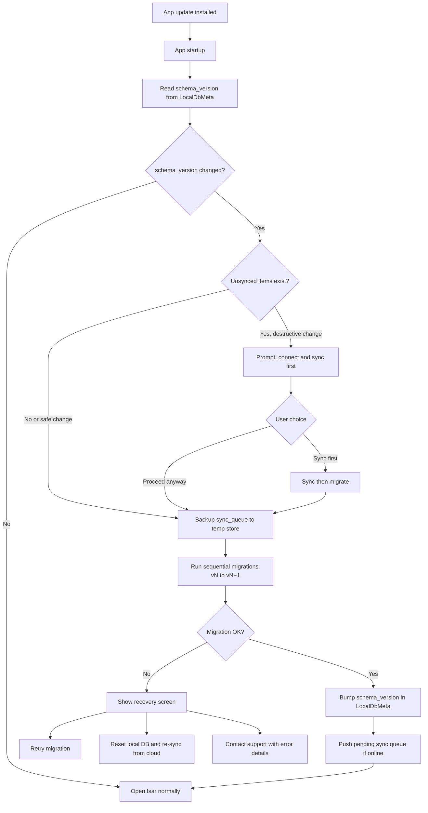
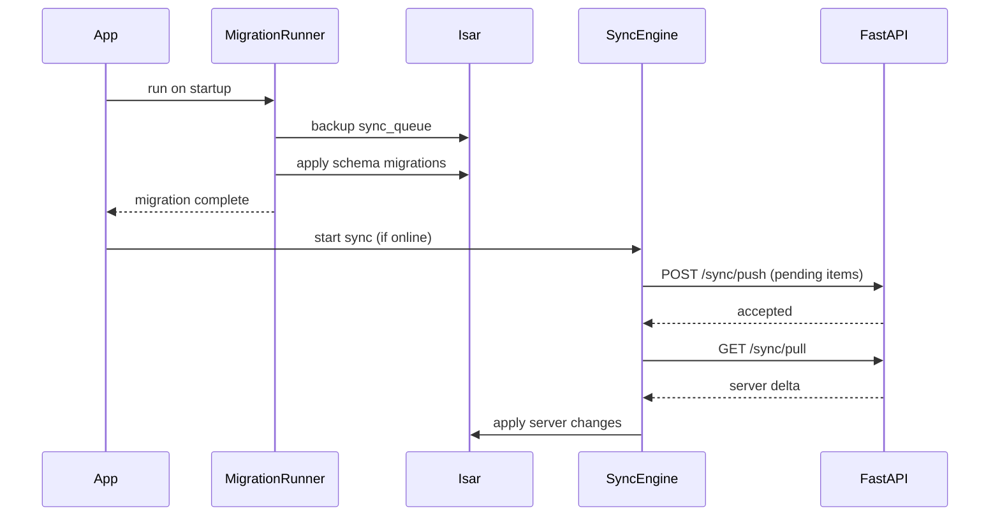

# SmartOps Local Database Migrations

> Related docs: [Architecture](./architecture.md) · [Database Design](./database-design.md) · [API Versioning](./api-versioning.md) · [Deployment](./deployment.md) · [MVP Requirements](./mvp-requirements.md)

## Overview

SmartOps stores business data locally in **Isar** for offline-first operation and in **PostgreSQL (Neon)** as the cloud source of truth. When users update the mobile app, the local schema may change. This document defines how app updates affect existing user data, how migrations run safely, and how to recover from failures.

**Core principle:** Cloud PostgreSQL is the source of truth for synced data. Local Isar is a cache plus offline write buffer. The highest-risk data during an app update is **unsynced pending changes** — not data already synced to the server.

---

## What Must Be Protected During App Updates

| Asset | Storage | Risk if lost |
|---|---|---|
| Unsynced business records | Isar (`sync_status = pending`) | **High** — offline work gone forever |
| Sync queue | Isar `sync_queue` collection | **High** — pending uploads lost |
| Synced business data | Isar (mirror of server) | **Low** — recoverable via cloud re-pull |
| Auth session | `flutter_secure_storage` | **Separate** — not affected by Isar migrations |
| User preferences (language) | Isar or secure storage | Medium — can be re-set |

---

## Migration Responsibilities

| Layer | Tool | When it runs |
|---|---|---|
| Cloud database | Alembic (Python) | Server deploy / CI pipeline |
| Local mobile database | Isar migration runner (Dart) | Every app cold start, before feature code |

Server and client schemas mirror each other logically but **migrate independently**. Releases must coordinate both sides. See [Release Coordination](#release-coordination-server--client) below.

---

## App Update Flow



---

## Schema Version Tracking

### LocalDbMeta collection

A dedicated Isar collection stores migration metadata:

| Field | Type | Purpose |
|---|---|---|
| `id` | int | Fixed ID = 1 (singleton) |
| `schema_version` | int | Current local schema version (integer, not semver) |
| `app_version` | String | App version from `package_info` (e.g. `1.2.0`) |
| `last_migration_at` | DateTime | Timestamp of last successful migration |
| `last_migration_from` | int | Previous schema version (audit) |

**Version numbering:** Increment `schema_version` by 1 for every Isar schema change that requires a migration. Map to app releases in release notes (e.g. app v1.2.0 = schema v3).

### Folder structure (future implementation)

```
mobile/lib/core/database/
  isar_service.dart
  migrations/
    migration_runner.dart
    migration.dart              # abstract base class
    migrations/
      migration_v1_to_v2.dart
      migration_v2_to_v3.dart
```

### Migration runner (conceptual)

```dart
// Conceptual — not production code
class MigrationRunner {
  static const currentSchemaVersion = 3;

  Future<void> run(Isar isar) async {
    final meta = await isar.localDbMetas.get(1);
    final fromVersion = meta?.schemaVersion ?? 0;

    if (fromVersion == currentSchemaVersion) return;

    // Block sync during migration
    for (var v = fromVersion; v < currentSchemaVersion; v++) {
      await _migrations[v].migrate(isar);
    }

    await isar.writeTxn(() async {
      await isar.localDbMetas.put(LocalDbMeta(
        id: 1,
        schemaVersion: currentSchemaVersion,
        lastMigrationAt: DateTime.now(),
        lastMigrationFrom: fromVersion,
      ));
    });
  }
}
```

---

## Types of Schema Changes

| Change type | User data impact | Strategy |
|---|---|---|
| Add optional field with default | None | Isar handles automatically; bump version for tracking |
| Add required field | Existing rows need default | Migration sets default on all existing records |
| Rename field | Data appears missing if not migrated | Use `@Name('old_name')` or copy data in migration |
| Remove field | Local field data dropped | Safe if synced; server re-pull restores entity |
| Change field type (int → String) | Read failures possible | Custom migration with conversion logic |
| Add new collection | None | Empty collection created on open |
| Remove collection | All local data in collection lost | Only after sync confirmed; warn if pending items |
| Index change | None | Automatic |
| Split one collection into two | High | Custom migration; test thoroughly |

### Prefer additive changes

For MVP and early releases, prefer:
- New **optional** fields with defaults
- New collections instead of restructuring existing ones
- Nullable fields on server (PostgreSQL) matching optional Isar fields

Avoid renames and type changes unless absolutely necessary.

---

## Sync Interaction

### Rules during migration

1. **Block sync** until migration completes successfully
2. **Backup `sync_queue`** to a JSON temp file before any destructive migration step
3. **After migration:** push pending queue **before** pull (preserve offline writes)
4. **Never** run feature code (expense forms, attendance) until migration succeeds

### Migration + sync sequence



---

## Release Coordination (Server + Client)

| Server change (Alembic) | Client change (Isar) | Deploy order |
|---|---|---|
| Add nullable column | Add optional field | Either order — safe |
| Add required column with default | Add required field + migration | **Server first**, then client |
| Rename column | Rename with data migration | Together, or server accepts both names temporarily |
| Remove column | Remove field | **Client first** (stop sending field), then server |
| Breaking API change | — | Bump API version; see [API Versioning](./api-versioning.md) |

### Client version headers (API coordination)

Mobile sends these headers on every API request (including sync). The server uses them to validate compatibility and filter pull responses.

| Header | Source | Purpose |
|---|---|---|
| `X-App-Version` | `package_info` semver | Force-update checks |
| `X-Client-Schema-Version` | `LocalDbMeta.schema_version` | Pull field filtering; schema compatibility |
| `X-Platform` | `android` / `ios` | Platform-specific behavior |
| `X-Device-Id` | Generated UUID | Auth + sync device binding |

**Server responses:**
- `426 Upgrade Required` if app or schema version is below minimum supported
- Pull responses omit fields the client's schema version does not support

Full policy (N + N-1 API versions, 90-day sunset, sync rules): [API Versioning](./api-versioning.md).

---

## Recovery Flows

### Migration failed

Show a dedicated recovery screen (not a crash):

| Option | Action |
|---|---|
| **Retry** | Re-run migration runner |
| **Reset and sync** | Wipe Isar (keep secure storage tokens); full pull from server |
| **Contact support** | Show error code + option to export diagnostic log |

### Reset local database

Used when migration is unrecoverable or user chooses fresh start:

1. Warn if `sync_queue` count > 0: "You have unsynced changes that will be lost"
2. Require explicit confirmation
3. Close Isar instance
4. Delete Isar database files from app documents directory
5. Re-open Isar with current schema (fresh empty DB)
6. Keep tokens in `flutter_secure_storage` — user stays logged in
7. Trigger full sync pull from server

### Unsynced data warning

Before destructive migrations (remove collection, change field type):

```
You have 12 unsynced changes.
Connect to the internet and sync before updating,
or unsynced data may be lost.
[Sync Now]  [Continue Anyway]
```

---

## What Users Experience

| Scenario | User-visible behavior |
|---|---|
| Safe update (additive fields) | App opens normally; no interruption |
| Update with migration | Brief splash "Updating database..." (< 2 s typical) |
| Update with unsynced data + destructive change | Prompt to sync first |
| Migration failure | Recovery screen with retry / reset options |
| Reset local DB | "Syncing your data from cloud..." progress bar |
| Old app version against new server | "Please update SmartOps to continue" |

---

## Testing Checklist

Before shipping any schema version bump:

- [ ] Fresh install on schema vN (no prior data)
- [ ] Upgrade v(N-1) → vN with empty database
- [ ] Upgrade v(N-1) → vN with 100+ records per collection
- [ ] Upgrade with 10+ pending sync_queue items (unsynced)
- [ ] Upgrade while offline, then sync after
- [ ] Upgrade on low-storage device (< 100 MB free)
- [ ] Migration failure injection → recovery screen works
- [ ] Reset local DB → full re-pull restores synced data
- [ ] Auth tokens survive migration and reset (user stays logged in)
- [ ] Server Alembic migration tested against Neon staging branch

---

## CI Integration

```yaml
# GitHub Actions — migration tests (future)
- name: Run Isar migration tests
  run: |
    cd mobile
    flutter test test/core/database/migrations/
```

Migration tests use fixture Isar databases at version N-1, run the migration runner, and assert:
- All records preserved or correctly transformed
- `sync_queue` items intact
- `schema_version` updated

---

## Related Documents

- [Architecture](./architecture.md) — sync engine, offline-first design
- [Database Design](./database-design.md) — PostgreSQL schema (Alembic migrations)
- [API Versioning](./api-versioning.md) — headers, compatibility matrix, sync protocol across app versions
- [Deployment](./deployment.md) — server-side Alembic deploy pipeline
- [Auth & Sessions](./auth-sessions.md) — tokens stored separately from Isar
