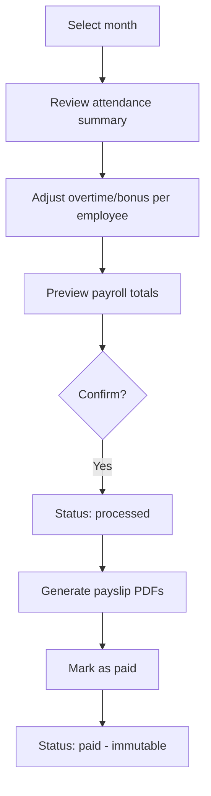
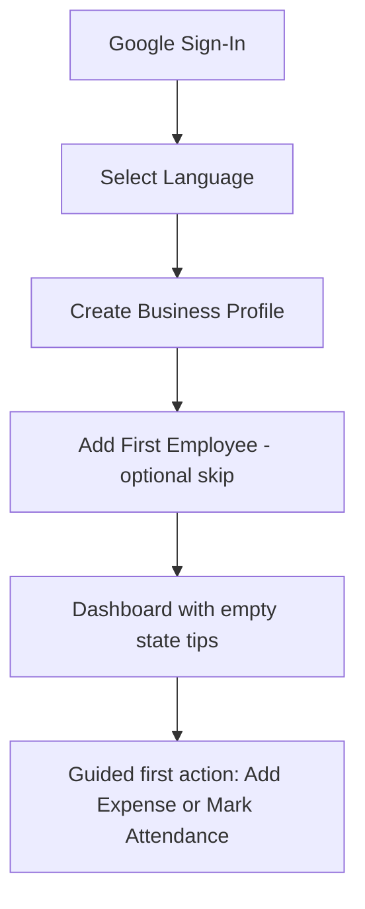
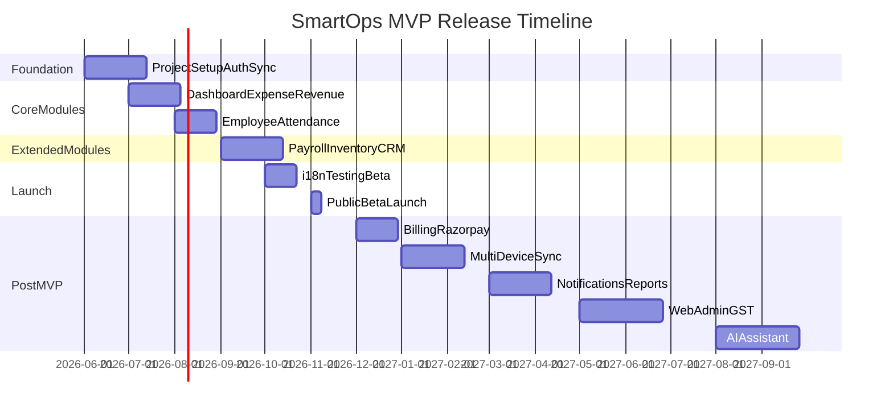

# SmartOps MVP Requirements

> Related docs: [Architecture](./architecture.md) · [Database Design](./database-design.md) · [Auth & Sessions](./auth-sessions.md) · [API Versioning](./api-versioning.md) · [UI/UX Design System](./ui-ux-design-system.md) · [UI/UX Screens](./ui-ux-screens.md) · [Local Database Migrations](./local-database-migrations.md) · [Local Development](./local-development.md) · [Testing Strategy](./testing-strategy.md) · [Sync Protocol](./sync-protocol.md) · [Export Formats](./export-formats.md) · [Deployment](./deployment.md) · [Tech Stack](./tech-stack.md) · [Revenue Model](./revenue-model.md)

## MVP Definition

**SmartOps MVP v1.0** is an offline-capable mobile application (Android + iOS) that enables a small business owner to manage daily operations — finances, employees, attendance, payroll, inventory, and customer/vendor relationships — from a single app with English and Hindi UI support.

### MVP Goal

Validate that Indian small business owners will adopt an offline-first, all-in-one business management app and use it daily for core operational tasks.

### MVP Success Criteria

| Metric | Target (90 days post-launch) |
|---|---|
| Beta registrations | 200+ businesses |
| Weekly active users (WAU) | 40%+ of registered |
| Daily active users (DAU) | 20%+ of registered |
| Offline session rate | 30%+ of sessions start offline |
| Sync success rate | 95%+ of sync attempts succeed |
| Core action completion (add expense/attendance) | <3 taps from home |
| App crash rate | <1% of sessions |
| NPS (beta survey) | >40 |

---

## Personas

### Persona 1: Rajesh — Shop Owner (Primary)

| Attribute | Detail |
|---|---|
| Age | 38 |
| Business | Grocery store, 8 employees |
| Location | Tier-2 city, India |
| Tech comfort | Uses WhatsApp, UPI; limited English |
| Language | Hindi preferred |
| Pain points | Tracks expenses in notebook; attendance on paper; no payroll system |
| Goal | Know daily profit, manage staff, stop losing receipts |
| Device | Android mid-range phone; unreliable shop WiFi |

### Persona 2: Priya — Workshop Manager

| Attribute | Detail |
|---|---|
| Age | 32 |
| Business | Auto repair workshop, 15 employees |
| Role | Manager (not owner) |
| Language | English |
| Pain points | Owner asks for daily reports; manual attendance register |
| Goal | Mark attendance quickly, log daily expenses, generate monthly summary |
| Device | Android; works in basement with no signal |

### Persona 3: Amit — Employee

| Attribute | Detail |
|---|---|
| Age | 25 |
| Role | Shop assistant |
| Language | Hindi |
| Pain points | Doesn't know salary breakdown; can't check attendance history |
| Goal | Mark own attendance, view payslip |
| Device | Basic Android phone |

---

## Scope Summary

### In Scope (MVP v1.0)

| Module | Priority |
|---|---|
| Authentication & Onboarding | P0 |
| Dashboard | P0 |
| Expense Management | P0 |
| Revenue Management | P0 |
| Employee Management | P0 |
| Attendance Management | P0 |
| Payroll (manual) | P0 |
| Inventory Management | P1 |
| CRM (Customer + Vendor) | P1 |
| Offline sync | P0 |
| i18n (English + Hindi) | P0 |
| CSV export (expenses, revenue) | P1 |
| Payslip PDF (English + Hindi) | P1 |

### Out of Scope (Explicit Non-Goals)

| Feature | Target version |
|---|---|
| Task management | v2.0 |
| Push / email notifications | v2.0 |
| Multi-device real-time sync | v2.0 |
| AI business assistant | v3.0 |
| Web admin panel | v3.0 |
| GST filing / compliance reports | v2.0 |
| Phone OTP login | v2.0 |
| Apple Sign-In | v2.0 |
| GPS / geofencing attendance | v2.0 |
| Barcode / QR inventory scanning | v2.0 |
| Automated payroll / bank transfer | v2.0 |
| PF/ESI auto-calculation | v2.0 |
| Subscription billing (Razorpay) | v1.1 |
| Advanced PDF/Excel reports | v2.0 |
| Multi-branch UI | v2.0 |
| Voice input | v2.0 |

---

## RBAC — Permission Matrix (MVP)

MVP uses three roles. Full six-role model (Admin, HR, Accountant) expands in v2.

| Permission | Owner | Manager | Employee |
|---|:---:|:---:|:---:|
| **Organization** | | | |
| View/edit org settings | Yes | View | — |
| Manage subscription/billing | Yes | — | — |
| Invite/remove users | Yes | — | — |
| **Dashboard** | | | |
| View full dashboard | Yes | Yes | — |
| **Employees** | | | |
| View all employees | Yes | Yes | Own only |
| Create/edit employees | Yes | Yes | — |
| Delete/deactivate employees | Yes | — | — |
| View salary structures | Yes | Yes | Own only |
| Edit salary structures | Yes | — | — |
| Upload employee documents | Yes | Yes | Own only |
| **Attendance** | | | |
| Mark attendance (any employee) | Yes | Yes | Own only |
| View attendance reports | Yes | Yes | Own only |
| Approve/reject leave | Yes | Yes | — |
| Submit leave request | Yes | Yes | Yes |
| **Payroll** | | | |
| Create/process payroll runs | Yes | — | — |
| View all payslips | Yes | Yes | Own only |
| **Expenses** | | | |
| Create/edit/delete expenses | Yes | Yes | — |
| View expenses | Yes | Yes | — |
| Manage expense categories | Yes | Yes | — |
| **Revenue** | | | |
| Create/edit/delete revenue entries | Yes | Yes | — |
| View revenue | Yes | Yes | — |
| **Inventory** | | | |
| Manage products/stock | Yes | Yes | — |
| View inventory | Yes | Yes | — |
| **CRM** | | | |
| Manage customers/vendors | Yes | Yes | — |
| View CRM data | Yes | Yes | — |
| **Export** | | | |
| CSV export | Yes | Yes | — |
| Payslip PDF | Yes | Yes | Own only |

---

## Module Requirements

### 1. Authentication & Onboarding

#### User Stories

| ID | Story | Priority |
|---|---|---|
| AUTH-01 | As a **new user**, I want to sign in with my Google account, so that I can access the app without creating a password or paying for SMS. | P0 |
| AUTH-02 | As a **returning user**, I want to reopen the app and access my data offline after signing in once, so that I can work without internet. | P0 |
| AUTH-03 | As a **new owner**, I want to create my business profile during onboarding, so that the app is configured for my business. | P0 |
| AUTH-04 | As a **user**, I want to select Hindi or English during onboarding, so that I can use the app in my preferred language. | P0 |
| AUTH-05 | As an **owner**, I want to invite a manager by email, so that they can help manage daily operations. | P2 |
| AUTH-06 | As a **user**, I want to log out and clear local data, so that I can safely switch accounts on a shared device. | P0 |
| AUTH-07 | As a **returning user with network**, I want my session refreshed silently, so that sync works without signing in again. | P0 |

#### Acceptance Criteria

**AUTH-01:**
- Given the login screen, when the user taps "Sign in with Google", then the Google account picker opens
- Given a valid Google account selected, when the ID token is sent to the backend, then the user is authenticated and redirected to onboarding (new) or dashboard (returning)
- Given an invalid or expired Google token, when submitted, then an error message is shown in the user's selected language

**AUTH-02:**
- Given a previously authenticated user with a valid refresh token in secure storage, when the app is opened offline, then the dashboard loads from local data without requiring network
- Given an expired access token and no network, when the user tries to sync, then a "connect to internet to refresh" message is shown; local operations continue

**AUTH-07:**
- Given a stored refresh token and network connectivity, when the app foregrounds with an expired access token, then a silent refresh occurs before sync without user interaction

**AUTH-03:**
- Given a new authenticated user, when onboarding starts, then the user is prompted for: business name, business type, city, preferred language
- Given completed onboarding, when the user reaches the dashboard, then a default organization, primary branch, and default expense/revenue categories are created

---

### 2. Dashboard

#### User Stories

| ID | Story | Priority |
|---|---|---|
| DASH-01 | As an **owner**, I want to see today's revenue, expenses, and profit on the home screen, so that I know my daily business performance at a glance. | P0 |
| DASH-02 | As an **owner**, I want to see employee count and today's attendance summary, so that I know who is present. | P0 |
| DASH-03 | As an **owner**, I want to see outstanding payments (receivable and payable), so that I know who owes me and whom I owe. | P1 |
| DASH-04 | As an **owner**, I want to see salary due this month, so that I can plan cash flow for payroll. | P1 |
| DASH-05 | As an **owner**, I want the dashboard to work offline with cached data, so that I can check metrics without internet. | P0 |
| DASH-06 | As an **owner**, I want to view monthly revenue vs expense trend, so that I can spot patterns. | P1 |

#### MVP Metrics Displayed

| Metric | Source | Offline |
|---|---|---|
| Revenue (today / this month) | revenue_entries | Yes |
| Expenses (today / this month) | expenses | Yes |
| Net profit (month) | computed | Yes |
| Cash flow (month) | revenue - expenses - payroll paid | Yes |
| Employee count (active) | employees | Yes |
| Attendance today (present/absent/leave) | attendance_records | Yes |
| Salary due | unpaid payroll_runs | Yes |
| Outstanding receivable | customers.outstanding_balance | Yes |
| Outstanding payable | vendors.outstanding_balance | Yes |

#### Out of Scope (v1.0)

- Business Health Score
- AI-generated insights
- Revenue forecasting charts

---

### 3. Expense Management

#### User Stories

| ID | Story | Priority |
|---|---|---|
| EXP-01 | As an **owner**, I want to add an expense with amount, category, date, and description, so that I track daily spending. | P0 |
| EXP-02 | As an **owner**, I want to attach a photo of an invoice to an expense, so that I have proof of purchase. | P0 |
| EXP-03 | As an **owner**, I want to categorize expenses, so that I can analyze spending by type. | P0 |
| EXP-04 | As an **owner**, I want to search and filter expenses by date range and category, so that I can find specific records. | P0 |
| EXP-05 | As an **owner**, I want to link an expense to a vendor, so that I track vendor-wise spending. | P1 |
| EXP-06 | As an **owner**, I want to create recurring expense templates, so that I can quickly log regular bills. | P1 |
| EXP-07 | As an **owner**, I want to add expenses offline, so that I can record costs in areas without network. | P0 |
| EXP-08 | As a **manager**, I want to add and view expenses, so that I can log operational costs on behalf of the business. | P0 |

#### Acceptance Criteria

**EXP-01:**
- Given the expense form, when the user enters amount > 0, category, and date, then the expense is saved locally immediately
- Given a saved expense, when sync runs, then the expense appears on the server with matching data

**EXP-02:**
- Given an expense form, when the user taps "Attach invoice", then the camera/gallery opens
- Given a selected image (JPEG/PNG, max 10 MB), when attached, then the image is stored locally and uploaded on sync

**EXP-07:**
- Given the device is offline, when the user creates an expense, then it saves with sync_status = pending and appears in the expense list immediately

#### Default Categories (Seeded on Org Creation)

Utilities, Rent, Salaries, Raw Materials, Transport, Maintenance, Marketing, Other

---

### 4. Revenue Management

#### User Stories

| ID | Story | Priority |
|---|---|---|
| REV-01 | As an **owner**, I want to record a sale with amount, date, and category, so that I track daily income. | P0 |
| REV-02 | As an **owner**, I want to link revenue to a customer, so that I know customer-wise sales. | P1 |
| REV-03 | As an **owner**, I want to see daily and monthly revenue totals, so that I can compare periods. | P0 |
| REV-04 | As an **owner**, I want to record different income types (product sales, service income, other), so that I categorize revenue correctly. | P0 |
| REV-05 | As an **owner**, I want to add revenue offline, so that I can record sales without internet. | P0 |
| REV-06 | As an **owner**, I want to export revenue data as CSV, so that I can share with my accountant. | P1 |

#### Out of Scope (v1.0)

- Revenue forecasting
- Customer-wise analytics charts
- Invoice generation

---

### 5. Employee Management

#### User Stories

| ID | Story | Priority |
|---|---|---|
| EMP-01 | As an **owner**, I want to add an employee with name, phone, role, department, and joining date, so that I maintain a staff directory. | P0 |
| EMP-02 | As an **owner**, I want to set salary information for an employee, so that payroll can be calculated. | P0 |
| EMP-03 | As an **owner**, I want to upload employee documents (Aadhaar, PAN, contract), so that records are centralized. | P1 |
| EMP-04 | As an **owner**, I want to search employees by name, so that I can quickly find staff. | P0 |
| EMP-05 | As an **owner**, I want to deactivate an employee who leaves, so that they no longer appear in active lists. | P0 |
| EMP-06 | As an **employee**, I want to view my own profile and documents, so that I can verify my information. | P1 |
| EMP-07 | As an **owner**, I want to manage departments and designations, so that I can organize my team. | P1 |

#### Out of Scope (v1.0)

- Performance notes and reviews
- Employee lifecycle automation (probation, confirmation)
- Bulk import

---

### 6. Attendance Management

#### User Stories

| ID | Story | Priority |
|---|---|---|
| ATT-01 | As an **owner**, I want to mark daily attendance for all employees (present/absent/half-day/on-leave), so that I track who came to work. | P0 |
| ATT-02 | As an **owner**, I want to record check-in and check-out times, so that I track working hours. | P0 |
| ATT-03 | As an **employee**, I want to mark my own attendance, so that I can check in without the owner present. | P1 |
| ATT-04 | As an **employee**, I want to submit a leave request, so that my absence is recorded properly. | P1 |
| ATT-05 | As an **owner**, I want to approve or reject leave requests, so that I control staffing. | P1 |
| ATT-06 | As an **owner**, I want to view a monthly attendance report per employee, so that I can calculate payable days for payroll. | P0 |
| ATT-07 | As an **owner**, I want to mark attendance offline, so that I can record presence in areas without network. | P0 |

#### Acceptance Criteria

**ATT-01:**
- Given the attendance screen for today, when the owner marks 8 employees as present and 2 as absent, then all 10 records save locally
- Given attendance marked offline, when sync runs, then server records match local records
- Given attendance already marked for an employee on a date, when marked again, then the record updates (no duplicate)

**ATT-06:**
- Given a selected month, when the owner views an employee's attendance report, then it shows: days present, absent, half-day, on-leave, and total working days

#### Out of Scope (v1.0)

- GPS-based attendance
- Geofencing
- Face recognition
- Shift management (basic shift assignment in P1; no shift scheduling)

---

### 7. Payroll Management

#### User Stories

| ID | Story | Priority |
|---|---|---|
| PAY-01 | As an **owner**, I want to define a salary structure for each employee (base, allowances, deductions), so that payroll is calculated correctly. | P0 |
| PAY-02 | As an **owner**, I want to run monthly payroll manually, so that I process salaries based on attendance. | P0 |
| PAY-03 | As an **owner**, I want payroll to factor in days worked from attendance, so that absent days reduce salary automatically. | P0 |
| PAY-04 | As an **owner**, I want to add overtime and bonus amounts during payroll processing, so that extra payments are included. | P1 |
| PAY-05 | As an **owner**, I want to generate a payslip PDF in Hindi or English, so that employees receive salary statements. | P1 |
| PAY-06 | As an **owner**, I want to mark payroll as paid, so that records are finalized and immutable. | P0 |
| PAY-07 | As an **employee**, I want to view my payslip, so that I understand my salary breakdown. | P1 |
| PAY-08 | As an **owner**, I want to process payroll offline, so that I can finalize salaries without internet. | P0 |

#### Payroll Processing Flow

#### Acceptance Criteria

**PAY-06:**
- Given a payroll run with status `paid`, when any user attempts to edit line items, then the API returns 403 and the mobile app shows "Payroll is finalized"
- Given a paid payroll run, when sync occurs, then client accepts server state without conflict

#### Out of Scope (v1.0)

- PF/ESI automatic calculation
- TDS computation
- Bank transfer integration
- Automated payroll scheduling
- Payslip email delivery

---

### 8. Inventory Management

#### User Stories

| ID | Story | Priority |
|---|---|---|
| INV-01 | As an **owner**, I want to add products with name, SKU, unit, and prices, so that I maintain a product catalog. | P1 |
| INV-02 | As an **owner**, I want to record stock in and stock out, so that inventory levels stay accurate. | P1 |
| INV-03 | As an **owner**, I want to see current stock levels, so that I know what's available. | P1 |
| INV-04 | As an **owner**, I want to set a low stock threshold, so that I'm alerted when items run low. | P1 |
| INV-05 | As an **owner**, I want to manage product categories, so that I organize my catalog. | P1 |
| INV-06 | As an **owner**, I want to manage inventory offline, so that I can update stock in the warehouse without network. | P1 |

#### Out of Scope (v1.0)

- Barcode/QR scanning
- Warehouse management (multi-location stock)
- Inventory valuation reports
- Purchase order management

---

### 9. CRM (Customer & Vendor)

#### User Stories

| ID | Story | Priority |
|---|---|---|
| CRM-01 | As an **owner**, I want to add customer profiles with name, phone, and address, so that I maintain a customer directory. | P1 |
| CRM-02 | As an **owner**, I want to add vendor profiles, so that I track my suppliers. | P1 |
| CRM-03 | As an **owner**, I want to see a customer's outstanding balance, so that I know who hasn't paid. | P1 |
| CRM-04 | As an **owner**, I want to see a vendor's outstanding balance, so that I know what I owe. | P1 |
| CRM-05 | As an **owner**, I want to link revenue entries to customers, so that customer balances update automatically. | P1 |
| CRM-06 | As an **owner**, I want to link expenses to vendors, so that vendor balances update automatically. | P1 |
| CRM-07 | As an **owner**, I want to search customers and vendors by name or phone, so that I find records quickly. | P1 |

#### Out of Scope (v1.0)

- Follow-up reminders
- Customer analytics / purchase history charts
- Lead management
- GSTIN-based invoice matching

---

## Cross-Cutting Requirements

### Offline-First

| Requirement | Detail |
|---|---|
| All 8 modules writable offline | Local Isar write + sync queue |
| Dashboard readable offline | Computed from local data |
| Sync trigger | App foreground, network restored, manual pull-to-sync |
| Sync indicator | Global status bar icon: synced / syncing / offline / conflict |
| Pending count | Show count of unsynced changes |

### Localization (i18n)

| Requirement | Detail |
|---|---|
| MVP languages | English (en), Hindi (hi) |
| Scope | All UI text, form labels, validation messages, payslip PDF |
| User preference | Set during onboarding; changeable in settings |
| Company default | Owner sets default language for reports |
| Date/number format | `en_IN` / `hi_IN` locale formatting |
| Currency display | ₹ (INR) default; format per org settings |

### Data Export

See [Export Formats](./export-formats.md) for CSV column definitions and payslip PDF layout.

| Export | Format | Tier | Phase |
|---|---|---|---|
| Expenses list | CSV | All (Starter+ gated post-billing) | MVP |
| Revenue list | CSV | All | MVP |
| Payslip | PDF (EN/HI) | Starter+ | MVP |
| Attendance report | CSV | Starter+ | MVP |

### Onboarding Flow

---

## UI/UX Flow List

Full screen specifications: [UI/UX Screens](./ui-ux-screens.md). Design system: [UI/UX Design System](./ui-ux-design-system.md).

| Flow | Screens |
|---|---|
| Auth | Splash → Google Sign-In → Force update (if 426) |
| Onboarding | Language → Business profile → Add employee (optional) → Welcome |
| Dashboard | Home tab → Metric cards → Quick actions (≤3 taps to expense/attendance) |
| Money | Money Hub → Expenses / Revenue lists → Add/Edit forms |
| People | People Hub → Employees / Attendance / Payroll |
| Expense | List → Filter → Add/Edit form → Attach photo |
| Revenue | List → Filter → Add/Edit form |
| Employee | List → Search → Profile → Edit → Documents |
| Attendance | Daily grid → Mark status → Check-in/out → Monthly report |
| Leave | Request form → Pending list → Approve/Reject |
| Payroll | Salary structures → New run → Preview → Process → Payslip |
| Inventory | Product list → Add/Edit → Stock in/out → Low stock badge |
| CRM | CRM hub → Customer/Vendor lists → Profile → Transactions |
| Settings | Language → Sync status → Org settings → Logout |
| System | Migration progress → Recovery → Sync conflict dialog |

### UX Acceptance Criteria

| Criterion | Target |
|---|---|
| Core action tap count | Add expense / mark attendance ≤ 3 taps from dashboard |
| Offline indicator | `SyncStatusBanner` visible on every authenticated screen when offline |
| Empty states | Every list screen has `EmptyStateView` + primary CTA |
| Hindi layout | No truncated button text at 360dp width with `hi` locale |
| Touch targets | All interactive elements ≥ 48dp |
| Role gating | Employee cannot access owner-only routes (`/money`, payroll admin) |
| Force update | 426 shows `ForceUpdateScreen` with store link; local data preserved |
| Form feedback | Offline save shows snackbar confirmation |
| Navigation | 5-tab bottom nav (Owner/Manager); 3-tab (Employee) |

See [UI/UX Screens](./ui-ux-screens.md) for wireframes and [UI/UX Design System](./ui-ux-design-system.md) for components.

---

## Technical Acceptance Criteria (Beta Release)

### Performance

| Requirement | Target |
|---|---|
| App cold start | <3 seconds on mid-range Android |
| Screen navigation | <300ms |
| Local write (expense, attendance) | <100ms |
| Dashboard load (offline) | <500ms |
| Sync 100 records | <10 seconds on 4G |
| APK size | <30 MB |
| Isar DB size (1000 expenses) | <5 MB |

### Reliability

| Requirement | Target |
|---|---|
| Sync success rate | 95%+ |
| Zero data loss on app crash | WAL-mode Isar; sync queue persisted |
| Offline operation duration | Unlimited local access while refresh token exists in secure storage |
| App update data preservation | Unsynced pending changes preserved across one schema version bump; see [Local Database Migrations](./local-database-migrations.md) |
| App crash rate | <1% sessions |

### Deployment

| Requirement | Detail |
|---|---|
| Staging environment | Neon staging branch + Render/Vercel staging deploy live before beta |
| Production environment | Neon production + Render/Vercel production; see [Deployment](./deployment.md) |
| Server migrations | Alembic `upgrade head` run in CI before each deploy |
| Health check | `GET /health` returns 200 on staging and production |
| Mobile API URL | Staging and production flavors configured with correct `API_BASE_URL` |

### API Versioning

| Requirement | Detail |
|---|---|
| Client headers | Mobile sends `X-App-Version`, `X-Client-Schema-Version`, `X-Platform`, `X-Device-Id` on every request |
| Server middleware | Rejects clients below `MIN_SUPPORTED_APP_VERSION` with `426 Upgrade Required` |
| Force-update UX | Mobile shows blocking update screen on 426; local data preserved |
| Sync compatibility | Push ignores unknown fields; pull filters by client schema version |
| MVP scope | `/api/v1` only; v2 documented but not implemented until first breaking change |
| Reference | See [API Versioning](./api-versioning.md) |

### Security

| Requirement | Detail |
|---|---|
| Token storage | flutter_secure_storage only |
| Salary data | Encrypted in local DB and server DB |
| Logout | Clears local DB and secure storage |
| API | All endpoints require auth except `/auth/google` and `/auth/refresh` |

### Platform

| Platform | Minimum version |
|---|---|
| Android | API 24 (Android 7.0) |
| iOS | iOS 14 |

---

## Release Plan

### Sprint Breakdown

| Sprint | Duration | Deliverables |
|---|---|---|
| S1–S3 | 6 weeks | Monorepo setup, FastAPI skeleton, Flutter skeleton, auth (Google Sign-In), Isar setup, sync engine foundation |
| S4–S6 | 5 weeks | Dashboard, expense module, revenue module, default categories, offline write + sync |
| S7–S8 | 4 weeks | Employee module, attendance module, leave requests |
| S9–S11 | 6 weeks | Payroll (structures, run, payslip PDF), inventory, CRM |
| S12–S13 | 3 weeks | Hindi i18n, integration testing, beta polish, Sentry setup |
| S14 | 1 week | Beta launch (TestFlight + Play Store internal track) |

**Pre-beta gate:** Staging environment (Neon + Render/Vercel) deployed and smoke-tested per [Deployment](./deployment.md) checklist before S14.

---

## Version Roadmap

### v1.0 — MVP (Beta)

All modules listed in scope above. Offline-first. English + Hindi. No billing.

### v1.1 — Monetization

- Razorpay subscription integration
- Free / Starter / Growth tiers enforced
- 14-day trial flow
- Referral program

### v2.0 — Growth

- Multi-device sync with conflict review UI
- Push notifications (FCM)
- Task management module
- GPS attendance
- Barcode inventory scanning
- Advanced reports (PDF, Excel)
- Multi-branch UI
- Full 6-role RBAC
- PF/ESI payroll templates
- GST reports
- Marathi, Gujarati, Tamil languages

### v3.0 — Platform

- Web admin dashboard (Next.js)
- AI business assistant
- Automated payroll
- API access for integrations
- SSO for enterprise
- Voice input (Hindi + English)
- Stripe for global markets

---

## Business Risks (MVP)

| Risk | Likelihood | Impact | Mitigation |
|---|---|---|---|
| Users expect GST invoicing in v1 | High | Medium | Clear marketing: "GST reports coming in v2" |
| Offline sync bugs cause data loss | Medium | High | Extensive sync testing; migration tests; audit logs; beta with 50 users first |
| App update loses unsynced offline data | Medium | High | Follow [Local Database Migrations](./local-database-migrations.md); backup sync_queue before migrations |
| Hindi translation quality poor | Medium | Medium | Native Hindi speaker review before launch |
| Competitors launch similar offline feature | Low | Medium | Speed to market; depth of all-in-one modules |
| Low engagement after install | Medium | High | Onboarding guided first action; empty state tips |
| Payroll errors damage trust | Low | High | Manual review step before "process"; immutable after "paid" |

---

## Related Documents

- [Architecture](./architecture.md) — sync engine, API design, security
- [Database Design](./database-design.md) — full schema
- [Tech Stack](./tech-stack.md) — Flutter, FastAPI, Isar
- [Revenue Model](./revenue-model.md) — pricing tiers and feature gating
- [Auth & Sessions](./auth-sessions.md) — Google Sign-In, JWT session lifecycle, offline behavior
- [Local Database Migrations](./local-database-migrations.md) — Isar schema updates on app upgrade
- [API Versioning](./api-versioning.md) — multi-app-version support, headers, sync protocol
- [Sync Protocol](./sync-protocol.md) — push/pull payloads per entity type
- [Export Formats](./export-formats.md) — CSV columns and payslip PDF layout
- [UI/UX Design System](./ui-ux-design-system.md) — M3 theme, components, navigation
- [UI/UX Screens](./ui-ux-screens.md) — screen specs, wireframes, states
- [Local Development](./local-development.md) — full-stack dev setup
- [Testing Strategy](./testing-strategy.md) — offline/sync QA, beta checklist
- [Deployment](./deployment.md) — free-tier MVP hosting (Neon + Render/Vercel)
- [App Details](./app-details.md) — early brainstorming (superseded)
