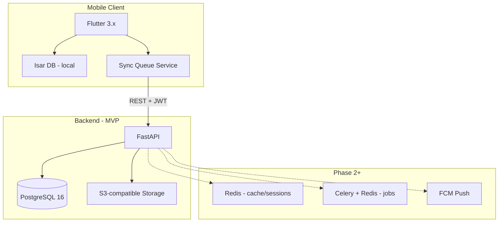
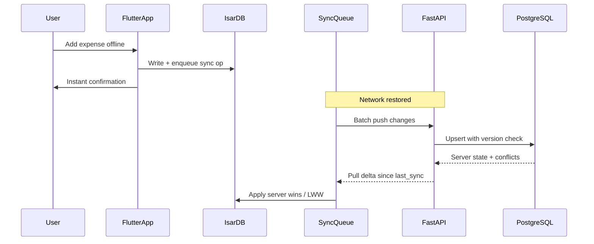
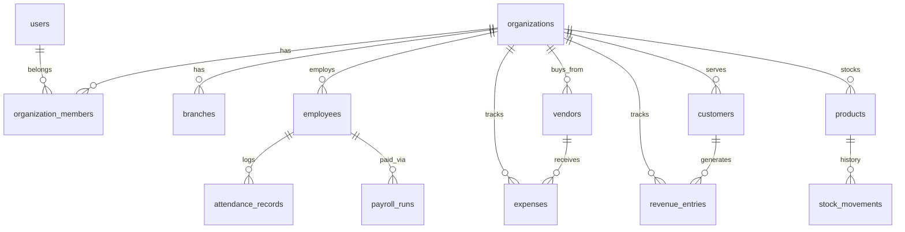
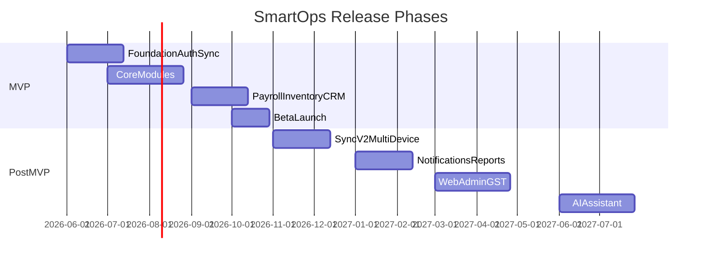

# SmartOps Full Application Planning

## Current State

The repo is documentation-only ([docs/initial-Prompt.txt](docs/initial-Prompt.txt), [docs/app-details.md](docs/app-details.md), [docs/tech-stack.md](docs/tech-stack.md)). No application code exists yet. Your decisions:

| Decision | Choice |
|---|---|
| Market | India-first launch, global-ready architecture |
| Backend | FastAPI + Python (preferred; validated below) |
| MVP modules | Dashboard, Expense, Revenue, Employee, Attendance, Payroll, Inventory, CRM (Customer + Vendor) |
| Out of MVP v1.0 | Task Management, advanced Reports/Export, AI, push notifications, multi-device sync |
| Revenue | Recommend based on Indian SMB market |

---

## Document Deliverables (5 files)

We will create/update these under [`docs/`](docs/):

| # | Document | Purpose |
|---|---|---|
| 1 | [`docs/tech-stack.md`](docs/tech-stack.md) | Full stack with rationale, alternatives rejected, and phase gates |
| 2 | [`docs/architecture.md`](docs/architecture.md) | System design, folder structure, sync flow, security, scalability |
| 3 | [`docs/database-design.md`](docs/database-design.md) | ER model, tables, multi-tenancy, sync fields, future extensions |
| 4 | [`docs/revenue-model.md`](docs/revenue-model.md) | Pricing tiers, monetization, payment integration, unit economics |
| 5 | [`docs/mvp-requirements.md`](docs/mvp-requirements.md) | PRD-lite: user stories, acceptance criteria, RBAC, non-goals, release phases |

Optional cross-reference doc: [`docs/product-vision.md`](docs/product-vision.md) — condensed vision extracted from [initial-Prompt.txt](docs/initial-Prompt.txt) so MVP docs stay focused.

---

## 1. Tech Stack ([`docs/tech-stack.md`](docs/tech-stack.md))

### Recommendation: Keep FastAPI + Python

Your preference aligns well with SmartOps goals:

- **FastAPI** — async REST, OpenAPI auto-docs, fast MVP velocity, strong validation (Pydantic)
- **Python ecosystem** — natural fit for future AI/analytics without a second language
- **NestJS tradeoff** — better TypeScript monorepo story with React web later, but adds complexity before web exists; revisit at web phase (shared types via OpenAPI codegen)

### Proposed Stack by Layer



| Layer | Technology | MVP | Later |
|---|---|---|---|
| Mobile | Flutter, Dart 3 | Yes | Web via Flutter Web or React (Phase 3) |
| Local DB | **Isar** (not SQLite raw) | Yes | — |
| State | Riverpod or Bloc (pick one in doc) | Yes | — |
| Architecture | Clean Architecture + feature modules | Yes | — |
| Backend | FastAPI, Uvicorn, Pydantic v2 | Yes | — |
| Primary DB | PostgreSQL 16 | Yes | Read replicas at scale |
| Auth | JWT access + refresh tokens | Yes | SSO (Phase 3) |
| File storage | Cloudflare R2 or AWS S3 | Yes | CDN in front |
| Payments | Razorpay (India) | Phase 1.5 | Stripe for global |
| i18n | Flutter ARB + backend template keys | English + Hindi MVP | 9 regional languages |
| Observability | Sentry + structured logging | Yes | Prometheus/Grafana |
| CI/CD | GitHub Actions | Yes | — |
| Infra | Docker, deploy on Railway/Fly.io/AWS | MVP staging | K8s at 100k+ users |

**Doc will include:** version pinning strategy, monorepo layout (`mobile/`, `backend/`, `docs/`), and explicit "not in MVP" list (Redis, Celery, AI, web).

---

## 2. Architecture ([`docs/architecture.md`](docs/architecture.md))

### Core Principle: Offline-First (from [app-details.md](docs/app-details.md))



### Architecture Sections in Doc

**Mobile (`mobile/lib/`)**
```
lib/
  core/           # network, auth, sync engine, theme, l10n
  features/
    dashboard/
    expenses/
    revenue/
    employees/
    attendance/
    payroll/
    inventory/
    crm/
  shared/         # widgets, models, utils
```
Each feature: `data/` (local + remote repos) → `domain/` (entities, use cases) → `presentation/` (UI + state).

**Backend (`backend/app/`)**
```
app/
  api/v1/         # route handlers per module
  core/           # config, security, deps
  models/         # SQLAlchemy ORM
  schemas/        # Pydantic request/response
  services/       # business logic
  sync/           # delta sync, conflict resolution
  workers/        # future Celery tasks
```

**Sync Strategy (MVP)**
- Each record: `id` (UUID), `organization_id`, `version`, `updated_at`, `deleted_at` (soft delete), `client_updated_at`
- **Phase 1 conflict:** Last-Write-Wins on non-financial fields; **role priority** (Owner > Admin > Manager) on salary/payroll amounts
- **MVP limitation (explicit):** Single active device per business owner; multi-device sync deferred to v2 (per [app-details.md](docs/app-details.md) Phase 2)
- Sync endpoints: `POST /sync/push`, `GET /sync/pull?since={timestamp}`

**Security Architecture**
- Auth: email/phone + OTP (MSG91 or Twilio for India)
- RBAC enforced at API middleware + row-level `organization_id` filtering
- At-rest encryption for sensitive fields (salary, bank details)
- Audit log table for payroll and financial mutations

**Scalability Roadmap (embedded in architecture doc)**
- Phase 1 (1k users): single FastAPI instance + managed PostgreSQL
- Phase 2 (10k): Redis cache, connection pooling, read replica
- Phase 3 (100k): horizontal API scaling, Celery job queue, CDN for assets
- Phase 4 (1M+): sharding by `organization_id`, event-driven sync

**Future Web Expansion**
- Shared FastAPI backend + OpenAPI contract
- Admin web: Next.js in `web/` monorepo folder (Phase 3)
- No duplicate business logic — all rules live in backend services

---

## 3. Database Design ([`docs/database-design.md`](docs/database-design.md))

### Multi-Tenancy Strategy

**Shared database, shared schema, tenant isolation via `organization_id`** on every business table. Supports:
- One user → many organizations (multi-business)
- Future branches via `branch_id` (nullable in MVP, required in v2 UI)
- Global expansion via `country_code`, `currency_code`, `timezone` on `organizations`



### Core Tables (MVP)

| Domain | Tables |
|---|---|
| Identity | `users`, `organizations`, `organization_members`, `roles`, `permissions`, `role_permissions` |
| Employee | `employees`, `employee_documents`, `departments`, `designations` |
| Attendance | `attendance_records`, `leave_requests`, `leave_types`, `shifts` |
| Payroll | `salary_structures`, `payroll_runs`, `payroll_line_items`, `deductions`, `bonuses` |
| Finance | `expense_categories`, `expenses`, `revenue_categories`, `revenue_entries`, `recurring_expenses` |
| Inventory | `products`, `product_categories`, `stock_movements`, `units_of_measure` |
| CRM | `customers`, `vendors`, `customer_transactions`, `vendor_transactions` |
| Sync | `sync_cursors`, `audit_logs` |
| Billing (Phase 1.5) | `subscriptions`, `subscription_plans`, `invoices` |
| i18n | `user_preferences` (language), `organization_settings` |

### Future-Ready Fields (designed now, used later)

- `organizations.gstin`, `organizations.pan` — India tax compliance (v2)
- `branches` table — multi-location (v2)
- `products.barcode`, `products.qr_code` — scanning (v2)
- `attendance_records.latitude/longitude` — GPS attendance (v2)
- `ai_insights` table stub — AI features (v3)
- `notification_preferences`, `notification_queue` — push (v2)

### Indexing Strategy

- Composite indexes: `(organization_id, created_at)`, `(organization_id, employee_id, date)` for attendance
- Partial indexes on `deleted_at IS NULL`
- Full-text search on employee/customer names (PostgreSQL `tsvector`, Phase 2)

**Doc will include:** full column definitions, FK constraints, enum types, sample queries for dashboard aggregates, and migration strategy (Alembic).

---

## 4. Revenue Model ([`docs/revenue-model.md`](docs/revenue-model.md))

### Recommended Model: Freemium + Employee-Seat Hybrid

Best fit for Indian SMB market — low adoption friction, upsell on scale and compliance features.

| Tier | Price (indicative) | Limits | Includes |
|---|---|---|---|
| **Free** | ₹0 | 1 business, 5 employees, 1 user | Dashboard, Expense, Revenue, Attendance, basic Employee profiles |
| **Starter** | ₹499/mo or ₹4,999/yr | 1 business, 25 employees, 3 users | + Inventory, CRM, Payroll (manual), PDF reports |
| **Growth** | ₹999/mo or ₹9,999/yr | 1 business, 100 employees, 10 users | + Multi-branch, recurring expenses, advanced reports, priority sync |
| **Business** | ₹1,999/mo | Multi-business, unlimited employees | + Automated payroll, GST reports, API access, dedicated support |

**Add-ons (future revenue)**
- AI Business Assistant: ₹299/mo
- Extra business slot: ₹199/mo
- White-label / franchise: custom pricing

**Payment integration**
- MVP launch: manual/offline billing or Razorpay subscription (Phase 1.5 — after core product validation)
- Annual discount (~17%) — standard in India
- UPI AutoPay via Razorpay

**Doc will include:** competitive positioning vs Vyapar/Khatabook/Zoho Books, CAC assumptions, break-even employee count, free-to-paid conversion targets, and feature gating matrix mapped to MVP modules.

---

## 5. MVP Requirements ([`docs/mvp-requirements.md`](docs/mvp-requirements.md))

### MVP Definition

**SmartOps MVP v1.0** = offline-capable mobile app (Android + iOS) for a single business owner managing one business with up to 25 employees, covering 8 core modules, English + Hindi UI, cloud backup on sync.

### In Scope (your selections)

| Module | MVP Capability | Out of Scope (v1.0) |
|---|---|---|
| **Dashboard** | Revenue, expenses, profit, cash flow, employee count, attendance summary, salary due | Business Health Score, AI insights, forecasting |
| **Expense** | CRUD, categories, attach invoice photo, search/filter, recurring (manual trigger) | Vendor auto-matching, AI optimization |
| **Revenue** | Sales/service income CRUD, daily/monthly totals, customer-linked entries | Forecasting, advanced analytics |
| **Employee** | Profiles, roles, dept, salary info, documents (photo/PDF) | Performance notes, lifecycle automation |
| **Attendance** | Daily mark, check-in/out times, leave requests, monthly report | GPS, geofencing, face recognition |
| **Payroll** | Salary structures, manual payroll run, deductions, payslip PDF (Hindi/English) | Bank transfer, PF/ESI auto-calc, automation |
| **Inventory** | Product catalog, stock in/out, low stock indicator | Barcode, warehouse, valuation reports |
| **CRM** | Customer + vendor profiles, contact info, linked transactions, outstanding balance | Follow-up reminders, analytics |

### Cross-Cutting MVP Requirements

- **Auth:** Phone OTP + email; offline access after first login
- **RBAC:** Owner, Manager, Employee (simplified from 6 roles — Admin/HR/Accountant merged into Manager/Owner for MVP)
- **Offline:** All 8 modules work offline; sync on reconnect
- **i18n:** English + Hindi (ARB files from day one)
- **Onboarding:** Create business → add employees → choose modules flow
- **Data export:** Basic CSV export for expenses/revenue (PDF payslip only for payroll)

### Explicit Non-Goals (v1.0)

- Task management
- Push/email notifications
- Multi-device real-time sync
- AI assistant
- Web admin panel
- GST filing integration
- Social login

### User Stories Structure (sample)

Each module gets 5–8 user stories in format:
> As an **Owner**, I want to **mark attendance for all employees**, so that **I can track daily presence offline**.

With acceptance criteria (Given/When/Then) and priority (P0/P1/P2).

### Release Phases



**Doc will include:** persona definitions, permission matrix, wireframe flow list, success metrics (DAU, sync reliability, offline session %), and technical acceptance criteria for beta release.

---

## Implementation Order for Documentation

1. **Expand** [`docs/tech-stack.md`](docs/tech-stack.md) — full stack with FastAPI validation
2. **Create** [`docs/architecture.md`](docs/architecture.md) — highest dependency for other docs
3. **Create** [`docs/database-design.md`](docs/database-design.md) — references architecture sync model
4. **Create** [`docs/revenue-model.md`](docs/revenue-model.md) — maps tiers to feature flags in DB
5. **Create** [`docs/mvp-requirements.md`](docs/mvp-requirements.md) — ties everything to shippable scope

Each document will be self-contained (readable standalone) with cross-links at the top.

---

## Open Items to Confirm During Doc Writing

These do not block planning but will be noted as decisions in the docs:

1. **State management:** Riverpod vs Bloc — recommend Riverpod for simpler DI with Clean Architecture
2. **OTP provider:** MSG91 (India-native) vs Firebase Auth
3. **Hosting:** Railway vs AWS — recommend Railway for MVP cost/simplicity
4. **Payroll compliance depth in MVP:** manual calculation only vs basic PF/ESI templates (recommend manual for v1.0)

No further blocking questions — ready to write all five documents on your approval.
