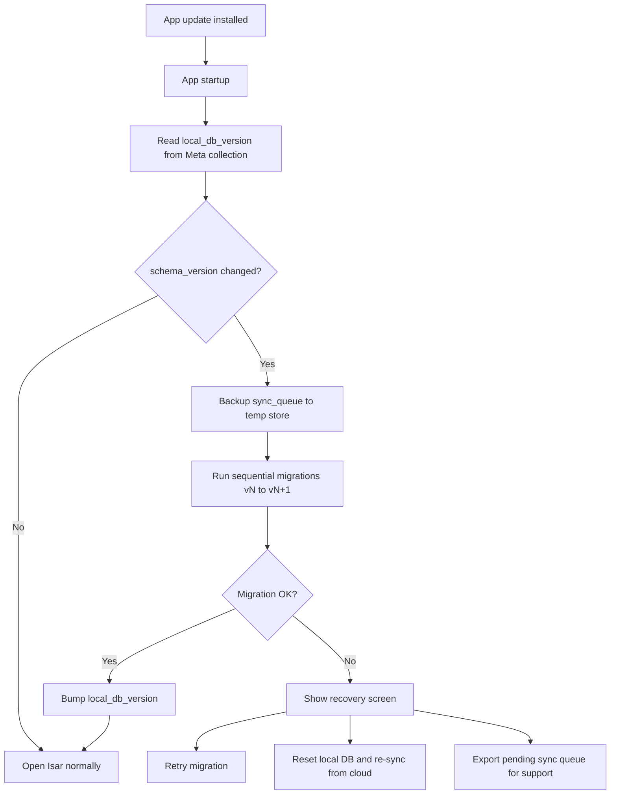
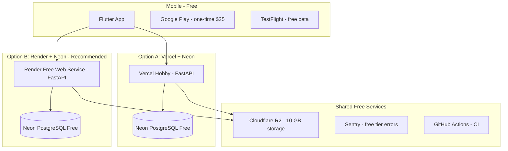

# Local Database Migrations + MVP Deployment Plan

## Context

SmartOps is offline-first: business data lives in **Isar** on device and **PostgreSQL (Neon)** in cloud. App updates can change the local schema; deployment docs currently recommend Railway ([`docs/tech-stack.md`](docs/tech-stack.md), [`docs/architecture.md`](docs/architecture.md)) with no dedicated migration or deployment guide.

Your questions:
1. How do app updates affect existing user data in the local database?
2. Can backend deploy on **Vercel** with **Neon** DB using free tiers?

---

## Part 1: App Updates and Local Data

### Core principle

**Cloud PostgreSQL is the source of truth for synced data.** Local Isar is a cache + offline write buffer. App update strategy must protect two things above all else:

1. **Unsynced pending changes** (`sync_queue`, records with `sync_status = pending`)
2. **User session** (tokens in secure storage — separate from Isar business data)

If a local migration fails, synced data can be recovered via cloud re-pull. **Unsynced offline work is the real data-loss risk.**



### Types of schema changes and impact

| Change type | User data impact | Strategy |
|---|---|---|
| Add optional field with default | None | Isar handles automatically |
| Add required field | Existing rows need default | Migration script sets default value |
| Rename field | Data appears missing if not migrated | Use Isar `@Name('old_name')` or copy in migration |
| Remove field | Local field data dropped | OK if synced; server re-pull restores entity minus field |
| Change field type (e.g. int → string) | Risk of read failure | Custom migration required |
| Add new collection | None | New empty collection created |
| Remove collection | Local data in that collection lost | Only after sync confirmed; or re-pull from server |
| Index change | None | Automatic |

### Migration architecture (document in new file)

**New file:** [`docs/local-database-migrations.md`](docs/local-database-migrations.md)

Sections to include:

1. **Overview** — Isar vs PostgreSQL migration responsibilities (Alembic = server; Isar migrations = mobile)
2. **Version tracking** — `LocalDbMeta` Isar collection:
   - `schema_version` (int, matches app release)
   - `last_migration_at`
   - `app_version` (from `package_info`)
3. **Migration runner** — runs on every cold start before any feature code:
   ```
   mobile/lib/core/database/migrations/
     migration_runner.dart
     migrations/
       migration_v1_to_v2.dart
       migration_v2_to_v3.dart
   ```
4. **Rules (mandatory)**:
   - Forward-only migrations; never edit a shipped migration
   - Always migrate `sync_queue` first
   - Prefer additive/backward-compatible schema changes
   - Destructive changes require user-facing warning if unsynced data exists
   - Test migrations with real fixture data in CI
5. **Sync interaction**:
   - Block sync until migration completes successfully
   - After migration, push pending queue before pull (preserve offline writes)
   - Server schema (Alembic) and client schema must stay compatible — coordinate releases
6. **Release coordination matrix**:

   | Server change | Client change | Action |
   |---|---|---|
   | Add nullable column | Add optional Isar field | Safe; deploy either order |
   | Add required column | Add required field + migration | Deploy server first, then client |
   | Rename column | Rename with migration | Deploy together or server accepts both names temporarily |
   | Breaking API change | — | Bump API version; old clients show "please update" |

7. **Recovery flows**:
   - **Migration failed:** Show recovery screen with "Retry" / "Reset and sync from cloud"
   - **Reset local DB:** Wipe Isar (not secure storage tokens); full pull from server; warn about unsynced pending data
   - **Unsynced data warning:** If `sync_queue` count > 0 before destructive migration, prompt user to connect and sync first
8. **Testing checklist** — upgrade paths v1→v2→v3 with pending sync items, offline upgrade, low storage device

### Cross-doc updates

Add links from:
- [`docs/architecture.md`](docs/architecture.md) — expand "Isar schema migration on app update" risk row; link to new doc
- [`docs/database-design.md`](docs/database-design.md) — brief note that Isar mirrors PG schema but migrations are independent
- [`docs/mvp-requirements.md`](docs/mvp-requirements.md) — add technical acceptance: "App update preserves unsynced data across one schema version bump"

---

## Part 2: MVP Deployment (Free Tier)

### Can you use Vercel + Neon?

| Component | Free tier? | Verdict for SmartOps MVP |
|---|---|---|
| **Neon PostgreSQL** | Yes — permanent free plan: 0.5 GB storage, 100 CU-hours/project/month, scale-to-zero after 5 min | **Strong yes** — ideal MVP database |
| **Vercel (FastAPI)** | Yes — Hobby plan, official FastAPI support | **Possible with caveats** |
| **Render (FastAPI)** | Yes — 750 instance hours/month, spins down after 15 min idle (~1 min cold start) | **Better fit for FastAPI** |

### Vercel + FastAPI: honest assessment

**Yes, Vercel officially supports FastAPI** as a serverless function ([Vercel FastAPI docs](https://vercel.com/docs/frameworks/backend/fastapi)). Pair with Neon using the **Neon serverless driver** + connection pooler (`?sslmode=require` pooled endpoint).

**Limitations that matter for SmartOps:**

| Limitation | Impact on SmartOps |
|---|---|
| Cold starts (1–5 s) | Slow first API call after idle; bad for mobile app open + sync |
| 10 s execution timeout (Hobby) | Large sync push/pull batches may timeout |
| Stateless / no background workers | OK for MVP (Celery deferred anyway) |
| No WebSockets | OK for MVP (realtime sync deferred to v2) |
| DB connection pooling | Must use Neon pooler; never open per-request raw connections |

**Mitigations if using Vercel:**
- Keep sync batches ≤ 50 records per request
- Mobile app retries with exponential backoff on timeout
- Use Neon pooled connection string
- Accept cold-start delay on first request after idle

### Recommended free-tier stack (document both options)

**New file:** [`docs/deployment.md`](docs/deployment.md)



### Free tier cost breakdown (MVP)

| Service | Role | Free allowance | MVP cost |
|---|---|---|---|
| Neon | PostgreSQL | 0.5 GB, 100 CU-hrs/mo, 5 GB egress | ₹0 |
| Vercel Hobby | FastAPI backend | Serverless, 100 GB bandwidth | ₹0 |
| Render Free | FastAPI backend (alt.) | 750 hrs/mo, spin-down after 15 min | ₹0 |
| Cloudflare R2 | Invoice photos, documents | 10 GB storage, no egress fee | ₹0 |
| Sentry | Error tracking | 5k errors/mo | ₹0 |
| GitHub Actions | CI/CD | 2,000 min/mo (private repo) | ₹0 |
| Google Cloud Console | Google Sign-In OAuth | Free | ₹0 |
| Google Play | Android distribution | One-time $25 (~₹2,100) | One-time |
| Apple Developer | iOS distribution | $99/year (~₹8,300/yr) | Optional for beta (TestFlight needs it) |

**Total recurring MVP infra: ₹0/month** (excluding optional Apple Developer Program for iOS App Store).

Previous docs estimated ₹3,500–₹7,000/mo using Railway — update [`docs/revenue-model.md`](docs/revenue-model.md) to note free-tier deployment option reduces this to ~₹0 until scale.

### Deployment doc sections

1. **Environments** — `development` (local Docker Postgres) · `staging` (Neon branch) · `production` (Neon main)
2. **Option A: Vercel + Neon** — step-by-step:
   - Create Neon project; copy pooled connection string
   - Configure Vercel env vars: `DATABASE_URL`, `JWT_SECRET`, `GOOGLE_CLIENT_ID`, `R2_*`
   - `vercel.json` + FastAPI entrypoint (`app/main.py`)
   - Run Alembic migrations via CI or Vercel build script
   - Neon serverless driver setup in SQLAlchemy
3. **Option B: Render + Neon (recommended)** — step-by-step:
   - Neon project + Render web service from GitHub repo
   - `render.yaml` blueprint: build command, start command (`uvicorn`)
   - Auto-deploy on push to `main`
   - No 10 s timeout; better for sync batches
4. **Database migrations (server)** — Alembic run in CI before deploy:
   ```yaml
   # GitHub Actions step
   alembic upgrade head
   ```
5. **Environment variables reference** — full list for backend
6. **Cloudflare R2 setup** — bucket, CORS for mobile presigned uploads
7. **Mobile app configuration** — `API_BASE_URL` per flavor (dev/staging/prod)
8. **Neon branching strategy** — use Neon branch per PR for staging previews (free: 10 branches/project)
9. **Monitoring** — Sentry DSN for mobile + backend
10. **Limitations and when to upgrade** — table of free tier caps and upgrade triggers
11. **Comparison table: Vercel vs Render for SmartOps**

| Criteria | Vercel + Neon | Render + Neon |
|---|---|---|
| Cost | ₹0 | ₹0 |
| FastAPI fit | Serverless; timeouts | Container; no timeout issue |
| Cold start | 1–5 s | ~1 min after 15 min idle |
| Sync batch safety | Risk at >10 s | Safer |
| Setup complexity | Medium | Low |
| Recommendation | OK for early beta | **Primary recommendation** |

### Cross-doc updates

| File | Change |
|---|---|
| [`docs/tech-stack.md`](docs/tech-stack.md) | Replace "Railway" as MVP default with "Neon + Render (recommended) or Neon + Vercel"; link to deployment doc |
| [`docs/architecture.md`](docs/architecture.md) | Replace Railway deployment diagram with Neon + Render primary; add Vercel alternative |
| [`docs/revenue-model.md`](docs/revenue-model.md) | Update infra cost table with free-tier column (₹0/mo MVP possible) |
| [`docs/mvp-requirements.md`](docs/mvp-requirements.md) | Add deployment acceptance: staging environment live before beta |

---

## Document Deliverables

| # | File | Purpose |
|---|---|---|
| 1 | [`docs/local-database-migrations.md`](docs/local-database-migrations.md) | Isar schema versioning, migration runner, sync safety, recovery |
| 2 | [`docs/deployment.md`](docs/deployment.md) | Free-tier MVP deployment: Neon + Vercel AND Neon + Render |

Plus targeted updates to 4 existing docs (links, infra recommendations, cost estimates).

---

## Implementation order

1. Create [`docs/local-database-migrations.md`](docs/local-database-migrations.md)
2. Create [`docs/deployment.md`](docs/deployment.md)
3. Update [`docs/architecture.md`](docs/architecture.md) — migration link + deployment diagram
4. Update [`docs/tech-stack.md`](docs/tech-stack.md) — hosting section
5. Update [`docs/revenue-model.md`](docs/revenue-model.md) — free-tier infra costs
6. Update [`docs/database-design.md`](docs/database-design.md) + [`docs/mvp-requirements.md`](docs/mvp-requirements.md) — cross-links and acceptance criteria

No application code in this phase — documentation only.
