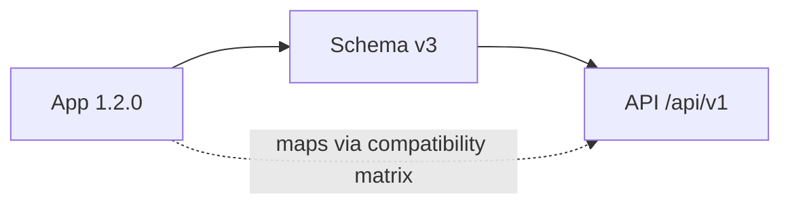
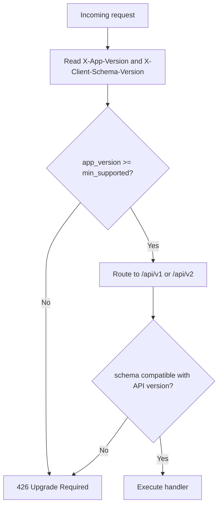
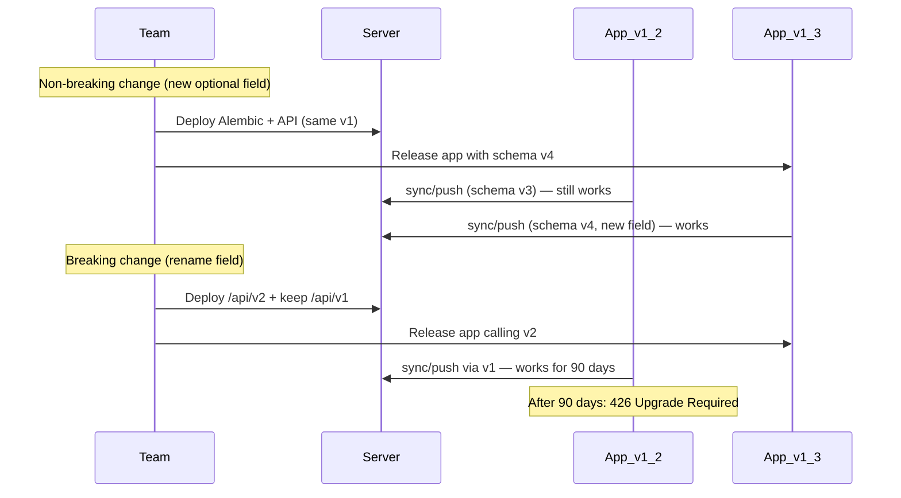

# API Versioning Strategy Plan

## Problem

SmartOps is offline-first with local Isar schema and cloud PostgreSQL. Users update the app at different times. The backend must simultaneously serve:

- Old app versions still installed (syncing offline data)
- New app versions with updated local schema and fields
- Future web admin (Phase 3) on the same API

Existing docs only mention `/api/v1` ([architecture.md](docs/architecture.md)) and a one-line `X-Client-Schema-Version` header ([local-database-migrations.md](docs/local-database-migrations.md)). A full versioning strategy is needed.

---

## Three Version Concepts (must stay separate)

| Concept | Example | Who owns it | Purpose |
|---|---|---|---|
| **App version** | `1.2.0` (semver) | Mobile release | User-facing; store updates; force-update checks |
| **Client schema version** | `3` (integer) | Isar migration runner | Local DB migration tracking |
| **API version** | `v1` (URL path) | Backend routes | REST contract + sync protocol |



**Rule:** API version bumps only on **breaking** contract changes. App and schema versions can increment without a new API version if changes are backward-compatible.

---

## Recommended Compatibility Policy

**Support N and N-1 API versions for 90 days** after a new version ships.

| Policy | Rationale |
|---|---|
| N + N-1 window | Mobile users update slowly; offline users may sync days later on old app |
| 90-day deprecation | Enough time for organic app store updates without blocking business ops |
| Force update below minimum | Security fixes, auth breaking changes, incompatible sync |
| Single DB schema (Alembic) | Server DB is shared; v1 and v2 APIs read/write same PostgreSQL with adapter layers |

**Do not** force single-version-only for SmartOps — offline sync from an old app after a server deploy would fail and cause data-loss anxiety.

### When to bump API version (v1 → v2)

| Change | New API version? |
|---|---|
| Add optional JSON field / nullable DB column | No — v1 continues |
| Add new endpoint | No — v1 continues |
| Rename or remove request/response field | **Yes — v2** |
| Change field type or validation rules | **Yes — v2** |
| Change sync push/pull envelope structure | **Yes — v2** |
| Change auth token format | **Yes — v2** + force update |

### When to force app update (without new API version)

- Critical security patch
- Google auth client ID rotation
- Client below `min_supported_app_version` in server config

---

## Versioning Mechanism

### 1. URL path versioning (primary)

Already established in [architecture.md](docs/architecture.md):

```
/api/v1/auth/google
/api/v1/sync/push
/api/v1/expenses
/api/v2/sync/push   ← future breaking sync change
```

**FastAPI structure (future code):**

```
backend/app/api/
  v1/
    router.py
    auth.py, sync.py, expenses.py, ...
  v2/
    router.py
    sync.py, ...          # only endpoints that changed
  deps.py                 # shared auth deps
backend/app/services/     # shared business logic — NOT duplicated per version
backend/app/schemas/
  v1/
  v2/
```

v2 routes call the same `services/` layer; version-specific adapters transform request/response shapes.

### 2. Client identification headers (every request)

Mobile sends on all API calls:

| Header | Example | Purpose |
|---|---|---|
| `X-App-Version` | `1.2.0` | Semver from `package_info` |
| `X-Client-Schema-Version` | `3` | Isar schema version from `LocalDbMeta` |
| `X-Platform` | `android` / `ios` | Platform-specific behavior |
| `X-Device-Id` | UUID | Device binding (auth + sync) |
| `X-Organization-Id` | UUID | Tenant context (existing) |

Server responds with (optional but recommended):

| Header | Purpose |
|---|---|
| `X-API-Version` | `1` — version that handled the request |
| `X-Min-Supported-App-Version` | Below this → force update screen |
| `X-Latest-App-Version` | Soft nudge to update (optional) |

### 3. Compatibility matrix (server config)

Stored in backend config or DB table `api_compatibility`:

| min_app_version | max_schema_version | api_version | status |
|---|---|---|---|
| 1.0.0 | 3 | v1 | active |
| 1.3.0 | 5 | v1 | active |
| 1.5.0 | 6 | v2 | active |

Middleware checks headers on every request:



---

## Error Responses

### 426 Upgrade Required (force update)

```json
{
  "error": {
    "code": "APP_UPDATE_REQUIRED",
    "message": "Please update SmartOps to continue",
    "details": {
      "min_supported_app_version": "1.3.0",
      "latest_app_version": "1.5.0",
      "store_url": "https://play.google.com/store/apps/details?id=..."
    }
  }
}
```

Mobile shows blocking "Update required" screen with store link. Local data remains intact; sync paused.

### 426 Soft update (optional — 200 with warning header)

For non-breaking deprecations, return success + `X-Deprecation-Warning: API v1 sunsets 2026-09-01`.

---

## Sync Protocol Versioning

Sync is the highest-risk cross-version surface. Special rules:

### MVP (v1 only)

- All clients use `POST /api/v1/sync/push` and `GET /api/v1/sync/pull`
- Server accepts unknown fields in push payload (ignore extras — forward compatibility)
- Server never requires new fields from old clients (backward compatibility)
- Pull response includes only fields the client schema supports (filter by `X-Client-Schema-Version`)

### Push from old client to new server

```json
{
  "device_id": "...",
  "client_schema_version": 2,
  "changes": { "expenses": [ { "id": "...", "amount": 500 } ] }
}
```

Server fills defaults for new DB columns server-side. Old clients don't send new fields — OK.

### Pull to old client from new server

Server strips fields unknown to client's schema version:

```
if client_schema_version < 4:
  omit "gstin" from customer objects
```

### When sync protocol breaks (v2)

New endpoints:

```
POST /api/v2/sync/push
GET  /api/v2/sync/pull
```

v1 sync endpoints remain for 90 days. Mobile app v1.x continues calling v1; app v2.x calls v2.

---

## Release Coordination Workflow



### Deploy checklist (add to versioning doc)

1. Classify change: breaking or compatible?
2. If compatible: deploy server first, then app (or either order)
3. If breaking: deploy v2 API + keep v1; release new app calling v2; set v1 sunset date
4. Update compatibility matrix
5. Update OpenAPI spec for each active API version
6. Test: old app + new server, new app + new server, old app after v1 sunset

---

## Mobile Client Behavior

| Server response | Mobile action |
|---|---|
| 200 OK | Normal operation |
| 426 `APP_UPDATE_REQUIRED` | Show force-update screen; local data preserved |
| 401 | Refresh token or re-login |
| Sync 409 conflict | Existing conflict handler |
| Network error | Offline mode continues |

Store `min_supported_app_version` from last successful response; check on app launch.

---

## OpenAPI and Documentation

- Generate separate OpenAPI specs: `/api/v1/openapi.json`, `/api/v2/openapi.json`
- Tag deprecated v1 endpoints with `deprecated: true` during sunset period
- Phase 3 web admin codegen from v2 spec when ready

---

## Document Deliverable

**New file:** [`docs/api-versioning.md`](docs/api-versioning.md)

Sections:
1. Overview — three version concepts
2. Compatibility policy (N + N-1, 90 days) — **recommended approach**
3. URL path versioning + FastAPI folder structure
4. Client headers + server response headers
5. Compatibility matrix + middleware logic
6. Error responses (426 force update)
7. Sync protocol versioning (push/pull rules)
8. Release coordination workflow + deploy checklist
9. Deprecation and sunset process
10. Testing matrix (old app / new server combinations)
11. Relationship to [Local Database Migrations](docs/local-database-migrations.md) and [Deployment](docs/deployment.md)

---

## Cross-Document Updates

| File | Change |
|---|---|
| [docs/architecture.md](docs/architecture.md) | Expand API Layer Design with versioning headers, 426 handling, v1/v2 router note; link to api-versioning.md |
| [docs/local-database-migrations.md](docs/local-database-migrations.md) | Expand "API version header" section; link to api-versioning.md for full policy |
| [docs/mvp-requirements.md](docs/mvp-requirements.md) | Add acceptance: mobile sends version headers; server returns 426 below minimum |
| [docs/deployment.md](docs/deployment.md) | Note: deploy v2 routes alongside v1; never delete v1 without sunset period |
| [docs/tech-stack.md](docs/tech-stack.md) | Add API versioning row: URL path + client headers |

---

## MVP Scope (v1.0 beta)

Keep scope minimal for first release:

- Only `/api/v1` exists
- Implement version headers + compatibility middleware (reject below `1.0.0` only)
- Sync ignores unknown push fields; pull sends full v1 shape
- Document v2 process now; implement v2 when first breaking change occurs

No v2 code needed until a breaking change ships post-MVP.

---

## Implementation order

1. Create [`docs/api-versioning.md`](docs/api-versioning.md)
2. Update [`docs/architecture.md`](docs/architecture.md)
3. Update [`docs/local-database-migrations.md`](docs/local-database-migrations.md)
4. Update [`docs/mvp-requirements.md`](docs/mvp-requirements.md), [`docs/deployment.md`](docs/deployment.md), [`docs/tech-stack.md`](docs/tech-stack.md)

Documentation only — no application code in this phase.
