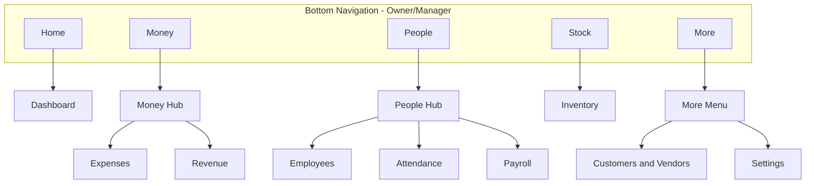

# SmartOps UI/UX Documentation Plan

## Context

SmartOps MVP is a **mobile-first, offline-first** Flutter app for Indian small businesses. Existing docs define personas, a brief screen flow list ([mvp-requirements.md](docs/mvp-requirements.md) lines 473–489), and onboarding diagram — but no design system, component library, screen layouts, or accessibility guidelines.

Your choices:
- **Depth:** Full design system + all MVP screen specs + wireframe descriptions
- **Visual style:** **Material Design 3** (Flutter `ThemeData` / `ColorScheme` / M3 components)

---

## Document Deliverables

| # | File | Purpose |
|---|---|---|
| 1 | [`docs/ui-ux-design-system.md`](docs/ui-ux-design-system.md) | M3 theme, tokens, components, navigation, i18n UX, accessibility |
| 2 | [`docs/ui-ux-screens.md`](docs/ui-ux-screens.md) | Screen-by-screen specs, wireframes, states, RBAC views per module |

Cross-link both from [mvp-requirements.md](docs/mvp-requirements.md), [architecture.md](docs/architecture.md), and [tech-stack.md](docs/tech-stack.md).

Optional later: Figma file mirroring these docs (out of scope for this doc pass).

---

## Design Principles (for Indian SMB + offline-first)

| Principle | Implementation |
|---|---|
| **Clarity over density** | Rajesh (persona) uses WhatsApp, not Excel — one primary action per screen |
| **≤3 taps to core actions** | Quick actions on dashboard: Add expense, Mark attendance ([mvp-requirements.md](docs/mvp-requirements.md)) |
| **Offline visibility** | Persistent sync/offline banner; never hide connectivity state |
| **Hindi-first friendly** | Icons + labels always; Noto Sans Devanagari; test layouts with longer Hindi strings |
| **Thumb-zone navigation** | Bottom nav + FAB for primary create actions |
| **Trust for money data** | Confirm destructive actions; show ₹ amounts prominently; payroll "Finalize" requires explicit confirm |
| **Role-aware UI** | Employee role sees minimal nav (profile, attendance, payslip only) |

---

## Part 1: Design System ([`docs/ui-ux-design-system.md`](docs/ui-ux-design-system.md))

### 1.1 Material Design 3 Theme

Define Flutter M3 `ColorScheme` (light mode MVP; dark mode noted as Phase 2):

| Token | Value direction | Usage |
|---|---|---|
| `primary` | Deep teal or blue (#0D6E6E suggested) | App bar, FAB, primary buttons — professional, not playful |
| `onPrimary` | White | Text on primary |
| `secondary` | Amber/gold accent | Revenue highlights, positive metrics |
| `tertiary` | Soft green | Success states, "present" attendance |
| `error` | M3 error red | Validation, destructive actions |
| `surface` | White / light grey | Cards, backgrounds |
| `surfaceContainerHighest` | Light grey | Metric card backgrounds |

Include `ThemeData` snippet (conceptual) mapping to `useMaterial3: true`.

**Typography:** M3 type scale (`displayLarge` → `labelSmall`) with:
- **English:** Roboto (Flutter default)
- **Hindi:** Noto Sans Devanagari via `fontFamily` fallback in theme
- **Numbers/currency:** Tabular figures for aligned amount columns

**Spacing:** 4dp grid — `4, 8, 12, 16, 24, 32` standard paddings.

**Elevation:** Cards at elevation 1; modals at 3; FAB at 3.

### 1.2 Navigation Architecture



**Bottom nav (4 tabs + More):** Home · Money · People · Stock · More

- Avoid 8 bottom tabs — use **hub screens** for grouped modules
- **FAB:** Contextual per tab (e.g. "+" on Money → bottom sheet: Add Expense / Add Revenue)
- **Employee role:** Reduced nav — Home (limited), Attendance, Payslip, Profile only

**Routing:** Document mapping to `go_router` paths (e.g. `/money/expenses`, `/people/attendance`).

### 1.3 Core Components Library

Document reusable Flutter widgets in `shared/widgets/`:

| Component | M3 base | Purpose |
|---|---|---|
| `SmartOpsScaffold` | `Scaffold` | App bar + sync banner slot + bottom nav |
| `SyncStatusBanner` | `Banner` / custom bar | Offline / syncing / pending count / conflict |
| `MetricCard` | `Card` | Dashboard KPI (amount, label, trend) |
| `AmountDisplay` | `Text` | ₹ formatted via `intl` — `en_IN` / `hi_IN` |
| `EmptyStateView` | Column + illustration | Icon, title, CTA button per module |
| `SmartOpsListTile` | `ListTile` | Standard row with trailing amount/status |
| `FilterChipBar` | `FilterChip` | Date range, category filters |
| `ConfirmDialog` | `AlertDialog` | Destructive actions, payroll finalize |
| `ForceUpdateScreen` | Full-screen | 426 response — store link |
| `LoadingOverlay` | `CircularProgressIndicator` | Sync, migration |
| `PhotoAttachmentPicker` | `IconButton` + camera | Expense invoice attach |
| `EmployeeAvatar` | `CircleAvatar` | Initials fallback |
| `StatusBadge` | `Chip` | Present/Absent/Paid/Draft |
| `QuickActionGrid` | `GridView` | Dashboard 2x2 shortcuts |

Each component: anatomy, states (default, loading, error, disabled), Hindi text overflow rules.

### 1.4 Global UX Patterns

| Pattern | Spec |
|---|---|
| **Lists** | Pull-to-refresh triggers sync; skeleton loaders on first load |
| **Forms** | Single column; labels above fields; sticky Save button; validate on submit |
| **Amount entry** | Numeric keyboard; ₹ prefix; no negative for expense/revenue |
| **Date pickers** | Material date picker; locale-aware |
| **Search** | Persistent in list app bars for employees, customers, products |
| **Snackbar feedback** | "Saved offline — will sync when online" for offline writes |
| **Bottom sheets** | Choose category, payment method, employee for attendance |
| **Offline** | Top banner amber when offline; green flash on sync complete |
| **Empty states** | Illustration + one-line Hindi/English + primary CTA |
| **Errors** | Inline field errors; full-screen for migration/recovery failures |

### 1.5 Localization UX

From [mvp-requirements.md](docs/mvp-requirements.md) and [initial-Prompt.txt](docs/initial-Prompt.txt):

- All strings via ARB — no hardcoded UI text
- Language toggle in onboarding + Settings
- Layout must accommodate **30% longer Hindi strings** without truncation on buttons
- Currency/date/number via `intl` locale — never format manually
- Document RTL readiness note (not needed for Hindi/English; note for future Arabic)

### 1.6 Accessibility (MVP baseline)

| Requirement | Target |
|---|---|
| Touch target | Minimum 48x48 dp |
| Contrast | WCAG AA for text on surfaces |
| Screen reader | `Semantics` labels on icon-only buttons |
| Font scaling | Support system font scale up to 1.3x without layout break |
| Color-only status | Always pair color + icon + text (attendance status) |

### 1.7 Role-Based UI Shell

| Role | Bottom nav visible | Dashboard | Modules hidden |
|---|---|---|---|
| Owner | Full (5 tabs) | Full metrics | — |
| Manager | Full | Full metrics | Billing/settings limited |
| Employee | 3 tabs: Home, Attendance, Profile | Personal summary only | Money, Stock, CRM, Payroll admin |

---

## Part 2: Screen Specifications ([`docs/ui-ux-screens.md`](docs/ui-ux-screens.md))

For each screen document:

- **Purpose** and user story reference
- **Entry points** (navigation path)
- **Wireframe** (ASCII or mermaid layout)
- **Components used** (from design system)
- **Fields/actions** with validation rules
- **States:** empty, loading, populated, offline, error, permission denied
- **RBAC:** Owner / Manager / Employee differences
- **i18n keys** (naming convention: `expenseListTitle`, etc.)

### Screen inventory (~45 screens/dialogs)

#### Global / Auth (6)
- Splash
- Google Sign-In
- Force Update (426)
- Migration progress ("Updating database...")
- Recovery (migration failed)
- Session expired → re-login

#### Onboarding (4)
- Language selection
- Business profile (name, type, city)
- Add first employee (optional skip)
- Welcome / guided first action

#### Dashboard (1 + empty)
- Dashboard (owner/manager) — metric cards, quick actions, attendance summary
- Dashboard (employee) — personal attendance + payslip link

#### Money — Expenses (5)
- Expense list (filter, search, totals)
- Expense add/edit form
- Category picker bottom sheet
- Invoice photo viewer
- Recurring expense template list (P1)

#### Money — Revenue (4)
- Revenue list
- Revenue add/edit form
- Category picker
- Customer link picker (P1)

#### People — Employees (5)
- Employee list
- Employee profile
- Employee add/edit form
- Department/designation management (P1)
- Document upload viewer

#### People — Attendance (6)
- Daily attendance grid (all employees)
- Employee check-in/out detail
- Monthly attendance report
- Leave request form (employee)
- Leave pending list (owner approve/reject)
- Self attendance mark (employee)

#### People — Payroll (6)
- Salary structure list
- Salary structure edit
- New payroll run — select period
- Payroll preview (line items, adjust)
- Payroll finalized confirmation
- Payslip view (PDF/share)

#### Stock — Inventory (4)
- Product list (low stock badge)
- Product add/edit
- Stock in/out form
- Product detail with movement history

#### More — CRM (6)
- CRM hub (Customers / Vendors tabs)
- Customer list + search
- Customer profile + linked transactions
- Vendor list + search
- Vendor profile + linked transactions
- Customer/vendor add/edit form

#### Settings & System (5)
- Settings menu
- Language preference
- Organization settings (owner)
- Sync status detail + manual sync button
- About / version / logout

#### Dialogs / Sheets (shared)
- Confirm delete
- Sync conflict alert
- Category/method picker sheets
- Date range filter sheet
- Export CSV confirmation

### Example wireframe format (Dashboard)

```
┌─────────────────────────────┐
│ SmartOps    [sync icon] [⚙] │
│ ⚠ Offline — changes saved   │
├─────────────────────────────┤
│  Today                      │
│ ┌──────────┐ ┌──────────┐  │
│ │ ₹12,500  │ │ ₹3,200   │  │
│ │ Revenue  │ │ Expenses │  │
│ └──────────┘ └──────────┘  │
│ ┌──────────┐ ┌──────────┐  │
│ │ ₹9,300   │ │ 6/8      │  │
│ │ Profit   │ │ Present  │  │
│ └──────────┘ └──────────┘  │
│  Quick Actions              │
│ [+ Expense] [✓ Attendance]  │
│ [+ Revenue] [→ Payroll]     │
├─────────────────────────────┤
│ 🏠  💰  👥  📦  ⋯         │
└─────────────────────────────┘
```

### Key flow diagrams to include

1. **First-time user:** Sign-in → Language → Business → Dashboard empty → Add expense
2. **Daily owner routine:** Dashboard → Mark attendance → Add expense → Check profit
3. **Monthly payroll:** People → Payroll → Select month → Preview → Confirm → Payslip
4. **Offline write:** Add expense offline → banner → sync on reconnect → snackbar
5. **Employee daily:** Open app → Mark attendance → View payslip

---

## Part 3: Cross-Document Updates

| File | Change |
|---|---|
| [docs/mvp-requirements.md](docs/mvp-requirements.md) | Expand UI/UX Flow List with links; add UX acceptance criteria (48dp targets, empty states, offline banner) |
| [docs/architecture.md](docs/architecture.md) | Link UI docs from presentation layer section; note `shared/widgets/` component library |
| [docs/tech-stack.md](docs/tech-stack.md) | Add row: UI framework — Material Design 3; fonts Roboto + Noto Sans Devanagari |
| [docs/revenue-model.md](docs/revenue-model.md) | Optional: note upgrade prompt UI patterns (future billing) |

---

## MVP UX Acceptance Criteria (add to mvp-requirements)

| Criterion | Target |
|---|---|
| Core action tap count | Add expense / mark attendance ≤ 3 taps from dashboard |
| Offline indicator | Visible on every screen when offline |
| Empty states | Every list screen has empty state + CTA |
| Hindi layout | No truncated button text on standard phone widths (360dp) |
| Touch targets | All interactive elements ≥ 48dp |
| Role gating | Employee cannot navigate to owner-only screens |
| Force update | 426 shows full-screen with Play Store link |
| Form feedback | Offline save shows snackbar confirmation |

---

## Out of Scope (document as Phase 2+)

- Dark mode theme
- Custom illustration pack (use M3 icons for MVP)
- Figma file creation
- Voice input UI
- Barcode scanner UI
- Web admin dashboard UI
- Animated onboarding walkthrough (Lottie)
- In-app billing / Razorpay checkout UI (v1.1)

---

## Implementation Order

1. Create [`docs/ui-ux-design-system.md`](docs/ui-ux-design-system.md)
2. Create [`docs/ui-ux-screens.md`](docs/ui-ux-screens.md) — module by module
3. Update [docs/mvp-requirements.md](docs/mvp-requirements.md) — UX acceptance + links
4. Update [docs/architecture.md](docs/architecture.md) and [docs/tech-stack.md](docs/tech-stack.md) — cross-links

Documentation only — no Flutter code in this phase.
