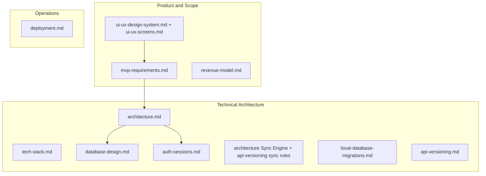
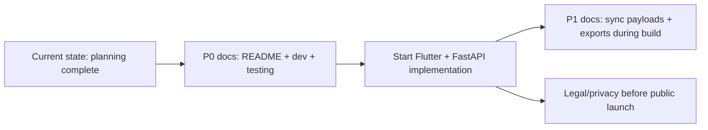

# SmartOps Documentation Completeness Assessment

## Verdict

**You are done with core MVP planning documentation.** The attached UI/UX plan is fully implemented:

| Deliverable | Status |
|---|---|
| [`docs/ui-ux-design-system.md`](docs/ui-ux-design-system.md) | Complete (531 lines) |
| [`docs/ui-ux-screens.md`](docs/ui-ux-screens.md) | Complete (~45 screens, flows, wireframes) |
| Cross-links in [`docs/mvp-requirements.md`](docs/mvp-requirements.md), [`docs/architecture.md`](docs/architecture.md), [`docs/tech-stack.md`](docs/tech-stack.md) | Complete |
| UX acceptance criteria in MVP requirements | Complete |

The repo now has **12 structured docs** covering product scope, architecture, data model, auth, sync, deployment, API versioning, revenue, migrations, and UI/UX. **No application code exists yet** — documentation-only phase is effectively complete for MVP v1.0 planning.

---

## What Is Already Well Covered

- **Product:** Personas, RBAC matrix, module user stories, acceptance criteria, release roadmap
- **Data:** Full PostgreSQL + Isar schema, ERD, indexes, sync metadata
- **Sync:** Push/pull payloads, conflict rules, single-device MVP constraint ([`architecture.md`](docs/architecture.md) Sync Engine section)
- **Auth:** Google Sign-In flow, JWT lifecycle, secure storage ([`auth-sessions.md`](docs/auth-sessions.md))
- **Ops:** Free-tier hosting (Neon + Render), CI/CD, env vars, beta checklist ([`deployment.md`](docs/deployment.md))
- **UI/UX:** M3 theme, component library, navigation, all MVP screens with wireframes and RBAC views

---

## Remaining Gaps (By Priority)

### P0 — Recommended before writing code

These are the only gaps that would materially help the first implementation sprint:

1. **Project README** — Missing entirely. No root [`README.md`](README.md) or docs index. New contributors have no entry point. Should link all 12 docs, repo structure (`mobile/`, `backend/`), and quick-start pointers.

2. **Mobile + full-stack local dev guide** — [`deployment.md`](docs/deployment.md) covers backend Docker + `uvicorn` only. Missing:
   - Flutter flavor setup (`staging` / `production` `API_BASE_URL`)
   - Isar code generation workflow
   - Running mobile against local backend
   - Google Sign-In dev credentials setup (partially in deployment § Google Sign-In)

3. **Testing strategy doc** — Testing guidance is scattered across [`mvp-requirements.md`](docs/mvp-requirements.md) (acceptance targets), [`deployment.md`](docs/deployment.md) (CI pytest), [`local-database-migrations.md`](docs/local-database-migrations.md) (migration checklist), and [`api-versioning.md`](docs/api-versioning.md) (compatibility matrix). A single **`docs/testing-strategy.md`** would unify:
   - Unit / integration / E2E scope per layer
   - Offline + sync test scenarios (airplane mode, conflict, migration)
   - Device matrix (360dp Hindi, mid-range Android)
   - Beta QA checklist (references existing UX acceptance criteria)

### P1 — Helpful during implementation (not blocking planning)

4. **Sync payload reference** — Auth endpoints are documented; sync push/pull have JSON examples in [`architecture.md`](docs/architecture.md). A dedicated **`docs/sync-protocol.md`** could enumerate per-entity payload shapes (expense, employee, attendance, payroll) aligned with [`database-design.md`](docs/database-design.md) tables. Optional because schema doc + sync examples may suffice for MVP.

5. **Export format specs** — MVP includes CSV export (expenses, revenue) and payslip PDF (P1). [`mvp-requirements.md`](docs/mvp-requirements.md) lists formats but not column definitions or PDF layout. Worth a short **`docs/export-formats.md`** when building export features.

6. **Error code catalog** — [`architecture.md`](docs/architecture.md) shows envelope format and `426` example. A consolidated list of business error codes (`EXPENSE_NOT_FOUND`, `PAYROLL_FINALIZED`, etc.) would help mobile error handling — can also emerge from OpenAPI during backend build.

7. **Consolidate legacy doc** — [`docs/app-details.md`](docs/app-details.md) is early brainstorming (mentions **task management** as offline-capable, which contradicts MVP out-of-scope in [`mvp-requirements.md`](docs/mvp-requirements.md)). Either mark it superseded with a header pointing to current docs, or archive/remove to avoid confusion.

### P2 — Defer to Phase 2+ or legal review

| Topic | Notes |
|---|---|
| Privacy / DPDP compliance | No data retention, deletion, or consent doc — needed before public launch, not internal planning |
| Upgrade / billing UI patterns | Optional note from UI/UX plan; [`revenue-model.md`](docs/revenue-model.md) covers tiers but not in-app upgrade screens (billing is Phase 1.5) |
| OpenAPI spec | Referenced in [`api-versioning.md`](docs/api-versioning.md) as `/api/v1/openapi.json` — **generated from code**, not a pre-code doc |
| Figma / design assets | Explicitly out of scope per UI/UX plan |
| Analytics event taxonomy | Not documented; add when instrumenting Sentry/analytics |
| ARB string catalog | Thousands of keys — belongs in codebase (`app_en.arb`), not planning docs |

---

## Intentionally Not Documented (Correct for MVP)

These are **out of scope** per [`mvp-requirements.md`](docs/mvp-requirements.md) and should not be documented now:

- Task management, push notifications, multi-device sync, GST filing, phone OTP, web admin, AI assistant, barcode scanner, dark mode, Razorpay checkout UI

Per-entity REST CRUD endpoints are also intentionally thin: MVP is **sync-first** (`POST /sync/push`, `GET /sync/pull`) with auth + file presign as the primary HTTP surface. Full REST list endpoints are conventions-only in [`architecture.md`](docs/architecture.md) — sufficient for MVP architecture.

---

## Recommended Next Step

**If the goal is "ready to build":** Add 3 short docs (README, local dev guide, testing strategy) and add a superseded notice to `app-details.md`. Estimated effort: one focused session.

**If the goal is "planning complete":** You can start implementation now. Remaining P1/P2 items can be written incrementally as features are built.

