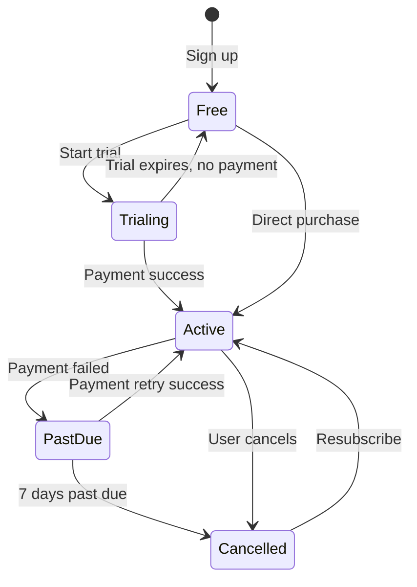

# SmartOps Revenue Model

> Related docs: [MVP Requirements](./mvp-requirements.md) · [Database Design](./database-design.md) · [Auth & Sessions](./auth-sessions.md) · [Deployment](./deployment.md) · [Tech Stack](./tech-stack.md)

## Overview

SmartOps targets **Indian small businesses (1–100 employees)** with a **freemium + employee-seat hybrid** model. The strategy prioritizes low adoption friction (free tier), monetizes on scale (employee count), and upsells compliance and automation features as businesses grow.

**Market context:** Indian SMB owners are price-sensitive, often compare against free tools (Khatabook, Excel), and prefer UPI/annual billing. A generous free tier drives adoption; paid tiers unlock the modules that save real operational time.

---

## Revenue Model: Freemium + Seat Hybrid

---

## Pricing Tiers

### Tier Comparison

| Feature | Free | Starter | Growth | Business |
|---|---|---|---|---|
| **Price (monthly)** | ₹0 | ₹499 | ₹999 | ₹1,999 |
| **Price (annual)** | ₹0 | ₹4,999 (~17% off) | ₹9,999 (~17% off) | ₹19,999 (~17% off) |
| **Businesses** | 1 | 1 | 1 | Unlimited |
| **Employees** | 5 | 25 | 100 | Unlimited |
| **User accounts** | 1 | 3 | 10 | Unlimited |
| **Dashboard** | Basic | Full | Full | Full |
| **Expense tracking** | Yes | Yes | Yes | Yes |
| **Revenue tracking** | Yes | Yes | Yes | Yes |
| **Employee profiles** | Basic | Full | Full | Full |
| **Attendance** | Yes | Yes | Yes | Yes |
| **Payroll** | — | Manual | Manual | Automated |
| **Inventory** | — | Yes | Yes | Yes |
| **CRM (Customer/Vendor)** | — | Yes | Yes | Yes |
| **Recurring expenses** | — | — | Yes | Yes |
| **Multi-branch** | — | — | Yes | Yes |
| **PDF reports** | — | Basic | Advanced | Advanced |
| **CSV export** | — | Yes | Yes | Yes |
| **Payslip PDF** | — | Yes (EN/HI) | Yes (EN/HI) | Yes (all languages) |
| **Cloud sync** | Yes | Yes | Priority | Priority |
| **Offline mode** | Yes | Yes | Yes | Yes |
| **GST reports** | — | — | — | Yes |
| **API access** | — | — | — | Yes |
| **Support** | Community | Email | Email + chat | Dedicated |
| **Free trial** | — | 14 days | 14 days | 14 days |

### Add-Ons (Post-MVP)

| Add-on | Price | Description |
|---|---|---|
| AI Business Assistant | ₹299/mo | Natural language queries, insights, recommendations |
| Extra business slot | ₹199/mo | Additional organization on same account |
| White-label / Franchise | Custom | Branded app for franchise networks |
| Priority onboarding | ₹2,999 one-time | Setup assistance, data migration |

---

## Feature Gating Matrix

Features are enforced at the API layer via subscription plan checks. See `subscription_plans.features` JSONB in [Database Design](./database-design.md).

| Module | Feature flag | Free | Starter+ |
|---|---|---|---|
| Dashboard | `dashboard.basic` | Yes | — |
| Dashboard | `dashboard.full` | — | Yes |
| Expenses | `expenses.*` | Yes | Yes |
| Revenue | `revenue.*` | Yes | Yes |
| Employees | `employees.basic` | Yes (5 max) | — |
| Employees | `employees.full` | — | Yes |
| Attendance | `attendance.*` | Yes | Yes |
| Payroll | `payroll.manual` | — | Starter+ |
| Payroll | `payroll.automated` | — | Business |
| Inventory | `inventory.*` | — | Starter+ |
| CRM | `crm.*` | — | Starter+ |
| Reports | `reports.pdf_basic` | — | Starter+ |
| Reports | `reports.advanced` | — | Growth+ |
| Reports | `reports.gst` | — | Business |
| Multi-branch | `branches.*` | — | Growth+ |
| API | `api.access` | — | Business |
| AI | `ai.assistant` | — | Add-on |

### Enforcement Points

1. **API middleware** — reject requests for gated features with `403 PLAN_UPGRADE_REQUIRED`
2. **Employee count** — block new employee creation when limit reached
3. **User invites** — block when user account limit reached
4. **Mobile UI** — show upgrade prompt on locked modules (graceful degradation)

---

## Payment Integration

### Phase 1.5: Razorpay (Post-MVP Validation)

Billing integration deferred until core product validated in beta. Before Razorpay:

- Manual onboarding for beta paid users
- Bank transfer / UPI to business account
- Manual subscription activation in admin

### Razorpay Integration Plan

| Component | Implementation |
|---|---|
| Subscription plans | Razorpay Plans API synced with `subscription_plans` table |
| Checkout | Razorpay Checkout (mobile WebView or native SDK) |
| Recurring billing | Razorpay Subscriptions with UPI AutoPay |
| Webhooks | `subscription.activated`, `subscription.charged`, `subscription.cancelled` |
| Invoicing | Razorpay Invoices for annual plans |
| Refunds | Manual via Razorpay dashboard initially |

### Payment Methods Supported

| Method | Priority |
|---|---|
| UPI AutoPay | Primary — most Indian SMB preference |
| Credit/Debit card | Secondary |
| Net banking | Tertiary |
| UPI one-time | Annual plan payments |

### Global Expansion (Future)

When expanding beyond India:
- Add **Stripe** for international cards and subscriptions
- Keep Razorpay for Indian customers
- Route by `organization.country_code`

---

## Unit Economics

### Assumptions (Year 1)

| Metric | Target |
|---|---|
| Total registered businesses | 5,000 |
| Free-to-paid conversion | 8–12% |
| Paid subscribers (end of Y1) | 400–600 |
| Average revenue per paying user (ARPU) | ₹650/mo |
| Monthly recurring revenue (MRR) at Y1 | ₹2.6L–₹3.9L |
| Annual churn | <5% monthly (target <3%) |
| Customer acquisition cost (CAC) | ₹500–₹1,500 |
| Lifetime value (LTV) | ₹15,000–₹25,000 (24-month avg retention) |
| LTV:CAC ratio target | >3:1 |

### Break-Even Analysis

#### Free-tier deployment (recommended for MVP beta)

| Cost item | Monthly (free tier) |
|---|---|
| Neon PostgreSQL | ₹0 |
| Render or Vercel (backend) | ₹0 |
| Cloudflare R2 storage | ₹0 |
| Authentication (Google Sign-In) | ₹0 |
| Sentry | ₹0 (free tier) |
| **Total infra (free tier MVP)** | **₹0/mo** |

See [Deployment Guide](./deployment.md) for setup.

#### Paid hosting (if free tier limits are hit)

| Cost item | Monthly |
|---|---|
| Render Starter (backend) | ~₹600/mo ($7) |
| Neon Launch (database) | Pay-as-you-go from ~₹500/mo |
| Cloudflare R2 storage | ₹500–₹2,000 |
| Authentication (Google Sign-In) | ₹0 |
| Sentry | ₹0 (free tier) |
| Razorpay fees | 2% of GMV (Phase 1.5+) |
| MSG91 OTP | ₹0 in MVP; ₹1,000–₹3,000/mo when added in Phase 2 |
| **Total infra (paid MVP)** | **~₹1,500–₹4,000/mo** |

**Break-even:** With free-tier deployment, infra cost is ₹0 until limits are hit. First paid upgrade (~₹600/mo Render Starter) is covered by 1–2 paying Starter subscribers.

### Revenue Projections (Conservative)

| Month | Free users | Paid users | MRR |
|---|---|---|---|
| M3 (beta) | 200 | 10 | ₹5,000 |
| M6 | 800 | 50 | ₹32,500 |
| M12 | 3,000 | 300 | ₹1,95,000 |
| M24 | 10,000 | 1,200 | ₹7,80,000 |

---

## Competitive Positioning

### Indian SMB Market Landscape

| Competitor | Focus | Pricing | SmartOps advantage |
|---|---|---|---|
| **Vyapar** | Billing, inventory, GST | Free–₹799/yr | Broader ops (HR, payroll, attendance); offline-first |
| **Khatabook** | Ledger, credit tracking | Free | Full business OS, not just ledger |
| **myBillBook** | Invoicing, GST | ₹1,999/yr | Employee + payroll management |
| **Zoho Books** | Accounting | ₹749+/mo | Simpler UX, mobile-first, Hindi UI, offline |
| **Tally** | Accounting (desktop) | ₹18,000+/yr | Modern mobile, cloud sync, lower price |
| **Excel + WhatsApp** | Everything | Free | Purpose-built, structured, syncs automatically |

### SmartOps Differentiators

1. **Offline-first** — works without internet (unique among competitors)
2. **All-in-one** — expense + revenue + HR + payroll + inventory in one app
3. **Hindi + regional language** UI from day one
4. **Mobile-first** — designed for shop floor, not desktop accountants
5. **Simple pricing** — no per-module nickel-and-diming

### Positioning Statement

> SmartOps is the business operating system for Indian small businesses — manage expenses, revenue, employees, attendance, payroll, and inventory from one app that works even without internet.

---

## Go-to-Market Pricing Strategy

### Launch (Beta — Months 1–4)

- All beta users on **Starter plan free for 3 months**
- Collect feedback; no billing friction during validation
- Grandfather early adopters: 50% lifetime discount on Growth plan

### Public Launch (Month 5+)

- Free tier live immediately — no credit card required
- 14-day trial on Starter/Growth (full features, no employee limit during trial)
- Annual plan promoted prominently (Indian preference for yearly billing)
- Referral program: 1 month free Starter for each referred paying business

### Upgrade Triggers (In-App)

Show contextual upgrade prompts when:

| Trigger | Message |
|---|---|
| 6th employee added (Free limit: 5) | "You've reached the free plan limit. Upgrade to manage up to 25 employees." |
| Tap Payroll module (Free) | "Payroll is available on Starter plan. Process salaries and generate payslips." |
| Tap Inventory module (Free) | "Track stock and get low-stock alerts with Starter." |
| 26th employee (Starter limit: 25) | "Upgrade to Growth to manage up to 100 employees." |
| Second business created | "Manage multiple businesses with the Business plan." |

---

## Subscription Lifecycle

### Downgrade Policy

- Downgrade takes effect at end of current billing period
- If current employee count exceeds new plan limit: warn user, block downgrade until resolved
- Data never deleted on downgrade — modules become read-only until upgrade

### Data Retention on Cancellation

- Active data retained for **90 days** after cancellation
- User can export all data (CSV) during retention period
- After 90 days: data archived; account deactivated
- Re-subscription within 90 days restores full access

---

## Revenue Model Risks

| Risk | Mitigation |
|---|---|
| Users stay on free tier indefinitely | Gate high-value modules (payroll, inventory, CRM); employee limit |
| Price too high for micro-businesses | Free tier covers 5 employees; annual discount |
| Razorpay UPI AutoPay adoption low | Offer card/netbanking fallback; manual UPI for annual |
| Competitors undercut on price | Compete on offline-first + all-in-one, not price alone |
| High churn after trial | Onboarding flow demonstrates payroll value in first session |
| GST compliance expected in MVP | Set expectations; GST reports on Business tier in v2 |

---

## Implementation Roadmap

| Phase | Billing capability |
|---|---|
| MVP (v1.0) | No billing; all users on implicit free tier |
| Phase 1.5 (v1.1) | Razorpay integration; Starter + Growth plans live |
| Phase 2 (v2.0) | Business plan; annual billing; referral program |
| Phase 3 (v3.0) | AI add-on billing; Stripe for global; white-label pricing |

---

## Related Documents

- [Database Design](./database-design.md) — `subscription_plans`, `subscriptions` tables
- [MVP Requirements](./mvp-requirements.md) — feature scope per tier
- [Tech Stack](./tech-stack.md) — Razorpay integration timing
- [Architecture](./architecture.md) — plan enforcement middleware
- [Auth & Sessions](./auth-sessions.md) — Google Sign-In (MVP auth cost: ₹0)
- [Deployment](./deployment.md) — free-tier hosting (Neon + Render/Vercel)
