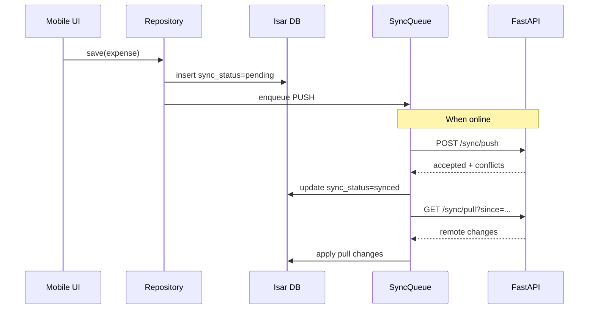

# SmartOps Sync Protocol Reference

> Related docs: [Architecture — Sync Engine](./architecture.md#sync-engine) · [Database Design](./database-design.md) · [API Versioning — Sync Protocol Versioning](./api-versioning.md#sync-protocol-versioning) · [Local Database Migrations](./local-database-migrations.md) · [Testing Strategy — Offline Scenarios](./testing-strategy.md#offline-and-sync-test-scenarios)

## Overview

SmartOps MVP uses a **sync-first** API. Business data flows primarily through two endpoints:

| Endpoint | Method | Purpose |
|---|---|---|
| `/api/v1/sync/push` | POST | Client sends local changes to server |
| `/api/v1/sync/pull` | GET | Client receives server changes since last sync |

Auth, file presign, and health check use separate endpoints. See [Auth & Sessions](./auth-sessions.md).

**MVP constraint:** Single active device per organization owner. Multi-device sync deferred to v2.0.

---

## Request Headers (All Sync Calls)

```
Authorization: Bearer <access_token>
X-Organization-Id: <uuid>
X-App-Version: 1.0.0
X-Client-Schema-Version: 1
X-Platform: android | ios
X-Device-Id: <uuid>
Content-Type: application/json
```

See [API Versioning](./api-versioning.md) for compatibility rules.

---

## Push — `POST /api/v1/sync/push`

### Request envelope

```json
{
  "device_id": "550e8400-e29b-41d4-a716-446655440000",
  "client_schema_version": 1,
  "last_sync_at": "2026-06-01T10:00:00Z",
  "changes": {
    "<entity_key>": [
      {
        "id": "uuid",
        "operation": "create | update | delete",
        "data": { },
        "client_updated_at": "2026-06-01T09:00:00Z"
      }
    ]
  }
}
```

| Field | Required | Description |
|---|---|---|
| `device_id` | Yes | Stable device UUID stored in secure storage |
| `client_schema_version` | Yes | Isar schema version |
| `last_sync_at` | Yes | Timestamp of last successful sync (ISO 8601 UTC) |
| `changes` | Yes | Map of entity key → array of change records |
| `operation` | Yes | `create`, `update`, or `delete` |
| `data` | For create/update | Entity fields (omit sync metadata the server owns) |
| `client_updated_at` | Yes | Client write timestamp for LWW resolution |

**Delete operation:** `data` may be empty; server sets `deleted_at` tombstone.

### Response envelope

```json
{
  "accepted": ["uuid-1", "uuid-2"],
  "rejected": [
    {
      "entity": "expenses",
      "id": "uuid-3",
      "code": "VALIDATION_ERROR",
      "message": "Amount must be positive"
    }
  ],
  "conflicts": [
    {
      "entity": "employees",
      "id": "uuid-4",
      "resolution": "server_wins | client_wins | role_priority",
      "server_data": { },
      "client_data": { }
    }
  ],
  "server_timestamp": "2026-06-01T10:05:00Z"
}
```

Client must apply `conflicts` resolution to local Isar and mark records `sync_status: synced`.

---

## Pull — `GET /api/v1/sync/pull`

### Query parameters

| Param | Required | Description |
|---|---|---|
| `since` | Yes | ISO 8601 UTC — return records modified after this timestamp |
| `organization_id` | Yes | Tenant UUID |

### Response envelope

```json
{
  "server_timestamp": "2026-06-01T10:05:00Z",
  "changes": {
    "<entity_key>": [
      {
        "id": "uuid",
        "operation": "create | update | delete",
        "data": { },
        "version": 3,
        "updated_at": "2026-06-01T10:04:00Z",
        "deleted_at": null
      }
    ]
  }
}
```

Server filters `data` fields by `X-Client-Schema-Version` — omits fields the client cannot deserialize.

---

## Syncable Entity Keys

Entity keys in `changes` map correspond to PostgreSQL/Isar collections. All include [standard sync columns](./database-design.md#standard-columns-all-syncable-tables) unless noted.

### Identity and organization

| Entity key | Table | Push notes |
|---|---|---|
| `organizations` | organizations | Owner-only update |
| `organization_settings` | organization_settings | Owner-only |
| `branches` | branches | MVP: single default branch |

### Employees

| Entity key | Table | Push notes |
|---|---|---|
| `departments` | departments | |
| `designations` | designations | |
| `employees` | employees | `full_name`, `joining_date` required on create |
| `employee_documents` | employee_documents | `file_key` from presigned upload |

**Employee payload (create/update):**

```json
{
  "id": "uuid",
  "organization_id": "uuid",
  "full_name": "Ramesh Kumar",
  "phone": "+919876543210",
  "email": null,
  "department_id": "uuid",
  "designation_id": "uuid",
  "joining_date": "2024-01-15",
  "employment_status": "active",
  "employee_code": "EMP001"
}
```

### Attendance

| Entity key | Table | Push notes |
|---|---|---|
| `shifts` | shifts | |
| `leave_types` | leave_types | |
| `attendance_records` | attendance_records | Date cannot be future |
| `leave_requests` | leave_requests | Employee submits; owner/manager approves |

**Attendance record payload:**

```json
{
  "id": "uuid",
  "organization_id": "uuid",
  "employee_id": "uuid",
  "attendance_date": "2026-06-05",
  "status": "present",
  "check_in_time": "09:15:00",
  "check_out_time": "18:00:00",
  "notes": null
}
```

`status` enum: `present`, `absent`, `half_day`, `leave`, `holiday`

### Payroll

| Entity key | Table | Push notes |
|---|---|---|
| `salary_structures` | salary_structures | Owner-only; role priority on amounts |
| `payroll_runs` | payroll_runs | Status transitions: draft → processed → paid |
| `payroll_line_items` | payroll_line_items | Immutable when run status = `paid` |

**Conflict rule:** `payroll_runs` with `status: paid` — server always wins; client cannot push updates.

**Payroll run payload:**

```json
{
  "id": "uuid",
  "organization_id": "uuid",
  "period_start": "2026-06-01",
  "period_end": "2026-06-30",
  "status": "draft",
  "notes": null
}
```

### Finance

| Entity key | Table | Push notes |
|---|---|---|
| `expense_categories` | expense_categories | |
| `expenses` | expenses | `amount` > 0; `expense_date` required |
| `recurring_expenses` | recurring_expenses | P1 |
| `revenue_categories` | revenue_categories | |
| `revenue_entries` | revenue_entries | `amount` > 0; `revenue_date` required |

**Expense payload:**

```json
{
  "id": "uuid",
  "organization_id": "uuid",
  "category_id": "uuid",
  "vendor_id": null,
  "amount": 1200.00,
  "currency_code": "INR",
  "expense_date": "2026-06-05",
  "description": "Electricity bill",
  "payment_method": "cash",
  "reference_number": null,
  "attachment_key": "org-uuid/expenses/uuid.jpg"
}
```

**Revenue payload:**

```json
{
  "id": "uuid",
  "organization_id": "uuid",
  "category_id": "uuid",
  "customer_id": null,
  "amount": 5000.00,
  "currency_code": "INR",
  "revenue_date": "2026-06-05",
  "description": "Product sales",
  "payment_method": "upi",
  "reference_number": "TXN123456"
}
```

### Inventory

| Entity key | Table | Push notes |
|---|---|---|
| `units_of_measure` | units_of_measure | pcs, kg, litre, etc. |
| `product_categories` | product_categories | |
| `products` | products | |
| `stock_movements` | stock_movements | `movement_type`: in, out, adjustment |

**Stock movement payload:**

```json
{
  "id": "uuid",
  "organization_id": "uuid",
  "product_id": "uuid",
  "movement_type": "in",
  "quantity": 50,
  "movement_date": "2026-06-05",
  "notes": "Restock from supplier"
}
```

### CRM

| Entity key | Table | Push notes |
|---|---|---|
| `customers` | customers | |
| `vendors` | vendors | |

**Customer payload:**

```json
{
  "id": "uuid",
  "organization_id": "uuid",
  "full_name": "Suresh Traders",
  "phone": "+919123456789",
  "email": null,
  "address": "Market Road, Jaipur",
  "gstin": null,
  "notes": null
}
```

---

## Non-Sync Endpoints

These entities are server-managed or accessed via dedicated endpoints:

| Entity | Reason |
|---|---|
| `users` | Created via Google Sign-In; not client-pushable |
| `refresh_tokens` | Server-managed session |
| `sync_cursors` | Updated by server after successful sync |
| `audit_logs` | Append-only server log |
| `subscription_plans`, `subscriptions` | Billing Phase 1.5 |

---

## Conflict Resolution Summary

| Data type | Strategy |
|---|---|
| General text fields (name, notes) | Last-Write-Wins (`client_updated_at`) |
| Financial amounts (salary, expense, revenue) | Role priority: Owner > Manager > Employee |
| Payroll run (`status = paid`) | Server wins — immutable |
| Soft deletes | Delete wins if server `deleted_at` set |

Full rationale in [Architecture — Conflict Resolution](./architecture.md#conflict-resolution).

---

## Sync Lifecycle (Client)



---

## Error Codes (Sync-Specific)

| Code | HTTP | Meaning |
|---|---|---|
| `SYNC_SCHEMA_TOO_OLD` | 426 | Client schema below `MIN_SUPPORTED_SCHEMA_VERSION` |
| `SYNC_CONFLICT` | 200 | Returned in push response `conflicts` array |
| `VALIDATION_ERROR` | 200 | Returned in push response `rejected` array |
| `PAYROLL_FINALIZED` | 200 | Rejected — cannot modify paid payroll |
| `PERMISSION_DENIED` | 200 | Rejected — RBAC violation |
| `ORGANIZATION_MISMATCH` | 403 | `X-Organization-Id` not in user's memberships |

General error envelope in [Architecture — Error envelope](./architecture.md#error-envelope).

---

## Related Documents

- [Architecture](./architecture.md) — sync engine design
- [Database Design](./database-design.md) — full table definitions
- [API Versioning](./api-versioning.md) — forward/backward compatibility
- [Local Database Migrations](./local-database-migrations.md) — schema version coordination
- [Testing Strategy](./testing-strategy.md) — offline/sync test scenarios
