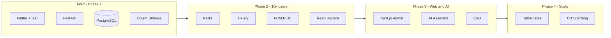

# SmartOps Technology Stack

> Related docs: [Architecture](./architecture.md) · [Database Design](./database-design.md) · [Auth & Sessions](./auth-sessions.md) · [API Versioning](./api-versioning.md) · [UI/UX Design System](./ui-ux-design-system.md) · [UI/UX Screens](./ui-ux-screens.md) · [Local Database Migrations](./local-database-migrations.md) · [Local Development](./local-development.md) · [Testing Strategy](./testing-strategy.md) · [Sync Protocol](./sync-protocol.md) · [Export Formats](./export-formats.md) · [Deployment](./deployment.md) · [Revenue Model](./revenue-model.md) · [MVP Requirements](./mvp-requirements.md)

## Overview

SmartOps is an **offline-first, mobile-first** business management platform targeting Indian small businesses first, with architecture designed for global expansion. This document defines the technology choices, rationale, version strategy, and phase gates for each layer.

---

## Stack Summary

| Layer | Technology | MVP | Phase 2+ |
|---|---|---|---|
| Mobile | Flutter 3.x, Dart 3 | Yes | Web admin via Next.js (Phase 3) |
| UI framework | Material Design 3 (`useMaterial3: true`) | Yes | Dark mode (Phase 2) |
| Fonts | Roboto (English) + Noto Sans Devanagari (Hindi) | Yes | Regional script fonts |
| Local DB | Isar | Yes | — |
| State management | Riverpod | Yes | — |
| Mobile architecture | Clean Architecture + feature modules | Yes | — |
| Backend | FastAPI, Uvicorn, Pydantic v2 | Yes | — |
| API versioning | URL path (`/api/v1`) + client headers | Yes | v2 on breaking changes; N/N-1 for 90 days |
| Primary DB | PostgreSQL 16 (Neon) | Yes | Read replicas |
| ORM / migrations | SQLAlchemy 2.x, Alembic | Yes | — |
| Auth | JWT (access + refresh), Google Sign-In | Yes | Phone OTP (Phase 2), SSO (Phase 3) |
| File storage | Cloudflare R2 | Yes | CDN |
| Payments | Razorpay | Phase 1.5 | Stripe (global) |
| i18n | Flutter ARB + backend template keys | English + Hindi | 9 regional languages |
| Observability | Sentry, structured JSON logging | Yes | Prometheus/Grafana |
| CI/CD | GitHub Actions | Yes | — |
| Infrastructure | Neon + Render (recommended) or Neon + Vercel | MVP free tier | AWS/K8s at 100k+ users |
| Cache / queue | — | No | Redis, Celery |
| Push notifications | — | No | Firebase Cloud Messaging |
| AI | — | No | OpenAI / local models (Phase 3) |

---

## Backend: FastAPI vs NestJS

### Decision: FastAPI + Python

| Criteria | FastAPI | NestJS |
|---|---|---|
| MVP velocity | High — minimal boilerplate, auto OpenAPI | Medium — more structure upfront |
| Async performance | Excellent (Starlette/Uvicorn) | Excellent (Node.js) |
| Validation | Pydantic v2 (best-in-class) | class-validator |
| AI / analytics future | Native Python ecosystem | Requires separate Python service |
| TypeScript monorepo with web | Requires OpenAPI codegen | Natural shared types |
| Hiring (India) | Strong Python pool | Strong JS/TS pool |
| Offline sync complexity | Well-suited for batch APIs | Equally capable |

**Verdict:** FastAPI is the right choice for SmartOps because the product roadmap includes AI business insights, analytics, and payroll calculations — all of which benefit from Python's ecosystem. When the web admin launches (Phase 3), shared types can be generated from the OpenAPI spec using tools like `openapi-generator` or `orval`.

NestJS remains a valid alternative if the team is TypeScript-only and web delivery is prioritized over AI timeline.

---

## Mobile Stack

### Flutter

**Why Flutter:**
- Single codebase for Android and iOS
- Strong offline/local DB ecosystem (Isar)
- Excellent i18n support via ARB files (critical for Hindi + regional languages)
- Mature tooling, hot reload, large India developer community
- Performance suitable for data-heavy business apps

**Version target:** Flutter 3.24+ / Dart 3.5+

### Material Design 3 (UI Framework)

**Why M3:**
- Native Flutter support via `ThemeData` / `ColorScheme` / M3 components
- Consistent, accessible patterns for forms, lists, navigation, and dialogs
- Professional look suited to Indian SMB users (not playful consumer styling)

**Implementation:**
- Light mode only for MVP; dark mode deferred to Phase 2
- Primary color `#0D6E6E` (deep teal); see full token table in [UI/UX Design System](./ui-ux-design-system.md)
- Typography: Roboto (English) + Noto Sans Devanagari (Hindi fallback in theme)
- Shared widget library in `shared/widgets/` — see design system component catalog
- Screen specs and wireframes in [UI/UX Screens](./ui-ux-screens.md)

### Isar (Local Database)

**Why Isar over raw SQLite:**
- Built for Flutter/Dart — no platform channel overhead
- Fast queries for dashboard aggregates on local data
- Supports indexes, filters, and relationships
- Works fully offline
- Better developer experience than Drift/sqflite for this use case

**Alternative considered:** Drift (SQLite wrapper) — rejected due to slower write throughput for batch sync operations.

### Riverpod (State Management)

**Why Riverpod over Bloc:**
- Simpler dependency injection aligned with Clean Architecture repositories
- Compile-safe providers, easy testing with overrides
- Less boilerplate than Bloc for CRUD-heavy business modules
- Works well with `AsyncValue` for offline/sync states

**Alternative considered:** Bloc — valid choice if team prefers explicit event/state diagrams; Riverpod chosen for faster MVP iteration.

### Mobile Architecture Pattern

```
Clean Architecture + Feature Modules + Repository Pattern
```

Each feature module contains:
- `domain/` — entities, repository interfaces, use cases
- `data/` — Isar models, local datasource, remote datasource, repository impl
- `presentation/` — screens, widgets, Riverpod providers/notifiers

See [Architecture](./architecture.md) for full folder structure.

---

## Backend Stack

### FastAPI

**Core dependencies:**

| Package | Purpose |
|---|---|
| `fastapi` | Web framework, routing, dependency injection |
| `uvicorn[standard]` | ASGI server |
| `pydantic` v2 | Request/response validation |
| `sqlalchemy` 2.x | ORM |
| `alembic` | Database migrations |
| `python-jose` / `PyJWT` | JWT token handling |
| `passlib[bcrypt]` | Password hashing (email login fallback) |
| `google-auth` | Google ID token verification |
| `httpx` | Async HTTP client (Razorpay, external APIs) |
| `boto3` / `aioboto3` | S3-compatible file storage |
| `python-multipart` | File upload support |

### PostgreSQL 16

**Why PostgreSQL:**
- ACID compliance for financial data (expenses, payroll, revenue)
- JSONB for flexible metadata (future AI insights, custom fields)
- Row-level security support for multi-tenancy hardening (Phase 2)
- Full-text search for employee/customer lookup (Phase 2)
- Mature managed hosting (Railway, Supabase, AWS RDS)

### Authentication

| Method | MVP | Notes |
|---|---|---|
| Google Sign-In | Yes | Primary and only auth method for MVP; zero cost |
| Phone + OTP | Phase 2 | MSG91; optional account linking to Google |
| Email + password | Phase 2+ | — |
| Apple Sign-In | Phase 2+ | iOS best practice when iOS user base grows |
| SSO (SAML/OIDC) | Phase 3 | Enterprise |

**Mobile package:** `google_sign_in` (Flutter)

**Backend package:** `google-auth` — verifies Google ID tokens against Google's public keys

**Token strategy:**
- Access token: JWT, 15-minute expiry
- Refresh token: opaque token, 30-day expiry, stored in DB with device binding
- Offline: tokens in `flutter_secure_storage`; local business data works offline; sync requires valid access token (silent refresh when online)

See [Auth & Sessions](./auth-sessions.md) for full session lifecycle.

---

## Infrastructure

### Monorepo Layout

```
SmartOps/
├── mobile/          # Flutter app
├── backend/         # FastAPI app
├── docs/            # Product & technical documentation
├── .github/
│   └── workflows/   # CI/CD pipelines
└── docker-compose.yml
```

Future additions:
- `web/` — Next.js admin dashboard (Phase 3)
- `shared/` — OpenAPI-generated types (Phase 3)

### Hosting (MVP)

**Recommendation:** [Neon](https://neon.com) (PostgreSQL) + [Render](https://render.com) (FastAPI) — both free tier, ₹0/mo.

**Alternative:** Neon + [Vercel](https://vercel.com) (serverless FastAPI; 10 s timeout on Hobby plan — see [Deployment](./deployment.md)).

| Environment | Backend | Database | File storage |
|---|---|---|---|
| Development | Local Uvicorn + Docker Postgres | Local container | Local / R2 dev bucket |
| Staging | Render preview or Vercel preview | Neon `staging` branch | Cloudflare R2 |
| Production | Render Free (upgrade when needed) | Neon `main` branch | Cloudflare R2 |

Full setup guide: [Deployment](./deployment.md).

**Why not Railway for MVP:** Railway no longer offers a meaningful free tier. Neon + Render achieves ₹0/mo recurring cost.

**Why not AWS for MVP:** Higher operational overhead. Migrate to AWS (ECS/RDS) when approaching 10,000+ active users.

### Docker

Both mobile backend and API containerized for consistent staging/production deployments:

```dockerfile
# backend/Dockerfile — Python 3.12 slim, Uvicorn
# docker-compose.yml — api + postgres + (redis in Phase 2)
```

---

## Observability & Quality

| Tool | Purpose | Phase |
|---|---|---|
| Sentry | Error tracking (mobile + backend) | MVP |
| Structured logging (JSON) | Request tracing, sync debugging | MVP |
| GitHub Actions | Lint, test, build on PR | MVP |
| pytest + httpx | Backend API tests | MVP |
| flutter_test + integration_test | Mobile unit/integration tests | MVP |
| Prometheus + Grafana | Metrics dashboards | Phase 2 |
| k6 / Locust | Load testing | Phase 2 |

---

## Internationalization (i18n)

| Component | Approach |
|---|---|
| Mobile UI | Flutter ARB files (`lib/l10n/app_en.arb`, `app_hi.arb`) |
| Backend notifications | Template keys with locale parameter |
| PDF reports (payslip) | Template engine with locale-aware formatting |
| Date/number formatting | `intl` package; `en_IN` and `hi_IN` locales |
| Currency | Stored as ISO 4217 code (`INR` default); displayed per org settings |

MVP languages: **English** and **Hindi**. Architecture supports adding languages by adding ARB files — no code changes required.

---

## Security Stack

| Concern | Solution |
|---|---|
| Transport | TLS 1.3 everywhere |
| Token storage (mobile) | flutter_secure_storage (Keychain/Keystore) |
| Sensitive fields (salary, bank) | AES-256 encryption at application layer before DB write |
| API rate limiting | slowapi (in-process MVP); Redis-backed (Phase 2) |
| RBAC | Role-permission matrix enforced in FastAPI dependencies |
| Audit | Immutable audit_log table for financial mutations |
| File uploads | Presigned URLs; virus scan via ClamAV (Phase 2) |

---

## Version Pinning Strategy

- Pin major versions in `pubspec.yaml` (Flutter) and `pyproject.toml` / `requirements.txt` (backend)
- Use Dependabot for automated minor/patch updates
- Lock files: `pubspec.lock`, `requirements.lock` (pip-tools)
- Database migrations always forward-only via Alembic; never edit applied migrations

---

## Explicitly NOT in MVP

The following are intentionally deferred to avoid scope creep and infrastructure cost:

| Technology | Reason deferred | Target phase |
|---|---|---|
| Redis | Not needed at <1k users | Phase 2 (10k users) |
| Celery | No background jobs in MVP | Phase 2 |
| Firebase Cloud Messaging | Push notifications out of MVP scope | Phase 2 |
| MSG91 / Phone OTP | Deferred to reduce MVP cost; Google auth is free | Phase 2 |
| Web frontend (React/Next.js) | Mobile-first launch | Phase 3 |
| AI / LLM integration | Requires stable data foundation first | Phase 3 |
| Kubernetes | Over-engineered for MVP scale | Phase 4 (100k+ users) |
| Elasticsearch | PostgreSQL full-text sufficient initially | Phase 2 |
| Stripe | India launch uses Razorpay | Global launch |

---

## Phase Gate Summary



---

## Decision Log

| Date | Decision | Rationale |
|---|---|---|
| 2026-06 | FastAPI over NestJS | Python AI ecosystem, user preference, MVP speed |
| 2026-06 | Isar over Drift | Better write performance for offline sync batches |
| 2026-06 | Riverpod over Bloc | Less boilerplate for CRUD-heavy modules |
| 2026-06 | Neon + Render for MVP hosting | Free tier (₹0/mo); Neon for Postgres, Render for FastAPI |
| 2026-06 | Google Sign-In for MVP auth | Zero SMS cost; defer MSG91/OTP to Phase 2 |
| 2026-06 | URL path API versioning + client headers | Support multiple app versions; N/N-1 for 90 days |
| 2026-06 | Razorpay deferred to Phase 1.5 | Validate product before billing integration |
