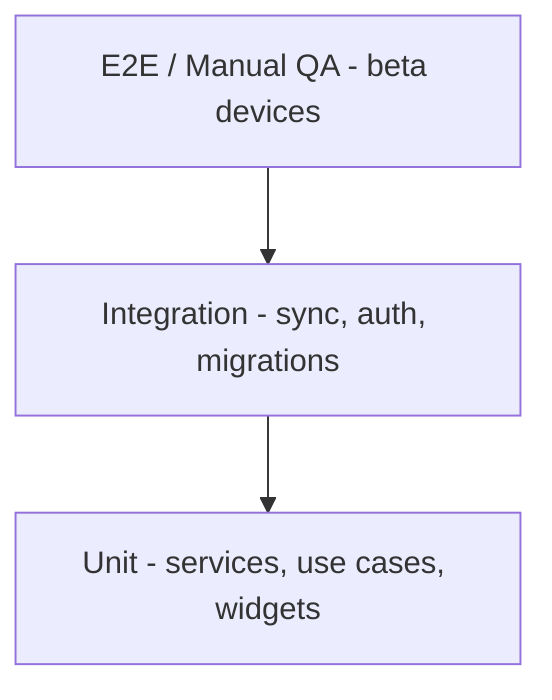

# SmartOps Testing Strategy

> Related docs: [MVP Requirements](./mvp-requirements.md) · [Local Development](./local-development.md) · [Deployment](./deployment.md) · [Local Database Migrations](./local-database-migrations.md) · [API Versioning](./api-versioning.md) · [UI/UX Screens](./ui-ux-screens.md) · [Sync Protocol](./sync-protocol.md)

## Overview

Unified testing strategy for SmartOps MVP. Covers unit, integration, and E2E tests across mobile and backend, with emphasis on **offline-first** and **sync** correctness — the highest-risk areas for data loss.

---

## Testing Pyramid



| Layer | Target coverage | Tools |
|---|---|---|
| Unit | Business logic, formatters, validators | `flutter_test`, `pytest` |
| Integration | API routes, sync push/pull, Isar repos | `integration_test`, `httpx` + test DB |
| E2E / Manual | Full flows, offline, Hindi layout, RBAC | Physical devices, TestFlight, Play internal track |

---

## Backend Testing

### Unit tests (`backend/tests/unit/`)

| Area | Examples |
|---|---|
| Services | Payroll immutability after `paid`, expense amount validation, RBAC checks |
| Sync conflict | Role priority on salary fields, LWW on name fields |
| Auth | Google token verification mock, JWT expiry, refresh rotation |

### Integration tests (`backend/tests/integration/`)

| Area | Examples |
|---|---|
| Auth endpoints | `POST /auth/google`, `/auth/refresh`, `/auth/logout` |
| Sync push | Accept create/update/delete per entity; reject invalid payloads |
| Sync pull | Filter fields by `X-Client-Schema-Version`; tombstone propagation |
| Version middleware | Return `426` when app version below minimum |
| File presign | Valid MIME types; reject oversize |

**Test database:** Ephemeral PostgreSQL in CI (GitHub Actions service container) or Neon branch per PR.

```bash
cd backend
pytest tests/unit -v
pytest tests/integration -v
```

### CI (from [Deployment](./deployment.md))

- Run `pytest` on every PR to `main`
- Run `alembic upgrade head` against test DB before integration tests
- Block deploy if tests fail

---

## Mobile Testing

### Unit tests (`mobile/test/`)

| Area | Examples |
|---|---|
| Use cases | Create expense, mark attendance, compute dashboard metrics |
| Repositories | Local write + sync queue enqueue (mock datasources) |
| Formatters | `AmountDisplay` — `en_IN` / `hi_IN` currency formatting |
| Validators | Expense amount > 0, date not in future |
| Widgets | `MetricCard`, `EmptyStateView`, `SyncStatusBanner` states |

```bash
cd mobile
flutter test
```

### Widget / golden tests

| Widget | Cases |
|---|---|
| `AmountDisplay` | ₹12,500.00 en_IN; Hindi locale |
| `StatusBadge` | Present (green + icon + text), Absent, Paid, Draft |
| Buttons at 360dp | Hindi labels — no truncation (golden file for `hi` locale) |

### Integration tests (`mobile/integration_test/`)

| Flow | Verification |
|---|---|
| Onboarding | Language → business profile → dashboard |
| Add expense offline | Saved to Isar; snackbar shown; sync queue pending |
| Sync on reconnect | Pending count clears; server ack received |
| Route guards | Employee role blocked from `/money` |
| Force update | Mock 426 → `ForceUpdateScreen` displayed |

```bash
flutter test integration_test/app_test.dart
```

---

## Offline and Sync Test Scenarios

These scenarios are **mandatory** before beta release. Reference [Sync Protocol](./sync-protocol.md) and [Architecture — Sync Engine](./architecture.md#sync-engine).

### Scenario 1: Offline write and sync

| Step | Action | Expected |
|---|---|---|
| 1 | Sign in; verify synced state | Green sync indicator |
| 2 | Enable airplane mode | Amber offline banner on all screens |
| 3 | Add expense ₹500 | Saved locally; snackbar "Saved offline" |
| 4 | Disable airplane mode | Auto-sync triggers |
| 5 | Verify backend | Expense in PostgreSQL; pending count = 0 |

### Scenario 2: App crash during write

| Step | Action | Expected |
|---|---|---|
| 1 | Add expense while offline | Written to Isar + sync queue |
| 2 | Force-kill app | — |
| 3 | Relaunch app | Expense still visible; sync queue intact |
| 4 | Go online | Sync completes without duplicate |

### Scenario 3: Schema migration

| Step | Action | Expected |
|---|---|---|
| 1 | Install app v1.0.0; create data | Data in Isar schema v1 |
| 2 | Upgrade to v1.1.0 (schema v2) | Migration screen; data preserved |
| 3 | Sync after upgrade | Push succeeds with `X-Client-Schema-Version: 2` |

See [Local Database Migrations — Testing Checklist](./local-database-migrations.md#testing-checklist).

### Scenario 4: Conflict resolution

| Step | Action | Expected |
|---|---|---|
| 1 | Owner edits employee salary on server (simulate) | Server version incremented |
| 2 | Manager edits same employee name offline | Local pending change |
| 3 | Sync | Name: LWW; salary: role priority (owner wins) |

### Scenario 5: Payroll immutability

| Step | Action | Expected |
|---|---|---|
| 1 | Process and finalize payroll (status `paid`) | Payslip generated |
| 2 | Attempt edit line item | API 403; mobile shows "Payroll is finalized" |
| 3 | Sync pull | Client accepts server state |

### Scenario 6: Force update (426)

| Step | Action | Expected |
|---|---|---|
| 1 | Set server `MIN_SUPPORTED_APP_VERSION=9.9.9` | — |
| 2 | Open app with v1.0.0 | Blocking `ForceUpdateScreen` |
| 3 | Verify local data | Isar data intact; sync paused |

See [API Versioning — Testing Matrix](./api-versioning.md#testing-matrix).

---

## Device and Locale Matrix

Test on real devices or emulators representing Indian SMB users.

| Device profile | OS | Screen | Locale | Priority |
|---|---|---|---|---|
| Mid-range Android | Android 12+ | 360×800 dp | Hindi (`hi`) | P0 |
| Mid-range Android | Android 12+ | 360×800 dp | English (`en`) | P0 |
| Small Android | Android 10+ | 320×640 dp | Hindi | P1 |
| Budget Android | Android 10+ | 360×800 dp | English | P1 |
| iOS (when added) | iOS 16+ | 390×844 pt | English | P1 |

**Performance targets** (from [MVP Requirements](./mvp-requirements.md#technical-acceptance-criteria-beta-release)):

| Metric | Target |
|---|---|
| Cold start | <3s on mid-range Android |
| Local write | <100ms |
| Dashboard load (offline) | <500ms |
| Sync 100 records | <10s on 4G |

---

## UX Acceptance Checklist (Beta QA)

Manual QA before beta launch. Full criteria in [MVP Requirements — UX Acceptance Criteria](./mvp-requirements.md#ux-acceptance-criteria) and [UI/UX Screens — UX Acceptance Checklist](./ui-ux-screens.md#ux-acceptance-checklist).

| # | Criterion | Pass |
|---|---|---|
| 1 | Add expense ≤ 3 taps from dashboard | |
| 2 | Mark attendance ≤ 3 taps from dashboard | |
| 3 | Offline banner visible on every authenticated screen | |
| 4 | Empty state + CTA on every list screen | |
| 5 | Hindi button text not truncated at 360dp | |
| 6 | All touch targets ≥ 48dp | |
| 7 | Employee cannot access `/money`, payroll admin | |
| 8 | 426 shows force-update screen with store link | |
| 9 | Offline save shows snackbar confirmation | |
| 10 | Sync complete shows success feedback | |
| 11 | Payroll finalize requires confirm dialog | |
| 12 | Paid payroll cannot be edited | |

---

## Beta Release Gate

All items must pass before S14 beta launch (see [MVP Requirements — Release Plan](./mvp-requirements.md#release-plan)):

- [ ] Staging environment deployed and smoke-tested ([Deployment checklist](./deployment.md#deployment-checklist-beta-launch))
- [ ] Backend `pytest` green on `main`
- [ ] Mobile `flutter test` green on `main`
- [ ] Offline/sync scenarios 1–6 passed on P0 device matrix
- [ ] UX acceptance checklist 1–12 passed
- [ ] Hindi i18n review complete (native speaker spot-check)
- [ ] Sentry receiving errors from staging backend + mobile
- [ ] Migration test: v1.0.0 → v1.0.1 upgrade with existing local data
- [ ] Presigned upload flow tested (expense invoice photo)

---

## Test Data Guidelines

| Rule | Detail |
|---|---|
| No production data in tests | Use factories/fixtures with fake names and amounts |
| Deterministic UUIDs in unit tests | Predictable assertions |
| Reset DB between integration tests | Transaction rollback or truncate per test |
| Seed categories | Test org gets default expense/revenue categories |

---

## Phase 2 Testing (Out of MVP Scope)

| Area | When |
|---|---|
| Multi-device sync conflicts | v2.0 |
| Load testing (k6/Locust) | 10k users |
| Phone OTP auth flows | v2.0 |
| Razorpay billing integration | v1.1 |

---

## Related Documents

- [Local Development](./local-development.md) — run tests locally
- [Deployment](./deployment.md) — CI pipeline
- [Local Database Migrations](./local-database-migrations.md) — migration test checklist
- [API Versioning](./api-versioning.md) — cross-version compatibility matrix
- [MVP Requirements](./mvp-requirements.md) — performance and reliability targets
