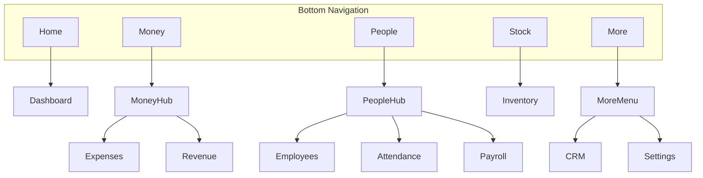

# SmartOps UI/UX Design System

> Related docs: [UI/UX Screens](./ui-ux-screens.md) · [MVP Requirements](./mvp-requirements.md) · [Architecture](./architecture.md) · [Tech Stack](./tech-stack.md)

## Overview

SmartOps uses **Material Design 3 (M3)** on Flutter with a custom theme tuned for **Indian small business owners**. The design prioritizes clarity, offline visibility, Hindi/English support, and thumb-friendly navigation.

**Target users:** Shop owners and managers with WhatsApp-level tech comfort; often Hindi-preferred; unreliable connectivity.

---

## Design Principles

| Principle | Implementation |
|---|---|
| Clarity over density | One primary action per screen; avoid spreadsheet-like layouts |
| ≤3 taps to core actions | Dashboard quick actions for expense and attendance |
| Offline visibility | Sync/offline banner on every authenticated screen |
| Hindi-first friendly | Icons + text labels; Noto Sans Devanagari; test 30% longer strings |
| Thumb-zone navigation | Bottom nav + contextual FAB |
| Trust for money data | Confirm destructive actions; prominent ₹ amounts; payroll finalize requires explicit confirm |
| Role-aware UI | Employee role sees reduced navigation and limited modules |

---

## Material Design 3 Theme

### Color palette (light mode — MVP)

| Token | Hex | Usage |
|---|---|---|
| `primary` | `#0D6E6E` | App bar, FAB, primary buttons, links |
| `onPrimary` | `#FFFFFF` | Text/icons on primary |
| `primaryContainer` | `#B2DFDB` | Selected chips, light highlights |
| `onPrimaryContainer` | `#004D40` | Text on primary container |
| `secondary` | `#F9A825` | Revenue metrics, positive highlights |
| `onSecondary` | `#212121` | Text on secondary |
| `tertiary` | `#43A047` | Success, present attendance, synced |
| `onTertiary` | `#FFFFFF` | Text on tertiary |
| `error` | `#B00020` | Validation errors, destructive actions |
| `surface` | `#FAFAFA` | Screen background |
| `surfaceContainerHighest` | `#EEEEEE` | Metric cards, input backgrounds |
| `onSurface` | `#212121` | Primary body text |
| `onSurfaceVariant` | `#616161` | Secondary text, captions |
| `outline` | `#BDBDBD` | Borders, dividers |

**Semantic colors (not in ColorScheme — use consistently):**

| Semantic | Color | Usage |
|---|---|---|
| Offline banner | `#FFF3E0` bg / `#E65100` text | Offline warning strip |
| Sync pending | `#E3F2FD` bg / `#1565C0` text | Unsynced changes indicator |
| Low stock | `#FFEBEE` bg / `#C62828` text | Inventory alert badge |
| Profit positive | `#E8F5E9` | Dashboard profit card when > 0 |
| Profit negative | `#FFEBEE` | Dashboard profit card when < 0 |

**Dark mode:** Phase 2 — not in MVP.

### ThemeData (conceptual)

```dart
// Conceptual — not production code
ThemeData smartOpsLightTheme = ThemeData(
  useMaterial3: true,
  colorScheme: ColorScheme.fromSeed(
    seedColor: const Color(0xFF0D6E6E),
    brightness: Brightness.light,
  ),
  fontFamily: 'Roboto',
  fontFamilyFallback: const ['Noto Sans Devanagari'],
  appBarTheme: const AppBarTheme(
    centerTitle: false,
    elevation: 0,
    scrolledUnderElevation: 1,
  ),
  cardTheme: CardTheme(
    elevation: 1,
    shape: RoundedRectangleBorder(borderRadius: BorderRadius.circular(12)),
  ),
  filledButtonTheme: FilledButtonThemeData(
    style: FilledButton.styleFrom(
      minimumSize: const Size(64, 48),
      shape: RoundedRectangleBorder(borderRadius: BorderRadius.circular(8)),
    ),
  ),
  inputDecorationTheme: InputDecorationTheme(
    filled: true,
    border: OutlineInputBorder(borderRadius: BorderRadius.circular(8)),
    contentPadding: const EdgeInsets.symmetric(horizontal: 16, vertical: 12),
  ),
);
```

---

## Typography

M3 type scale with locale-aware fonts:

| Style | Size | Weight | Usage |
|---|---|---|---|
| `displaySmall` | 36sp | Regular | Large currency totals (dashboard) |
| `headlineMedium` | 28sp | Regular | Screen titles |
| `titleLarge` | 22sp | Medium | Section headers, card titles |
| `titleMedium` | 16sp | Medium | List item primary text |
| `bodyLarge` | 16sp | Regular | Form labels, body text |
| `bodyMedium` | 14sp | Regular | Secondary descriptions |
| `labelLarge` | 14sp | Medium | Buttons, tabs |
| `labelSmall` | 11sp | Medium | Captions, timestamps |

**Fonts:**
- English: Roboto (Flutter default)
- Hindi: Noto Sans Devanagari (bundled in `assets/fonts/` or `google_fonts` package)
- Currency/numbers: Use tabular figures; format via `intl` — never hardcode `₹`

**Hindi layout rule:** Allow button labels to wrap to 2 lines before truncating. Minimum button width 88dp for primary actions.

---

## Spacing and Layout

**Grid:** 4dp base unit.

| Token | Value | Usage |
|---|---|---|
| `spaceXs` | 4dp | Icon padding, tight gaps |
| `spaceSm` | 8dp | Between related elements |
| `spaceMd` | 16dp | Standard screen padding, card padding |
| `spaceLg` | 24dp | Section spacing |
| `spaceXl` | 32dp | Large section breaks |

**Screen padding:** 16dp horizontal on all screens.

**Minimum touch target:** 48x48dp for all interactive elements.

**Breakpoints:** Design for 360dp width minimum (common Android in India). Test at 320dp for small devices.

---

## Elevation

| Level | Elevation | Usage |
|---|---|---|
| 0 | 0dp | App bar (flat), background |
| 1 | 1dp | Cards, list tiles |
| 2 | 3dp | FAB, bottom nav |
| 3 | 6dp | Dialogs, bottom sheets |
| 4 | 8dp | Modal overlays |

---

## Navigation Architecture

### Owner / Manager — bottom navigation

Five tabs with hub screens for grouped modules:



| Tab | Icon (M3) | Label EN | Label HI key | Default screen |
|---|---|---|---|---|
| Home | `home` | Home | `navHome` | Dashboard |
| Money | `account_balance_wallet` | Money | `navMoney` | Money Hub |
| People | `groups` | People | `navPeople` | People Hub |
| Stock | `inventory_2` | Stock | `navStock` | Inventory list |
| More | `more_horiz` | More | `navMore` | More menu |

### Employee — reduced navigation

| Tab | Screen |
|---|---|
| Home | Personal summary (attendance today, latest payslip) |
| Attendance | Self mark + history |
| Profile | Own profile + payslip list |

No Money, Stock, or More tabs for Employee role.

### FAB behavior

| Current tab | FAB action |
|---|---|
| Money Hub / Expenses | Opens bottom sheet: Add Expense / Add Revenue |
| People / Employees | Add Employee |
| Stock / Inventory | Add Product |
| More / CRM | Hidden (add via list screen buttons) |
| Dashboard | Hidden (use quick action grid) |

### Route map (`go_router`)

| Path | Screen |
|---|---|
| `/` | Splash |
| `/login` | Google Sign-In |
| `/onboarding/language` | Language selection |
| `/onboarding/business` | Business profile |
| `/onboarding/employee` | Add first employee |
| `/home` | Dashboard |
| `/money` | Money Hub |
| `/money/expenses` | Expense list |
| `/money/expenses/new` | Expense form |
| `/money/expenses/:id` | Expense edit |
| `/money/revenue` | Revenue list |
| `/money/revenue/new` | Revenue form |
| `/people` | People Hub |
| `/people/employees` | Employee list |
| `/people/employees/:id` | Employee profile |
| `/people/attendance` | Daily attendance |
| `/people/payroll` | Payroll list |
| `/people/payroll/run` | New payroll run |
| `/stock` | Inventory list |
| `/stock/products/:id` | Product detail |
| `/more` | More menu |
| `/more/crm` | CRM hub |
| `/more/settings` | Settings |
| `/force-update` | Force update screen |

---

## Component Library

Location: `mobile/lib/shared/widgets/`

### SmartOpsScaffold

Wraps all authenticated screens.

```
┌─────────────────────────────┐
│ AppBar (title, actions)     │
│ SyncStatusBanner (optional)   │
├─────────────────────────────┤
│                             │
│ body                        │
│                             │
│                    [FAB]    │
├─────────────────────────────┤
│ NavigationBar (5 tabs)      │
└─────────────────────────────┘
```

**Props:** `title`, `showBottomNav`, `fab`, `actions` (sync icon, settings).

### SyncStatusBanner

| State | Background | Icon | Message key |
|---|---|---|---|
| Offline | Amber `#FFF3E0` | `cloud_off` | `syncOfflineMessage` |
| Syncing | Blue `#E3F2FD` | `sync` (animated) | `syncInProgressMessage` |
| Pending | Blue `#E3F2FD` | `cloud_upload` | `syncPendingCount` — "{n} changes waiting" |
| Synced | Hidden | — | — |
| Conflict | Red `#FFEBEE` | `warning` | `syncConflictMessage` — tappable |

Tap banner when conflict → navigate to sync status screen.

### MetricCard

Dashboard KPI card.

```
┌──────────────────┐
│  ₹12,500         │  ← displaySmall / AmountDisplay
│  Revenue         │  ← labelMedium, onSurfaceVariant
│  ↑ 12% vs yday   │  ← optional trend, labelSmall
└──────────────────┘
```

**Variants:** default, positive (green tint), negative (red tint), neutral.

### AmountDisplay

Formats currency using `NumberFormat.currency(locale: locale, symbol: '₹')`.

- Always show 2 decimal places for payroll; 0 decimals optional for dashboard totals
- Negative amounts: prefix `-₹` in error color
- Loading state: shimmer placeholder

### EmptyStateView

```
      [icon 64dp]
   No expenses yet
   Track daily spending
   [ Add Expense ]  ← FilledButton
```

Center vertically in list area. Icon uses `primaryContainer` circle background.

### SmartOpsListTile

Standard list row:

```
[Avatar/Icon]  Primary text          ₹500
               Secondary · date       [>]
```

- Trailing: amount, status badge, or chevron
- Swipe actions (Phase 2): delete/edit

### FilterChipBar

Horizontal scroll row above lists:

```
[ Today ] [ This week ] [ This month ] [ Custom ▼ ]
```

Selected chip: `primaryContainer` fill.

### StatusBadge

| Status | Color | Icon |
|---|---|---|
| Present | Green | `check_circle` |
| Absent | Red | `cancel` |
| Half day | Orange | `timelapse` |
| On leave | Blue | `event_busy` |
| Draft | Grey | `edit` |
| Paid | Green | `paid` |
| Pending sync | Blue | `cloud_upload` |

Always show icon + text — never color alone.

### ConfirmDialog

Used for: delete record, finalize payroll, logout, reset local DB.

```
Title: Finalize payroll?
Body: This cannot be undone. 8 employees, total ₹1,24,000.
[ Cancel ]  [ Finalize ]  ← destructive = error color
```

### ForceUpdateScreen

Full-screen blocking UI for HTTP 426.

```
[SmartOps logo]
Update required
Please update to continue using SmartOps.
[ Update on Play Store ]  ← FilledButton, opens store URL
Local data is safe.
```

### QuickActionGrid

2x2 grid on dashboard:

```
[ + Expense ]  [ ✓ Attendance ]
[ + Revenue ]  [ → Payroll    ]
```

Each cell: `OutlinedButton` with icon + label, min height 72dp.

### PhotoAttachmentPicker

Expense form attachment area:

```
┌ ─ ─ ─ ─ ─ ─ ─ ─ ─ ─ ─ ┐
│   📷 Add invoice photo  │
└ ─ ─ ─ ─ ─ ─ ─ ─ ─ ─ ─ ┘
```

After attach: thumbnail preview + remove button.

---

## Global UX Patterns

### Lists

- Pull-to-refresh → triggers sync then reload
- First load: skeleton shimmer (3 placeholder rows)
- Section headers for date-grouped lists (Today, Yesterday, Earlier)
- Floating total bar at bottom of expense/revenue lists (optional)

### Forms

- Single column layout
- Labels above fields (not floating labels — clearer for Hindi)
- Required fields marked with `*` in label
- Sticky bottom bar with Save button (full width, 48dp height)
- Cancel via app bar back or explicit Cancel text button
- Validate on submit; inline errors below field
- Save disabled until required fields valid

### Amount entry

- `TextInputType.numberWithOptions(decimal: true)`
- ₹ prefix in `InputDecoration.prefixText`
- No negative values for expense/revenue entry
- Max 15 digits (matches DB NUMERIC)

### Date and time

- Material 3 `showDatePicker` with locale
- Default to today for expense/revenue/attendance
- Display format: `dd MMM yyyy` (locale-aware)

### Search

- `SearchBar` in app bar for: employees, customers, vendors, products
- Debounce 300ms; filter local Isar data (offline-capable)

### Feedback

| Action | Feedback |
|---|---|
| Save offline | Snackbar: "Saved — will sync when online" |
| Save synced | Snackbar: "Saved" (2s) |
| Delete | Snackbar with Undo (5s) — Phase 2 |
| Sync complete | Brief green banner flash |
| Error | Snackbar error color + retry action |

### Bottom sheets

Use for: category picker, payment method, add type selector (expense vs revenue), filter options.

- Drag handle at top
- Title + list of options
- Dismiss on selection

---

## Localization UX

| Rule | Detail |
|---|---|
| All strings | ARB files only — `app_en.arb`, `app_hi.arb` |
| Key naming | camelCase: `expenseListTitle`, `btnSave`, `errorRequired` |
| Language switch | Onboarding screen + Settings; applies immediately without restart |
| Layout | Design for 30% longer Hindi text; avoid fixed-width buttons |
| Currency | `intl` with `en_IN` / `hi_IN` — never manual `₹` concatenation |
| Dates | `DateFormat.yMMMd(locale)` |
| Plurals | ARB plurals for sync pending count, employee count |
| RTL | Not required for MVP (Hindi/English are LTR); note for future Arabic |

---

## Accessibility

| Requirement | Implementation |
|---|---|
| Touch targets | Minimum 48x48dp |
| Contrast | WCAG AA — 4.5:1 body text, 3:1 large text |
| Screen reader | `Semantics(label: ...)` on all icon-only buttons |
| Font scaling | Support up to 1.3x system scale without overflow |
| Status communication | Color + icon + text always together |
| Focus order | Logical top-to-bottom for forms |

---

## Role-Based UI Shell

| Element | Owner | Manager | Employee |
|---|---|---|---|
| Bottom nav tabs | 5 (full) | 5 (full) | 3 (Home, Attendance, Profile) |
| Dashboard metrics | All business KPIs | All business KPIs | Personal only |
| Money tab | Visible | Visible | Hidden |
| Stock tab | Visible | Visible | Hidden |
| Payroll admin | Visible | View only | Payslip view only |
| Settings / billing | Full | Limited | Profile only |
| FAB | Contextual | Contextual | Hidden on most screens |

Route guards: redirect Employee away from owner-only paths (`/money`, `/people/payroll/run`, etc.).

---

## Iconography

Use Material Symbols (Flutter `Icons` / `symbols` package):

| Domain | Icons |
|---|---|
| Expense | `receipt_long`, `money_off` |
| Revenue | `payments`, `trending_up` |
| Employee | `person`, `groups` |
| Attendance | `fact_check`, `schedule` |
| Payroll | `account_balance`, `description` |
| Inventory | `inventory_2`, `warning` (low stock) |
| CRM | `storefront`, `local_shipping` |
| Sync | `cloud_done`, `cloud_off`, `sync` |
| Settings | `settings`, `language`, `logout` |

---

## Out of Scope (MVP)

- Dark mode theme
- Custom illustration library (use M3 icons + EmptyStateView)
- Lottie animations
- Voice input UI
- Barcode scanner overlay
- Swipe-to-delete on lists
- Haptic feedback patterns doc

---

## Related Documents

- [UI/UX Screens](./ui-ux-screens.md) — screen-by-screen specifications
- [MVP Requirements](./mvp-requirements.md) — personas, user stories, UX acceptance
- [Architecture](./architecture.md) — presentation layer, folder structure
- [Tech Stack](./tech-stack.md) — Flutter, M3, fonts
