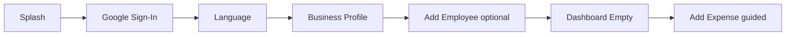
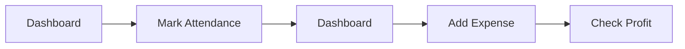
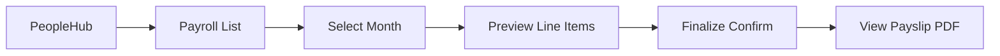
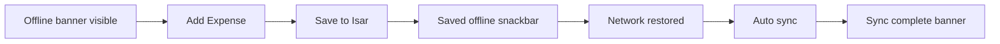

# SmartOps UI/UX Screen Specifications

> Related docs: [UI/UX Design System](./ui-ux-design-system.md) · [MVP Requirements](./mvp-requirements.md) · [Architecture](./architecture.md)

## Overview

Screen-by-screen specifications for SmartOps MVP v1.0. Each entry includes purpose, navigation, wireframe, components, fields, states, RBAC, and i18n key references.

**Conventions:**
- Wireframes use 360dp width reference
- i18n keys in `camelCase` — defined in `app_en.arb` / `app_hi.arb`
- P0 = MVP required; P1 = MVP nice-to-have

---

## Key User Flows

### First-time user



### Daily owner routine



### Monthly payroll



### Offline write



---

## Global and Auth Screens

### S-001 Splash

| Attribute | Detail |
|---|---|
| Purpose | App launch; check auth token and schema migration |
| Route | `/` |
| RBAC | All |

**Wireframe:**

```
┌─────────────────────────────┐
│                             │
│        [SmartOps Logo]        │
│                             │
│     ○ loading indicator     │
│                             │
└─────────────────────────────┘
```

**Logic:** If valid refresh token → `/home`. If not → `/login`. If migration running → migration screen.

**States:** loading only (max 3s)

---

### S-002 Google Sign-In

| Attribute | Detail |
|---|---|
| Purpose | AUTH-01 — authenticate via Google |
| Route | `/login` |
| Stories | AUTH-01 |

**Wireframe:**

```
┌─────────────────────────────┐
│                             │
│        [SmartOps Logo]        │
│   Manage your business        │
│   in one place                │
│                             │
│  ┌─────────────────────────┐│
│  │ G  Sign in with Google  ││
│  └─────────────────────────┘│
│                             │
│   Works offline after login   │
└─────────────────────────────┘
```

**Components:** Logo, tagline, `FilledButton.tonalIcon` (Google branding guidelines)

**States:** default, loading (button spinner), error (snackbar)

**i18n:** `loginTitle`, `loginSubtitle`, `btnSignInGoogle`, `loginOfflineNote`

---

### S-003 Force Update

| Attribute | Detail |
|---|---|
| Purpose | HTTP 426 — block app until update |
| Route | `/force-update` |
| Components | `ForceUpdateScreen` |

**Wireframe:**

```
┌─────────────────────────────┐
│        [SmartOps Logo]        │
│                             │
│      Update required          │
│  Please update SmartOps to    │
│  continue.                    │
│                             │
│  [ Update on Play Store ]     │
│                             │
│  Your local data is safe.     │
└─────────────────────────────┘
```

**i18n:** `forceUpdateTitle`, `forceUpdateBody`, `btnUpdateApp`, `forceUpdateDataSafe`

---

### S-004 Migration Progress

| Attribute | Detail |
|---|---|
| Purpose | Local Isar schema migration in progress |
| Route | overlay on splash |
| Components | `LoadingOverlay` |

**Wireframe:**

```
┌─────────────────────────────┐
│                             │
│     Updating database...      │
│     ○ progress indicator      │
│                             │
│  Please wait. Do not close    │
│  the app.                     │
└─────────────────────────────┘
```

**i18n:** `migrationInProgress`, `migrationWaitMessage`

---

### S-005 Migration Recovery

| Attribute | Detail |
|---|---|
| Purpose | Migration failed — recovery options |
| Route | `/recovery` |
| Stories | Local DB migrations doc |

**Wireframe:**

```
┌─────────────────────────────┐
│  ⚠ Could not update database │
│                             │
│  Error: MIGRATION_v2_FAILED   │
│                             │
│  [ Retry ]                    │
│  [ Reset and sync from cloud ]│
│  [ Contact support ]          │
└─────────────────────────────┘
```

**Actions:** Retry migration; Reset wipes Isar and full pull; Support exports diagnostic log.

---

## Onboarding Screens

### S-010 Language Selection

| Attribute | Detail |
|---|---|
| Purpose | AUTH-04 — choose UI language |
| Route | `/onboarding/language` |
| Stories | AUTH-04 |

**Wireframe:**

```
┌─────────────────────────────┐
│ ←                    Step 1/3│
│  Choose your language         │
│  अपनी भाषा चुनें               │
│                             │
│  ┌─────────────────────────┐│
│  │ ○ English               ││
│  └─────────────────────────┘│
│  ┌─────────────────────────┐│
│  │ ● Hindi / हिंदी          ││
│  └─────────────────────────┘│
│                             │
│  [ Continue ]                 │
└─────────────────────────────┘
```

**Fields:** Radio list — English, Hindi

**i18n:** `onboardingLanguageTitle`, `langEnglish`, `langHindi`, `btnContinue`

---

### S-011 Business Profile

| Attribute | Detail |
|---|---|
| Purpose | AUTH-03 — create organization |
| Route | `/onboarding/business` |
| Stories | AUTH-03 |

**Wireframe:**

```
┌─────────────────────────────┐
│ ←                    Step 2/3│
│  Tell us about your business  │
│                             │
│  Business name *              │
│  [________________________]   │
│  Business type                │
│  [ Grocery store        ▼ ]   │
│  City *                       │
│  [________________________]   │
│                             │
│  [ Continue ]                 │
└─────────────────────────────┘
```

**Fields:**

| Field | Type | Required | Validation |
|---|---|---|---|
| Business name | text | Yes | 2–255 chars |
| Business type | dropdown | No | retail, grocery, manufacturing, service, workshop, other |
| City | text | Yes | 2–100 chars |

**i18n:** `onboardingBusinessTitle`, `fieldBusinessName`, `fieldBusinessType`, `fieldCity`

---

### S-012 Add First Employee (Optional)

| Attribute | Detail |
|---|---|
| Purpose | Seed first employee; skippable |
| Route | `/onboarding/employee` |

**Wireframe:**

```
┌─────────────────────────────┐
│ ←                    Step 3/3│
│  Add your first employee?     │
│  You can skip and add later.  │
│                             │
│  Full name *                  │
│  [________________________]   │
│  Phone                        │
│  [________________________]   │
│                             │
│  [ Add employee ]             │
│  Skip for now                 │
└─────────────────────────────┘
```

---

### S-013 Welcome / Guided First Action

| Attribute | Detail |
|---|---|
| Purpose | Empty dashboard with guided CTA |
| Route | `/home` (first launch flag) |

**Wireframe:**

```
┌─────────────────────────────┐
│ SmartOps           [sync][⚙]│
├─────────────────────────────┤
│  Welcome, Rajesh! 👋          │
│  Let's record your first      │
│  expense or mark attendance.  │
│                             │
│  [ + Add first expense ]      │
│  [ ✓ Mark attendance ]        │
├─────────────────────────────┤
│ 🏠  💰  👥  📦  ⋯           │
└─────────────────────────────┘
```

---

## Dashboard

### S-020 Dashboard (Owner / Manager)

| Attribute | Detail |
|---|---|
| Purpose | DASH-01 to DASH-06 — business overview |
| Route | `/home` |
| Stories | DASH-01, DASH-02, DASH-05 |
| RBAC | Owner, Manager |

**Wireframe:**

```
┌─────────────────────────────┐
│ SmartOps    [sync ✓] [⚙]    │
│ ⚠ Offline — changes saved     │
├─────────────────────────────┤
│  Today                        │
│ ┌──────────┐ ┌──────────┐    │
│ │ ₹12,500  │ │ ₹3,200   │    │
│ │ Revenue  │ │ Expenses │    │
│ └──────────┘ └──────────┘    │
│ ┌──────────┐ ┌──────────┐    │
│ │ ₹9,300   │ │ 6/8      │    │
│ │ Profit   │ │ Present  │    │
│ └──────────┘ └──────────┘    │
│  Quick Actions                │
│ ┌──────────┐ ┌──────────┐    │
│ │+ Expense │ │Attendance│    │
│ └──────────┘ └──────────┘    │
│ ┌──────────┐ ┌──────────┐    │
│ │+ Revenue │ │ Payroll  │    │
│ └──────────┘ └──────────┘    │
│  This month →                 │
├─────────────────────────────┤
│ 🏠  💰  👥  📦  ⋯           │
└─────────────────────────────┘
```

**Components:** `SyncStatusBanner`, `MetricCard` x4, `QuickActionGrid`

**Metrics:** Revenue today, Expenses today, Profit (computed), Attendance present/total

**States:** populated, empty (S-013), offline, syncing

**Tap targets:** Metric cards → filtered list; Quick actions → respective forms (≤3 taps)

**i18n:** `dashboardToday`, `metricRevenue`, `metricExpenses`, `metricProfit`, `metricAttendance`, `quickActionExpense`, `quickActionAttendance`, `quickActionRevenue`, `quickActionPayroll`

---

### S-021 Dashboard (Employee)

| Attribute | Detail |
|---|---|
| Purpose | Personal summary for employee role |
| Route | `/home` |
| RBAC | Employee |

**Wireframe:**

```
┌─────────────────────────────┐
│ SmartOps                      │
├─────────────────────────────┤
│  Hello, Amit                  │
│  Today: ✓ Present             │
│  Check-in: 9:15 AM            │
│                             │
│  [ Mark attendance ]          │
│  [ View my payslip ]          │
│  [ My attendance history ]    │
├─────────────────────────────┤
│ 🏠      ✓ Attendance    👤    │
└─────────────────────────────┘
```

---

## Money Hub

### S-030 Money Hub

| Attribute | Detail |
|---|---|
| Purpose | Navigate to Expenses or Revenue |
| Route | `/money` |

**Wireframe:**

```
┌─────────────────────────────┐
│ ← Money                       │
├─────────────────────────────┤
│ ┌─────────────────────────┐ │
│ │ 📋 Expenses              >│ │
│ │ Track daily spending       │ │
│ └─────────────────────────┘ │
│ ┌─────────────────────────┐ │
│ │ 💰 Revenue               >│ │
│ │ Record sales and income    │ │
│ └─────────────────────────┘ │
│                             │
│  This month                   │
│  Expenses: ₹45,200            │
│  Revenue:  ₹1,12,500          │
│                    [FAB +]    │
├─────────────────────────────┤
│ 🏠  💰  👥  📦  ⋯           │
└─────────────────────────────┘
```

**FAB:** Bottom sheet — Add Expense / Add Revenue

---

## Expense Screens

### S-031 Expense List

| Attribute | Detail |
|---|---|
| Purpose | EXP-04 — view, search, filter expenses |
| Route | `/money/expenses` |
| Stories | EXP-04, EXP-07, EXP-08 |

**Wireframe:**

```
┌─────────────────────────────┐
│ ← Expenses          [filter]│
│ [ Today | Week | Month ]      │
├─────────────────────────────┤
│ Today                         │
│ ┌─────────────────────────┐ │
│ │ ⚡ Electricity    ₹1,200 │ │
│ │    Utilities · Cash      │ │
│ └─────────────────────────┘ │
│ ┌─────────────────────────┐ │
│ │ 🛒 Raw materials  ₹3,500 │ │
│ │    Materials · UPI  📷   │ │
│ └─────────────────────────┘ │
│                             │
│ Total: ₹4,700                 │
│                    [FAB +]    │
└─────────────────────────────┘
```

**Components:** `FilterChipBar`, `SmartOpsListTile`, `AmountDisplay`

**States:** empty (`EmptyStateView` + "Add expense"), populated, offline, loading skeleton

**Actions:** Tap row → edit; FAB → new expense; Filter → date sheet; Pull → sync

**i18n:** `expenseListTitle`, `expenseEmptyTitle`, `expenseEmptyCta`, `expenseTotal`

---

### S-032 Expense Form (Add / Edit)

| Attribute | Detail |
|---|---|
| Purpose | EXP-01, EXP-02, EXP-03 |
| Route | `/money/expenses/new`, `/money/expenses/:id` |
| Stories | EXP-01, EXP-02, EXP-03, EXP-07 |

**Wireframe:**

```
┌─────────────────────────────┐
│ ← Add expense                 │
├─────────────────────────────┤
│  Amount *                     │
│  [ ₹ __________________ ]     │
│  Category *                   │
│  [ Utilities           ▼ ]  │
│  Date *                       │
│  [ 05 Jun 2026         📅 ] │
│  Description                  │
│  [________________________]   │
│  Payment method               │
│  [ Cash                ▼ ]  │
│  Vendor (optional)            │
│  [ Select vendor       ▼ ]  │
│  ┌ ─ ─ ─ ─ ─ ─ ─ ─ ─ ─ ─ ┐  │
│  │  📷 Attach invoice     │  │
│  └ ─ ─ ─ ─ ─ ─ ─ ─ ─ ─ ─ ┘  │
├─────────────────────────────┤
│  [ Save expense ]             │
└─────────────────────────────┘
```

**Validation:** Amount > 0; category required; date not future

**Offline:** Save shows snackbar "Saved — will sync when online"

**i18n:** `expenseFormTitle`, `fieldAmount`, `fieldCategory`, `fieldDate`, `fieldDescription`, `fieldPaymentMethod`, `btnSaveExpense`

---

## Revenue Screens

### S-040 Revenue List

| Attribute | Detail |
|---|---|
| Purpose | REV-03, REV-05 |
| Route | `/money/revenue` |
| Stories | REV-03, REV-05 |

Structure mirrors S-031 Expense List with revenue-specific categories and customer link indicator.

**i18n:** `revenueListTitle`, `revenueEmptyTitle`, `revenueEmptyCta`

---

### S-041 Revenue Form

| Attribute | Detail |
|---|---|
| Purpose | REV-01, REV-04 |
| Route | `/money/revenue/new` |
| Stories | REV-01, REV-04, REV-05 |

Same layout as expense form minus photo attachment; optional customer picker (P1).

**i18n:** `revenueFormTitle`, `btnSaveRevenue`

---

## People Hub

### S-050 People Hub

| Attribute | Detail |
|---|---|
| Purpose | Navigate employees, attendance, payroll |
| Route | `/people` |

**Wireframe:**

```
┌─────────────────────────────┐
│ ← People                      │
├─────────────────────────────┤
│ ┌─────────────────────────┐ │
│ │ 👥 Employees           >│ │
│ │ 8 active                   │ │
│ └─────────────────────────┘ │
│ ┌─────────────────────────┐ │
│ │ ✓ Attendance           >│ │
│ │ Today: 6/8 present         │ │
│ └─────────────────────────┘ │
│ ┌─────────────────────────┐ │
│ │ 💳 Payroll              >│ │
│ │ June 2026 — draft          │ │
│ └─────────────────────────┘ │
└─────────────────────────────┘
```

---

## Employee Screens

### S-051 Employee List

| Attribute | Detail |
|---|---|
| Purpose | EMP-04 |
| Route | `/people/employees` |
| Stories | EMP-01, EMP-04 |

**Wireframe:**

```
┌─────────────────────────────┐
│ ← Employees         [search]│
├─────────────────────────────┤
│ ┌─────────────────────────┐ │
│ │ [R] Ramesh Kumar         >│ │
│ │     Sales · Active         │ │
│ └─────────────────────────┘ │
│ ┌─────────────────────────┐ │
│ │ [P] Priya Sharma         >│ │
│ │     Manager · Active       │ │
│ └─────────────────────────┘ │
│                    [FAB +]    │
└─────────────────────────────┘
```

**Components:** `EmployeeAvatar`, search bar, `EmptyStateView`

---

### S-052 Employee Profile

| Attribute | Detail |
|---|---|
| Purpose | EMP-06 — view employee details |
| Route | `/people/employees/:id` |

**Sections:** Contact info, Department/Designation, Joining date, Salary (Owner only), Documents, Attendance shortcut

**Actions:** Edit (Owner/Manager), Deactivate (Owner)

---

### S-053 Employee Form

| Attribute | Detail |
|---|---|
| Purpose | EMP-01, EMP-07 |
| Route | `/people/employees/new` |

**Fields:** Full name*, phone, email, department, designation, joining date*, employment status

---

## Attendance Screens

### S-060 Daily Attendance Grid

| Attribute | Detail |
|---|---|
| Purpose | ATT-01, ATT-07 |
| Route | `/people/attendance` |
| Stories | ATT-01, ATT-02, ATT-07 |

**Wireframe:**

```
┌─────────────────────────────┐
│ ← Attendance    [ Jun 5 ▼ ]  │
├─────────────────────────────┤
│ 6 present · 1 absent · 1 leave│
├─────────────────────────────┤
│ ┌─────────────────────────┐ │
│ │ [R] Ramesh    [Present ▼]│ │
│ │     In 9:00  Out 18:00   │ │
│ └─────────────────────────┘ │
│ ┌─────────────────────────┐ │
│ │ [S] Suresh    [Absent  ▼]│ │
│ └─────────────────────────┘ │
│                             │
│  [ Save attendance ]          │
└─────────────────────────────┘
```

**Components:** `StatusBadge`, dropdown for status per employee, time pickers for check-in/out

**Interaction:** Bulk mark all present button at top (Owner shortcut)

**Offline:** Full functionality; sync on reconnect

**i18n:** `attendanceDailyTitle`, `attendanceSummary`, `statusPresent`, `statusAbsent`, `btnSaveAttendance`, `btnMarkAllPresent`

---

### S-061 Monthly Attendance Report

| Attribute | Detail |
|---|---|
| Purpose | ATT-06 |
| Route | `/people/attendance/report` |

Calendar grid or list: days present, absent, leave per employee. Export CSV (P1).

---

### S-062 Leave Request Form

| Attribute | Detail |
|---|---|
| Purpose | ATT-04 |
| Route | `/people/attendance/leave/new` |
| RBAC | All roles can submit; Owner/Manager approve |

**Fields:** Leave type, start date, end date, reason

---

### S-063 Leave Pending List

| Attribute | Detail |
|---|---|
| Purpose | ATT-05 |
| Route | `/people/attendance/leave/pending` |
| RBAC | Owner, Manager |

**Actions:** Approve / Reject per request

---

## Payroll Screens

### S-070 Payroll List

| Attribute | Detail |
|---|---|
| Purpose | PAY-02 |
| Route | `/people/payroll` |
| RBAC | Owner (full), Manager (view), Employee (own payslip link) |

**Wireframe:**

```
┌─────────────────────────────┐
│ ← Payroll                     │
├─────────────────────────────┤
│ ┌─────────────────────────┐ │
│ │ June 2026    Draft       >│ │
│ │ 8 employees · ₹1,24,000    │ │
│ └─────────────────────────┘ │
│ ┌─────────────────────────┐ │
│ │ May 2026     Paid        >│ │
│ └─────────────────────────┘ │
│                             │
│  [ + New payroll run ]        │
└─────────────────────────────┘
```

---

### S-071 Salary Structure Edit

| Attribute | Detail |
|---|---|
| Purpose | PAY-01 |
| Route | `/people/payroll/structures/:employeeId` |
| RBAC | Owner only |

**Fields:** Base salary, HRA, allowances, PF, ESI, tax, other deductions

---

### S-072 Payroll Preview

| Attribute | Detail |
|---|---|
| Purpose | PAY-02, PAY-03, PAY-04 |
| Route | `/people/payroll/run` |

**Wireframe:**

```
┌─────────────────────────────┐
│ ← June 2026 payroll           │
├─────────────────────────────┤
│ Period: 1 Jun – 30 Jun 2026   │
│                             │
│ Ramesh Kumar                  │
│ Days: 26/26  Net: ₹14,500   │
│ [+ Bonus] [edit deductions]   │
│ ─────────────────────────     │
│ Suresh Patel                  │
│ Days: 24/26  Net: ₹13,800   │
│ ─────────────────────────     │
│ Total gross:    ₹1,32,000     │
│ Total net:      ₹1,24,000     │
├─────────────────────────────┤
│  [ Process payroll ]          │
└─────────────────────────────┘
```

**Confirm:** `ConfirmDialog` before finalize — "This cannot be undone"

---

### S-073 Payslip View

| Attribute | Detail |
|---|---|
| Purpose | PAY-05, PAY-07 |
| Route | `/people/payroll/:runId/payslip/:employeeId` |

**Actions:** View PDF, Share (system share sheet), available offline after generation

**i18n:** Payslip in user's language (EN/HI)

---

## Inventory Screens

### S-080 Product List

| Attribute | Detail |
|---|---|
| Purpose | INV-03, INV-04 |
| Route | `/stock` |
| Stories | INV-01 to INV-06 |

**Wireframe:**

```
┌─────────────────────────────┐
│ ← Inventory         [search]│
├─────────────────────────────┤
│ ┌─────────────────────────┐ │
│ │ Rice 25kg                 │ │
│ │ Stock: 45 pcs   ₹1,200   │ │
│ └─────────────────────────┘ │
│ ┌─────────────────────────┐ │
│ │ ⚠ Dal 1kg                 │ │
│ │ Stock: 3 pcs LOW STOCK     │ │
│ └─────────────────────────┘ │
│                    [FAB +]    │
├─────────────────────────────┤
│ 🏠  💰  👥  📦  ⋯           │
└─────────────────────────────┘
```

**Components:** Low stock badge (`StatusBadge` red), search

---

### S-081 Product Form

**Fields:** Name*, SKU, category, unit, cost price, selling price, low stock threshold

---

### S-082 Stock In/Out Form

**Fields:** Product (read-only if from detail), movement type (in/out), quantity*, date, notes

---

## CRM Screens

### S-090 CRM Hub

| Attribute | Detail |
|---|---|
| Purpose | CRM module entry |
| Route | `/more/crm` |

**Tabs:** Customers | Vendors (M3 `TabBar`)

---

### S-091 Customer List

| Attribute | Detail |
|---|---|
| Purpose | CRM-01, CRM-07 |
| Route | `/more/crm/customers` |

**List item:** Name, phone, outstanding balance (if > 0)

---

### S-092 Customer Profile

| Attribute | Detail |
|---|---|
| Purpose | CRM-03, CRM-05 |
| Route | `/more/crm/customers/:id` |

**Sections:** Contact, Outstanding balance, Linked revenue entries, Notes

---

### S-093 Vendor List / Profile

Mirror customer screens for vendors (CRM-02, CRM-04, CRM-06).

---

## Settings and System

### S-100 Settings Menu

| Attribute | Detail |
|---|---|
| Route | `/more/settings` |

**Items:**

| Item | RBAC | Route |
|---|---|---|
| Language | All | language screen |
| Organization | Owner | org settings |
| Sync status | All | sync detail |
| About | All | about |
| Log out | All | confirm dialog |

---

### S-101 Sync Status Detail

| Attribute | Detail |
|---|---|
| Purpose | Manual sync, pending count, last sync time |
| Route | `/more/settings/sync` |

**Wireframe:**

```
┌─────────────────────────────┐
│ ← Sync status                 │
├─────────────────────────────┤
│ Status: ✓ Synced              │
│ Last sync: 5 Jun, 2:30 PM      │
│ Pending changes: 0             │
│                             │
│  [ Sync now ]                 │
└─────────────────────────────┘
```

**Offline:** "Sync now" disabled with explanation

---

### S-102 Logout Confirm

**Dialog:** "Log out?" — warns local data will be cleared on shared devices. [Cancel] [Log out]

---

## Shared Dialogs and Sheets

### D-001 Confirm Delete

Used for: expense, revenue, employee deactivate, product delete

**Pattern:** Title + body + Cancel + Delete (error color)

---

### D-002 Sync Conflict Alert

**Body:** "A record was changed on another device. Server version applied." Details expandable.

---

### D-003 Category Picker Sheet

List of expense/revenue categories with color dot. Tap to select and dismiss.

---

### D-004 Date Range Filter Sheet

Presets: Today, This week, This month, Custom (date range picker)

---

### D-005 Add Type Sheet (Money FAB)

Options: Add Expense | Add Revenue

---

## Screen State Matrix (Summary)

| Screen | Empty | Loading | Offline | Error | Permission denied |
|---|---|---|---|---|---|
| Expense list | ✓ CTA | skeleton | banner | retry | hidden route |
| Dashboard | welcome | skeleton | banner | — | limited view |
| Attendance | "No employees" | skeleton | banner | retry | self only |
| Payroll | "No runs yet" | skeleton | banner | retry | payslip only |
| Inventory | ✓ CTA | skeleton | banner | retry | hidden |
| CRM | ✓ CTA | skeleton | banner | retry | hidden |

---

## UX Acceptance Checklist

| Criterion | Verification |
|---|---|
| Add expense ≤ 3 taps from dashboard | Dashboard → Quick action → Form |
| Mark attendance ≤ 3 taps | Dashboard → Quick action → Grid |
| Offline banner on all auth screens | Visual QA |
| Empty state on every list | Per screen matrix above |
| Hindi buttons no truncation at 360dp | Device test with `hi` locale |
| Touch targets ≥ 48dp | Design system audit |
| Employee blocked from /money | Route guard test |
| 426 shows force update screen | API versioning test |
| Offline save snackbar | Airplane mode test |

---

## Related Documents

- [UI/UX Design System](./ui-ux-design-system.md) — theme, components, navigation
- [MVP Requirements](./mvp-requirements.md) — user stories, personas, RBAC
- [API Versioning](./api-versioning.md) — force update screen (426)
- [Local Database Migrations](./local-database-migrations.md) — migration/recovery screens
